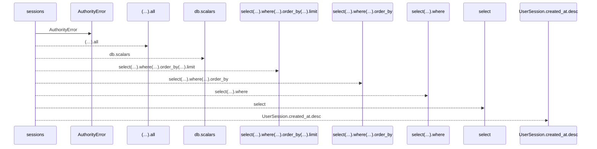
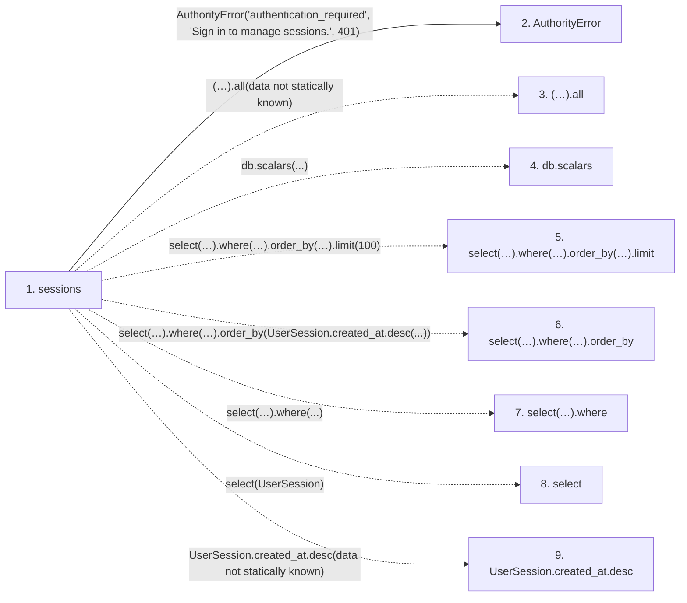

# sessions

**Entry point:** `sessions` (`http`)
**Source:** [routers_identity](../modules/routers_identity.md)
**Modules touched:** [authority](../modules/authority.md), [routers_identity](../modules/routers_identity.md)

## Call sequence

<!-- Auto-generated from static call edges. Dashed arrows are external or unresolved calls. Reviewed runtime conditions and side effects belong in Behavior. -->

## Data flow

<!-- Auto-generated static analysis. Treat values and boundaries as best-effort hints, not runtime proof. -->

### Step data

| Step | Inputs | Reads | Writes | Returns |
|---|---|---|---|---|
| `sessions` | `db: Database` | - | - | `...` |
| `AuthorityError` | - | - | - | - |
| `(…).all` | - | - | - | - |
| `db.scalars` | - | - | - | - |
| `select(…).where(…).order_by(…).limit` | - | - | - | - |
| `select(…).where(…).order_by` | - | - | - | - |
| `select(…).where` | - | - | - | - |
| `select` | - | - | - | - |
| `UserSession.created_at.desc` | - | - | - | - |

### Call data

| From | To | Line | Call |
|---|---|---:|---|
| sessions | AuthorityError | 306 | `AuthorityError('authentication_required', 'Sign in to manage sessions.', 401)` |
| sessions | (…).all | 307 | `(await db.scalars(select(UserSession).where(UserSession.principal_id == authority.principal_id).order_by(UserSession.created_at.desc()).limit(100))).all(data not statically known)` |
| sessions | db.scalars | 307 | `db.scalars(...)` |
| sessions | select(…).where(…).order_by(…).limit | 307 | `select(UserSession).where(UserSession.principal_id == authority.principal_id).order_by(UserSession.created_at.desc()).limit(100)` |
| sessions | select(…).where(…).order_by | 307 | `select(UserSession).where(UserSession.principal_id == authority.principal_id).order_by(UserSession.created_at.desc(...))` |
| sessions | select(…).where | 307 | `select(UserSession).where(...)` |
| sessions | select | 307 | `select(UserSession)` |
| sessions | UserSession.created_at.desc | 307 | `UserSession.created_at.desc(data not statically known)` |

### Boundary effects

*No boundary effects detected.*

### Static analysis gaps

| Kind | Step | Target | Line |
|---|---|---|---:|
| unresolved_call | `sessions` | `(await db.scalars(select(UserSession).where(UserSession.principal_id == authority.principal_id).order_by(UserSession.created_at.desc()).limit(100))).all` | 307 |
| unresolved_call | `sessions` | `db.scalars` | 307 |
| unresolved_call | `sessions` | `select(UserSession).where(UserSession.principal_id == authority.principal_id).order_by(UserSession.created_at.desc()).limit` | 307 |
| unresolved_call | `sessions` | `select(UserSession).where(UserSession.principal_id == authority.principal_id).order_by` | 307 |
| unresolved_call | `sessions` | `select(UserSession).where` | 307 |
| external_call | `sessions` | `select` | 307 |
| unresolved_call | `sessions` | `UserSession.created_at.desc` | 307 |

## Behavior

This flow starts at `sessions` and is classified as `http`. The generated call and data-flow sections are bounded static projections; runtime conditions and side effects require source-level confirmation.
