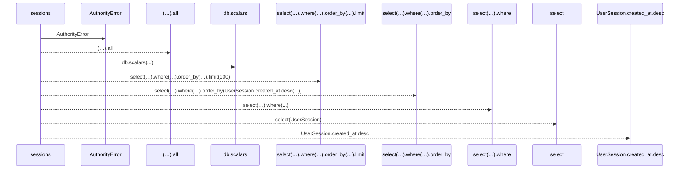
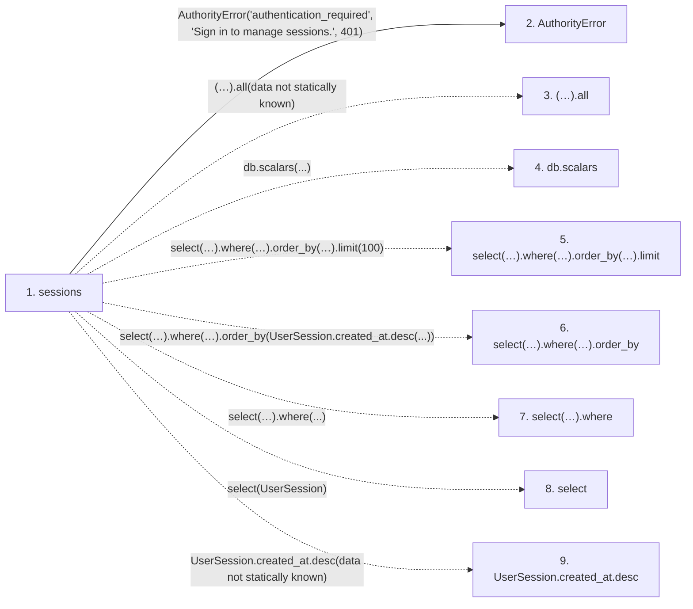

# sessions

**Entry point:** `sessions` (`http`)
**Source:** [routers_identity](../modules/routers_identity.md)
**Modules touched:** [authority](../modules/authority.md), [routers_identity](../modules/routers_identity.md)

## Call sequence

> Static overview in presentation order, not runtime execution order. Arrows retain captured callers; representative internal continuations and boundary examples precede repeated helper detail.

<!-- Auto-generated from static call edges. Dashed arrows are external or unresolved calls. Reviewed runtime conditions and side effects belong in Behavior. -->

```mermaid
sequenceDiagram
    participant p0 as sessions
    participant p1 as AuthorityError
    participant p2 as (…).all
    participant p3 as db.scalars
    participant p4 as select(…).where(…).order_by(…).limit
    participant p5 as select(…).where(…).order_by
    participant p6 as select(…).where
    participant p7 as select
    participant p8 as UserSession.created_at.desc
    p0->>p1: AuthorityError
    p0-->>p2: (…).all
    p0-->>p3: db.scalars(...)
    p0-->>p4: select(…).where(…).order_by(…).limit(100)
    p0-->>p5: select(…).where(…).order_by(UserSession.created_at.desc(...))
    p0-->>p6: select(…).where(...)
    p0-->>p7: select(UserSession)
    p0-->>p8: UserSession.created_at.desc
```

> Call sequence diagram shows 8 of 8 interactions; 0 omitted to keep the visualization within the 30-interaction and generated-diagram limits, with uncertain identities omitted rather than inferred.

> Captured boundary calls: external 1 of 1 (0 omitted); unresolved 6 of 6 (0 omitted). These counts cover the captured static trace.
> Detailed flow queries retain their own coverage and limits; omitted paths may execute at runtime.

## Data flow

<!-- Auto-generated static analysis. Treat values and boundaries as best-effort hints, not runtime proof. -->

### Analysis coverage

**Effect analysis partially available.** Flow assembly and source effect analysis are separate; empty observations do not prove an empty handler body.

Source steps: 2; effect analysis evaluated: 1, partial: 0, unavailable: 1. Counts include steps omitted from the displayed trace.

Collector observations for 1 source steps with known totals: observed: 2, emitted: 2, omitted: 0. Unavailable totals are excluded.

- Callable record unavailable for one or more source steps; those steps have no represented callable body.
- Effect collector totals unavailable; observed counts cover captured records only.

| Step | Callable record | Effect analysis | Collector totals | Observed | Emitted | Omitted |
|---|---|---|---|---:|---:|---:|
| `sessions` | `available` | `evaluated` | `available` | `2` | `2` | `0` |
| `AuthorityError` | `unavailable` | `unavailable` | `unavailable` | — | — | — |
| `(…).all` | `not_applicable` | `not_applicable` | `not_applicable` | — | — | — |
| `db.scalars` | `not_applicable` | `not_applicable` | `not_applicable` | — | — | — |
| `select(…).where(…).order_by(…).limit` | `not_applicable` | `not_applicable` | `not_applicable` | — | — | — |
| `select(…).where(…).order_by` | `not_applicable` | `not_applicable` | `not_applicable` | — | — | — |
| `select(…).where` | `not_applicable` | `not_applicable` | `not_applicable` | — | — | — |
| `select` | `not_applicable` | `not_applicable` | `not_applicable` | — | — | — |
| `UserSession.created_at.desc` | `not_applicable` | `not_applicable` | `not_applicable` | — | — | — |

```mermaid
flowchart LR
    s1["1. sessions"]
    s2["2. AuthorityError"]
    s3["3. (…).all"]
    s4["4. db.scalars"]
    s5["5. select(…).where(…).order_by(…).limit"]
    s6["6. select(…).where(…).order_by"]
    s7["7. select(…).where"]
    s8["8. select"]
    s9["9. UserSession.created_at.desc"]
    s1 -->|"AuthorityError('authentication_required', 'Sign in to manage sessions.', 401)"| s2
    s1 -. "(…).all(data not statically known)" .-> s3
    s1 -. "db.scalars(...)" .-> s4
    s1 -. "select(…).where(…).order_by(…).limit(100)" .-> s5
    s1 -. "select(…).where(…).order_by(UserSession.created_at.desc(...))" .-> s6
    s1 -. "select(…).where(...)" .-> s7
    s1 -. "select(UserSession)" .-> s8
    s1 -. "UserSession.created_at.desc(data not statically known)" .-> s9
    click s1 "../modules/routers_identity.md"
    click s2 "../modules/authority.md"
```

### Step data

| Step | Inputs | Reads | Writes | Returns |
|---|---|---|---|---|
| `sessions` | `db: Database` | - | - | `...` |
| `AuthorityError` | - | - | - | - |
| `(…).all` | - | - | - | - |
| `db.scalars` | - | - | - | - |
| `select(…).where(…).order_by(…).limit` | - | - | - | - |
| `select(…).where(…).order_by` | - | - | - | - |
| `select(…).where` | - | - | - | - |
| `select` | - | - | - | - |
| `UserSession.created_at.desc` | - | - | - | - |

### Call data

| From | To | Line | Call |
|---|---|---:|---|
| sessions | AuthorityError | 306 | `AuthorityError('authentication_required', 'Sign in to manage sessions.', 401)` |
| sessions | (…).all | 307 | `(await db.scalars(select(UserSession).where(UserSession.principal_id == authority.principal_id).order_by(UserSession.created_at.desc()).limit(100))).all(data not statically known)` |
| sessions | db.scalars | 307 | `db.scalars(...)` |
| sessions | select(…).where(…).order_by(…).limit | 307 | `select(UserSession).where(UserSession.principal_id == authority.principal_id).order_by(UserSession.created_at.desc()).limit(100)` |
| sessions | select(…).where(…).order_by | 307 | `select(UserSession).where(UserSession.principal_id == authority.principal_id).order_by(UserSession.created_at.desc(...))` |
| sessions | select(…).where | 307 | `select(UserSession).where(...)` |
| sessions | select | 307 | `select(UserSession)` |
| sessions | UserSession.created_at.desc | 307 | `UserSession.created_at.desc(data not statically known)` |

### Boundary effects

*No boundary-effect observations were captured in this static trace.*

### Static analysis gaps

| Kind | Step | Target | Line |
|---|---|---|---:|
| unresolved_call | `sessions` | `(await db.scalars(select(UserSession).where(UserSession.principal_id == authority.principal_id).order_by(UserSession.created_at.desc()).limit(100))).all` | 307 |
| unresolved_call | `sessions` | `db.scalars` | 307 |
| unresolved_call | `sessions` | `select(UserSession).where(UserSession.principal_id == authority.principal_id).order_by(UserSession.created_at.desc()).limit` | 307 |
| unresolved_call | `sessions` | `select(UserSession).where(UserSession.principal_id == authority.principal_id).order_by` | 307 |
| unresolved_call | `sessions` | `select(UserSession).where` | 307 |
| external_call | `sessions` | `select` | 307 |
| unresolved_call | `sessions` | `UserSession.created_at.desc` | 307 |

## Behavior

This flow starts at `sessions` and is classified as `http`. The generated call and data-flow sections are bounded static projections; runtime conditions and side effects require source-level confirmation.
