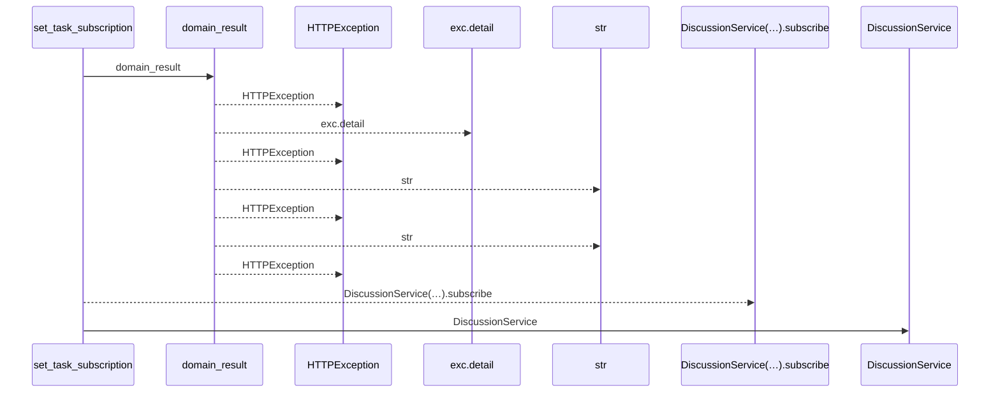
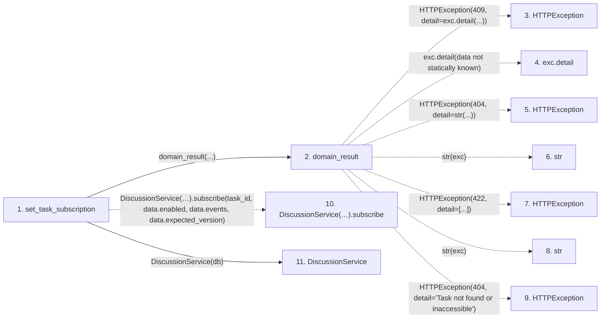

# set_task_subscription

**Entry point:** `set_task_subscription` (`http`)
**Source:** [routers_discussion](../modules/routers_discussion.md)
**Modules touched:** [discussion_service](../modules/discussion_service.md), [routers_discussion](../modules/routers_discussion.md), [routers_task_domain](../modules/routers_task_domain.md)

## Call sequence

<!-- Auto-generated from static call edges. Dashed arrows are external or unresolved calls. Reviewed runtime conditions and side effects belong in Behavior. -->

## Data flow

<!-- Auto-generated static analysis. Treat values and boundaries as best-effort hints, not runtime proof. -->

### Step data

| Step | Inputs | Reads | Writes | Returns |
|---|---|---|---|---|
| `set_task_subscription` | `task_id: int`, `data: SubscriptionInput`, `db: DiscussionDatabase` | - | - | `...` |
| `domain_result` | `awaitable` | `TaskVersionConflictError` | - | `result` |
| `HTTPException` | - | - | - | - |
| `exc.detail` | - | - | - | - |
| `HTTPException` | - | - | - | - |
| `str` | - | - | - | - |
| `HTTPException` | - | - | - | - |
| `str` | - | - | - | - |
| `HTTPException` | - | - | - | - |
| `DiscussionService(…).subscribe` | - | - | - | - |
| `DiscussionService` | - | - | - | - |

### Call data

| From | To | Line | Call |
|---|---|---:|---|
| set_task_subscription | domain_result | 70 | `domain_result(...)` |
| domain_result | HTTPException | 42 | `HTTPException(409, detail=exc.detail(...))` |
| domain_result | exc.detail | 42 | `exc.detail(data not statically known)` |
| domain_result | HTTPException | 44 | `HTTPException(404, detail=str(...))` |
| domain_result | str | 44 | `str(exc)` |
| domain_result | HTTPException | 46 | `HTTPException(422, detail=[...])` |
| domain_result | str | 46 | `str(exc)` |
| domain_result | HTTPException | 48 | `HTTPException(404, detail='Task not found or inaccessible')` |
| set_task_subscription | DiscussionService(…).subscribe | 70 | `DiscussionService(db).subscribe(task_id, data.enabled, data.events, data.expected_version)` |
| set_task_subscription | DiscussionService | 70 | `DiscussionService(db)` |

### Boundary effects

*No boundary effects detected.*

### Static analysis gaps

| Kind | Step | Target | Line |
|---|---|---|---:|
| external_call | `domain_result` | `HTTPException` | 42 |
| unresolved_call | `domain_result` | `exc.detail` | 42 |
| external_call | `domain_result` | `HTTPException` | 44 |
| external_call | `domain_result` | `HTTPException` | 46 |
| external_call | `domain_result` | `HTTPException` | 48 |
| unresolved_call | `set_task_subscription` | `DiscussionService(db).subscribe` | 70 |

## Behavior

Changes only the current human’s versioned subscription and event choices. The task scope is rechecked under the write lock. Preference changes do not alter lifecycle or evidence; queued delivery rechecks the committed preference.
