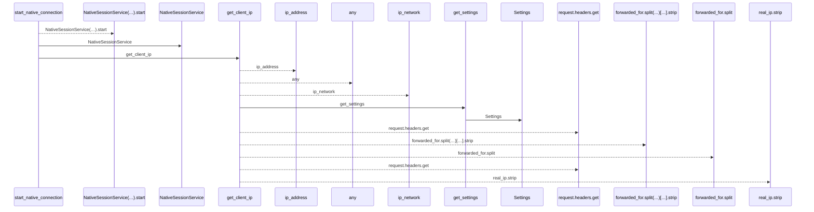
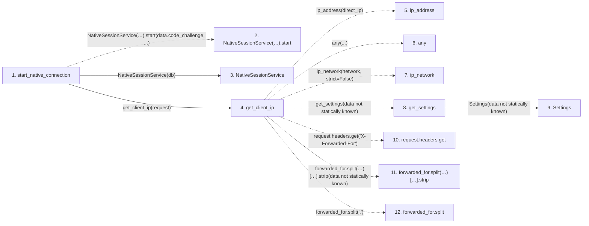

# start_native_connection

**Entry point:** `start_native_connection` (`http`)
**Source:** [routers_identity](../modules/routers_identity.md)
**Modules touched:** [config](../modules/config.md), [native_session_service](../modules/native_session_service.md), [routers_identity](../modules/routers_identity.md), [session_service](../modules/session_service.md)

## Call sequence

<!-- Auto-generated from static call edges. Dashed arrows are external or unresolved calls. Reviewed runtime conditions and side effects belong in Behavior. -->

## Data flow

<!-- Auto-generated static analysis. Treat values and boundaries as best-effort hints, not runtime proof. -->

### Step data

| Step | Inputs | Reads | Writes | Returns |
|---|---|---|---|---|
| `start_native_connection` | `data: NativeConnectionStart`, `request: Request`, `response: Response`, `db: Database` | - | `response.headers[...]` | `...` |
| `NativeSessionService(…).start` | - | - | - | - |
| `NativeSessionService` | - | - | - | - |
| `get_client_ip` | `request: Request` | - | - | `...`, `real_ip.strip(...)`, `direct_ip` |
| `ip_address` | - | - | - | - |
| `any` | - | - | - | - |
| `ip_network` | - | - | - | - |
| `get_settings` | - | - | - | `Settings(...)` |
| `Settings` | - | - | - | - |
| `request.headers.get` | - | - | - | - |
| `forwarded_for.split(…)[…].strip` | - | - | - | - |
| `forwarded_for.split` | - | - | - | - |

### Call data

| From | To | Line | Call |
|---|---|---:|---|
| start_native_connection | NativeSessionService(…).start | 79 | `NativeSessionService(db).start(data.code_challenge, ...)` |
| start_native_connection | NativeSessionService | 79 | `NativeSessionService(db)` |
| start_native_connection | get_client_ip | 79 | `get_client_ip(request)` |
| get_client_ip | ip_address | 52 | `ip_address(direct_ip)` |
| get_client_ip | any | 53 | `any(...)` |
| get_client_ip | ip_network | 54 | `ip_network(network, strict=False)` |
| get_client_ip | get_settings | 55 | `get_settings(data not statically known)` |
| get_settings | Settings | 481 | `Settings(data not statically known)` |
| get_client_ip | request.headers.get | 60 | `request.headers.get('X-Forwarded-For')` |
| get_client_ip | forwarded_for.split(…)[…].strip | 62 | `forwarded_for.split(',')[0].strip(data not statically known)` |
| get_client_ip | forwarded_for.split | 62 | `forwarded_for.split(',')` |

### Boundary effects

*No boundary effects detected.*

### Static analysis gaps

| Kind | Step | Target | Line |
|---|---|---|---:|
| unresolved_call | `start_native_connection` | `NativeSessionService(db).start` | 79 |
| external_call | `get_client_ip` | `ip_address` | 52 |
| external_call | `get_client_ip` | `any` | 53 |
| external_call | `get_client_ip` | `ip_network` | 54 |
| unresolved_call | `get_client_ip` | `request.headers.get` | 60 |
| unresolved_call | `get_client_ip` | `forwarded_for.split(',')[0].strip` | 62 |
| unresolved_call | `get_client_ip` | `forwarded_for.split` | 62 |
| step_limit | `start_native_connection` | `first 12 steps` | 0 |

## Behavior

Creates a ten-minute request with a hashed random identity, an S256 challenge, and a displayed verification code. It uses managed authentication, bounded attempt counts and bounded expired-request cleanup. The response points to a local browser consent path and carries no access token or device verifier.
