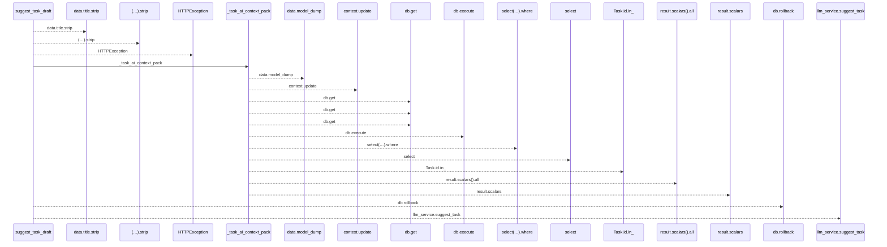
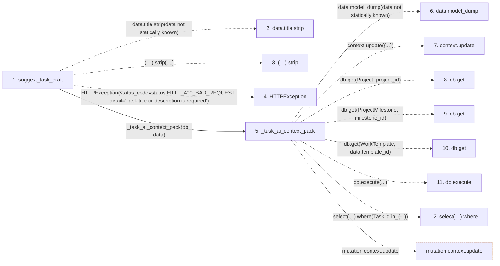

# suggest_task_draft

**Entry point:** `suggest_task_draft` (`http`)
**Source:** [routers_llm](../modules/routers_llm.md)
**Modules touched:** [routers_llm](../modules/routers_llm.md)

## Call sequence

<!-- Auto-generated from static call edges. Dashed arrows are external or unresolved calls. Reviewed runtime conditions and side effects belong in Behavior. -->

## Data flow

<!-- Auto-generated static analysis. Treat values and boundaries as best-effort hints, not runtime proof. -->

### Step data

| Step | Inputs | Reads | Writes | Returns |
|---|---|---|---|---|
| `suggest_task_draft` | `data: TaskAISuggestRequest`, `db: Annotated[AsyncSession, Depends(get_db, scope='function')]`, `llm_service: Annotated[LLMService, Depends(get_llm_service)]` | `status` | - | `...` |
| `data.title.strip` | - | - | - | - |
| `(…).strip` | - | - | - | - |
| `HTTPException` | - | - | - | - |
| `_task_ai_context_pack` | `db: AsyncSession`, `data: TaskAISuggestRequest`, `task: Task \| None` | `Project`, `ProjectMilestone`, `WorkTemplate` | `context[...]`, `context[...]`, `context[...]`, `context[...]` | `context` |
| `data.model_dump` | - | - | - | - |
| `context.update` | - | - | - | - |
| `db.get` | - | - | - | - |
| `db.get` | - | - | - | - |
| `db.get` | - | - | - | - |
| `db.execute` | - | - | - | - |
| `select(…).where` | - | - | - | - |

### Call data

| From | To | Line | Call |
|---|---|---:|---|
| suggest_task_draft | data.title.strip | 160 | `data.title.strip(data not statically known)` |
| suggest_task_draft | (…).strip | 160 | `data.title.strip(data not statically known)` |
| suggest_task_draft | HTTPException | 161 | `HTTPException(status_code=status.HTTP_400_BAD_REQUEST, detail='Task title or description is required')` |
| suggest_task_draft | _task_ai_context_pack | 165 | `_task_ai_context_pack(db, data)` |
| _task_ai_context_pack | data.model_dump | 41 | `data.model_dump(data not statically known)` |
| _task_ai_context_pack | context.update | 49 | `context.update({...})` |
| _task_ai_context_pack | db.get | 64 | `db.get(Project, project_id)` |
| _task_ai_context_pack | db.get | 77 | `db.get(ProjectMilestone, milestone_id)` |
| _task_ai_context_pack | db.get | 89 | `db.get(WorkTemplate, data.template_id)` |
| _task_ai_context_pack | db.execute | 105 | `db.execute(...)` |
| _task_ai_context_pack | select(…).where | 105 | `select(Task).where(Task.id.in_(...))` |

### Boundary effects

| Kind | Target | Step | Line |
|---|---|---|---:|
| mutation | `context.update` | `_task_ai_context_pack` | 49 |

### Static analysis gaps

| Kind | Step | Target | Line |
|---|---|---|---:|
| unresolved_call | `suggest_task_draft` | `data.title.strip` | 160 |
| unresolved_call | `suggest_task_draft` | `(data.description or '').strip` | 160 |
| external_call | `suggest_task_draft` | `HTTPException` | 161 |
| unresolved_call | `_task_ai_context_pack` | `data.model_dump` | 41 |
| unresolved_call | `_task_ai_context_pack` | `db.get` | 64 |
| unresolved_call | `_task_ai_context_pack` | `db.get` | 77 |
| unresolved_call | `_task_ai_context_pack` | `db.get` | 89 |
| unresolved_call | `_task_ai_context_pack` | `db.execute` | 105 |
| unresolved_call | `_task_ai_context_pack` | `select(Task).where` | 105 |
| step_limit | `suggest_task_draft` | `first 12 steps` | 0 |

## Behavior

This flow starts at `suggest_task_draft` and is classified as `http`. The generated call and data-flow sections are bounded static projections; runtime conditions and side effects require source-level confirmation.
