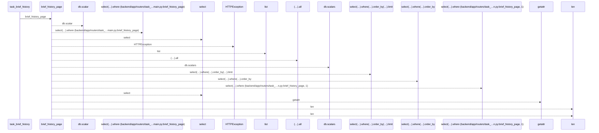
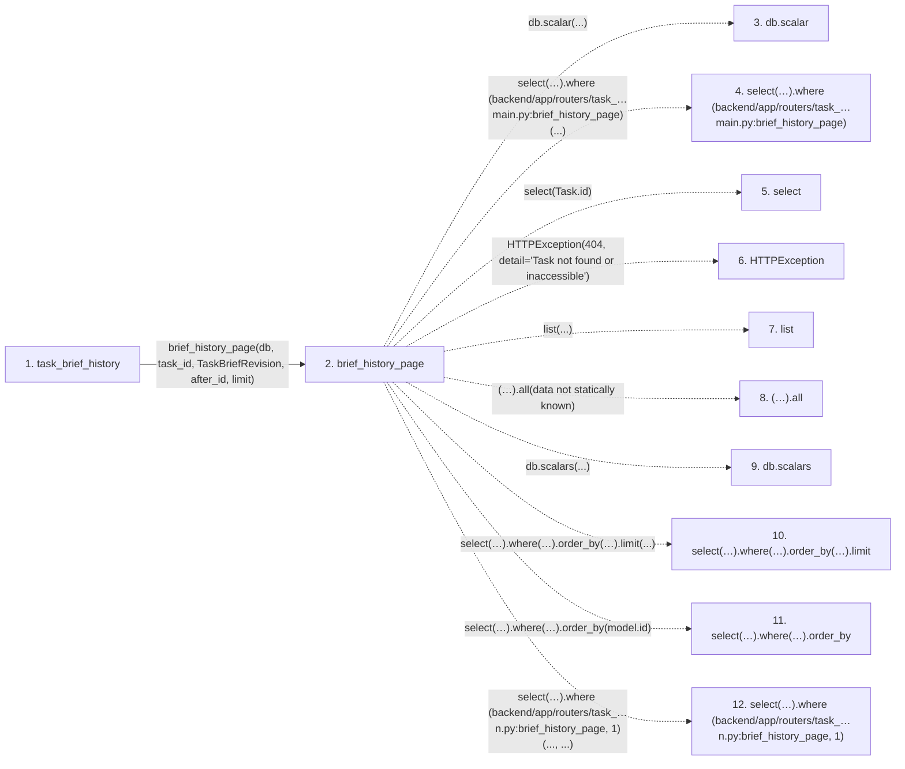

# task_brief_history

**Entry point:** `task_brief_history` (`http`)
**Source:** [routers_task_domain](../modules/routers_task_domain.md)
**Modules touched:** [routers_task_domain](../modules/routers_task_domain.md)

## Call sequence

<!-- Auto-generated from static call edges. Dashed arrows are external or unresolved calls. Reviewed runtime conditions and side effects belong in Behavior. -->

## Data flow

<!-- Auto-generated static analysis. Treat values and boundaries as best-effort hints, not runtime proof. -->

### Step data

| Step | Inputs | Reads | Writes | Returns |
|---|---|---|---|---|
| `task_brief_history` | `task_id: int`, `db: DB`, `limit: int`, `after_id: int` | `TaskBriefRevision` | - | `...` |
| `brief_history_page` | `db`, `task_id`, `model`, `after_id`, `limit` | `Task` | - | `{...}` |
| `db.scalar` | - | - | - | - |
| `select(…).where (backend/app/routers/task_…main.py:brief_history_page)` | - | - | - | - |
| `select` | - | - | - | - |
| `HTTPException` | - | - | - | - |
| `list` | - | - | - | - |
| `(…).all` | - | - | - | - |
| `db.scalars` | - | - | - | - |
| `select(…).where(…).order_by(…).limit` | - | - | - | - |
| `select(…).where(…).order_by` | - | - | - | - |
| `select(…).where (backend/app/routers/task_…n.py:brief_history_page, 1)` | - | - | - | - |

### Call data

| From | To | Line | Call |
|---|---|---:|---|
| task_brief_history | brief_history_page | 200 | `brief_history_page(db, task_id, TaskBriefRevision, after_id, limit)` |
| brief_history_page | db.scalar | 191 | `db.scalar(...)` |
| brief_history_page | select(…).where (backend/app/routers/task_…main.py:brief_history_page) | 191 | `select(Task.id).where(...)` |
| brief_history_page | select | 191 | `select(Task.id)` |
| brief_history_page | HTTPException | 192 | `HTTPException(404, detail='Task not found or inaccessible')` |
| brief_history_page | list | 193 | `list(...)` |
| brief_history_page | (…).all | 193 | `(await db.scalars(select(model).where(model.original_task_id == task_id, model.id > after_id).order_by(model.id).limit(limit + 1))).all(data not statically known)` |
| brief_history_page | db.scalars | 193 | `db.scalars(...)` |
| brief_history_page | select(…).where(…).order_by(…).limit | 193 | `select(model).where(model.original_task_id == task_id, model.id > after_id).order_by(model.id).limit(...)` |
| brief_history_page | select(…).where(…).order_by | 193 | `select(model).where(model.original_task_id == task_id, model.id > after_id).order_by(model.id)` |
| brief_history_page | select(…).where (backend/app/routers/task_…n.py:brief_history_page, 1) | 193 | `select(model).where(..., ...)` |

### Boundary effects

*No boundary effects detected.*

### Static analysis gaps

| Kind | Step | Target | Line |
|---|---|---|---:|
| unresolved_call | `brief_history_page` | `db.scalar` | 191 |
| unresolved_call | `brief_history_page` | `select(Task.id).where` | 191 |
| external_call | `brief_history_page` | `select` | 191 |
| external_call | `brief_history_page` | `HTTPException` | 192 |
| unresolved_call | `brief_history_page` | `(await db.scalars(select(model).where(model.original_task_id == task_id, model.id > after_id).order_by(model.id).limit(limit + 1))).all` | 193 |
| unresolved_call | `brief_history_page` | `db.scalars` | 193 |
| unresolved_call | `brief_history_page` | `select(model).where(model.original_task_id == task_id, model.id > after_id).order_by(model.id).limit` | 193 |
| unresolved_call | `brief_history_page` | `select(model).where(model.original_task_id == task_id, model.id > after_id).order_by` | 193 |
| unresolved_call | `brief_history_page` | `select(model).where` | 193 |
| step_limit | `task_brief_history` | `first 12 steps` | 0 |

## Behavior

This flow starts at `task_brief_history` and is classified as `http`. The generated call and data-flow sections are bounded static projections; runtime conditions and side effects require source-level confirmation.
