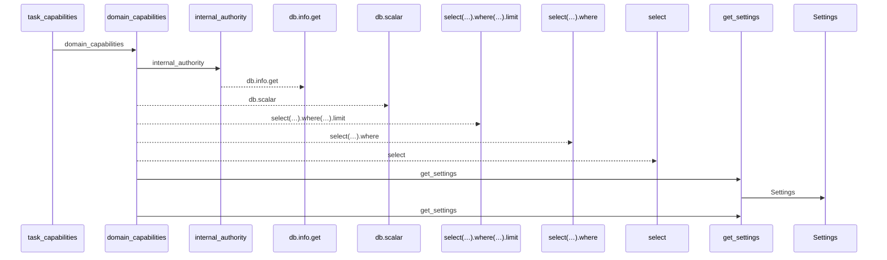
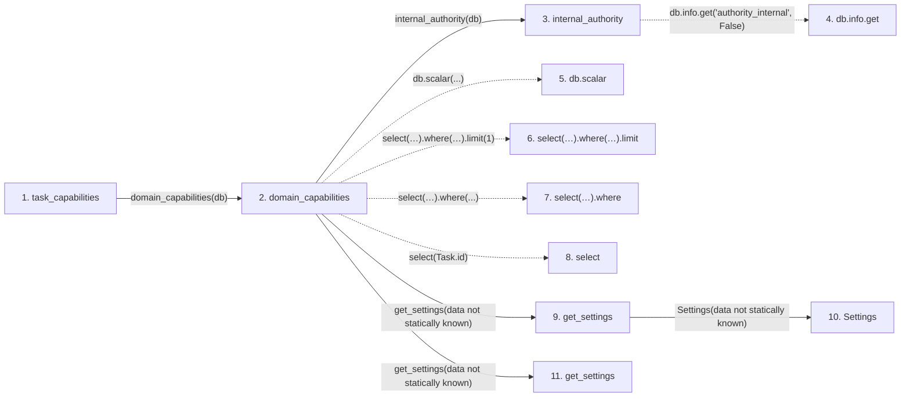

# task_capabilities

**Entry point:** `task_capabilities` (`http`)
**Source:** [routers_task_domain](../modules/routers_task_domain.md)
**Modules touched:** [authority](../modules/authority.md), [config](../modules/config.md), [routers_task_domain](../modules/routers_task_domain.md), [task_domain_service](../modules/task_domain_service.md)

## Call sequence

<!-- Auto-generated from static call edges. Dashed arrows are external or unresolved calls. Reviewed runtime conditions and side effects belong in Behavior. -->

## Data flow

<!-- Auto-generated static analysis. Treat values and boundaries as best-effort hints, not runtime proof. -->

### Step data

| Step | Inputs | Reads | Writes | Returns |
|---|---|---|---|---|
| `task_capabilities` | `db: DB` | - | - | `...` |
| `domain_capabilities` | `db` | - | - | `{...}`, `{...}` |
| `internal_authority` | `db` | - | `db.info[...]`, `db.info[...]` | - |
| `db.info.get` | - | - | - | - |
| `db.scalar` | - | - | - | - |
| `select(…).where(…).limit` | - | - | - | - |
| `select(…).where` | - | - | - | - |
| `select` | - | - | - | - |
| `get_settings` | - | - | - | `Settings(...)` |
| `Settings` | - | - | - | - |
| `get_settings` | - | - | - | `Settings(...)` |

### Call data

| From | To | Line | Call |
|---|---|---:|---|
| task_capabilities | domain_capabilities | 72 | `domain_capabilities(db)` |
| domain_capabilities | internal_authority | 56 | `internal_authority(db)` |
| internal_authority | db.info.get | 87 | `db.info.get('authority_internal', False)` |
| domain_capabilities | db.scalar | 57 | `db.scalar(...)` |
| domain_capabilities | select(…).where(…).limit | 57 | `select(Task.id).where(Task.domain_backfill_version < 1).limit(1)` |
| domain_capabilities | select(…).where | 57 | `select(Task.id).where(...)` |
| domain_capabilities | select | 57 | `select(Task.id)` |
| domain_capabilities | get_settings | 61 | `get_settings(data not statically known)` |
| get_settings | Settings | 481 | `Settings(data not statically known)` |
| domain_capabilities | get_settings | 62 | `get_settings(data not statically known)` |

### Boundary effects

*No boundary effects detected.*

### Static analysis gaps

| Kind | Step | Target | Line |
|---|---|---|---:|
| unresolved_call | `internal_authority` | `db.info.get` | 87 |
| unresolved_call | `domain_capabilities` | `db.scalar` | 57 |
| unresolved_call | `domain_capabilities` | `select(Task.id).where(Task.domain_backfill_version < 1).limit` | 57 |
| unresolved_call | `domain_capabilities` | `select(Task.id).where` | 57 |
| external_call | `domain_capabilities` | `select` | 57 |

## Behavior

This flow starts at `task_capabilities` and is classified as `http`. The generated call and data-flow sections are bounded static projections; runtime conditions and side effects require source-level confirmation.
