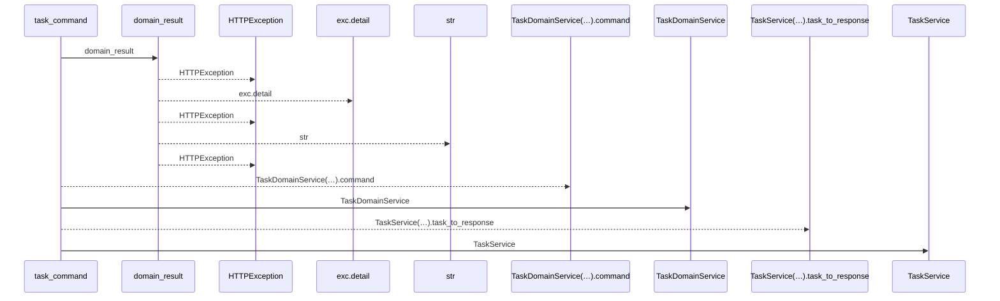
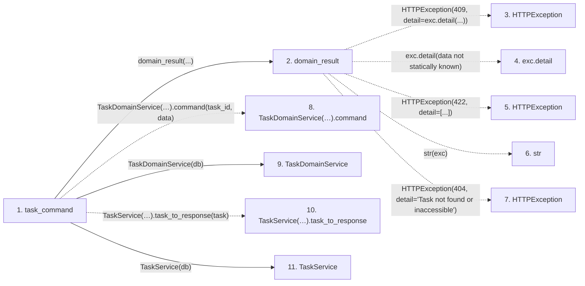

# task_command

**Entry point:** `task_command` (`http`)
**Source:** [routers_task_domain](../modules/routers_task_domain.md)
**Modules touched:** [routers_task_domain](../modules/routers_task_domain.md), [task_domain_service](../modules/task_domain_service.md), [task_service](../modules/task_service.md)

## Call sequence

<!-- Auto-generated from static call edges. Dashed arrows are external or unresolved calls. Reviewed runtime conditions and side effects belong in Behavior. -->

## Data flow

<!-- Auto-generated static analysis. Treat values and boundaries as best-effort hints, not runtime proof. -->

### Step data

| Step | Inputs | Reads | Writes | Returns |
|---|---|---|---|---|
| `task_command` | `task_id: int`, `data: TaskActionRequest`, `db: DB` | - | - | `...` |
| `domain_result` | `awaitable` | `TaskVersionConflictError` | - | `result` |
| `HTTPException` | - | - | - | - |
| `exc.detail` | - | - | - | - |
| `HTTPException` | - | - | - | - |
| `str` | - | - | - | - |
| `HTTPException` | - | - | - | - |
| `TaskDomainService(…).command` | - | - | - | - |
| `TaskDomainService` | - | - | - | - |
| `TaskService(…).task_to_response` | - | - | - | - |
| `TaskService` | - | - | - | - |

### Call data

| From | To | Line | Call |
|---|---|---:|---|
| task_command | domain_result | 137 | `domain_result(...)` |
| domain_result | HTTPException | 29 | `HTTPException(409, detail=exc.detail(...))` |
| domain_result | exc.detail | 29 | `exc.detail(data not statically known)` |
| domain_result | HTTPException | 31 | `HTTPException(422, detail=[...])` |
| domain_result | str | 31 | `str(exc)` |
| domain_result | HTTPException | 33 | `HTTPException(404, detail='Task not found or inaccessible')` |
| task_command | TaskDomainService(…).command | 137 | `TaskDomainService(db).command(task_id, data)` |
| task_command | TaskDomainService | 137 | `TaskDomainService(db)` |
| task_command | TaskService(…).task_to_response | 138 | `TaskService(db).task_to_response(task)` |
| task_command | TaskService | 138 | `TaskService(db)` |

### Boundary effects

*No boundary effects detected.*

### Static analysis gaps

| Kind | Step | Target | Line |
|---|---|---|---:|
| external_call | `domain_result` | `HTTPException` | 29 |
| unresolved_call | `domain_result` | `exc.detail` | 29 |
| external_call | `domain_result` | `HTTPException` | 31 |
| external_call | `domain_result` | `HTTPException` | 33 |
| unresolved_call | `task_command` | `TaskDomainService(db).command` | 137 |
| unresolved_call | `task_command` | `TaskService(db).task_to_response` | 138 |

## Behavior

This flow starts at `task_command` and is classified as `http`. The generated call and data-flow sections are bounded static projections; runtime conditions and side effects require source-level confirmation.
