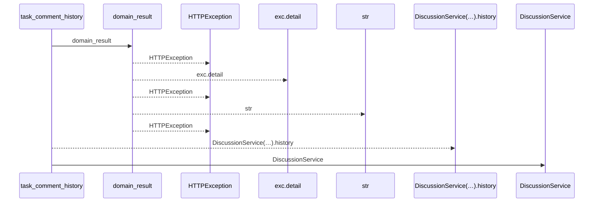
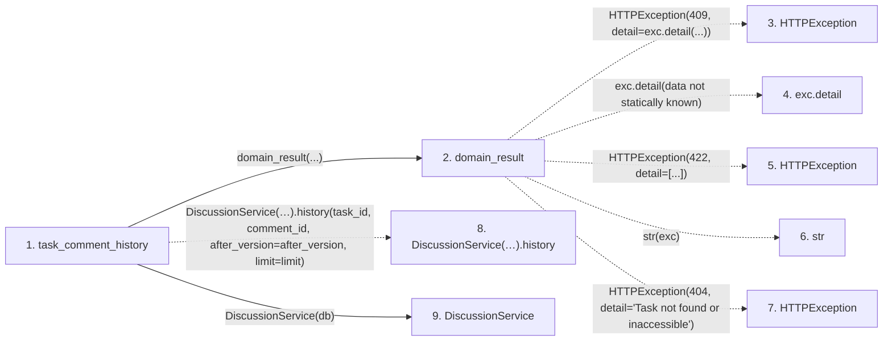

# task_comment_history

**Entry point:** `task_comment_history` (`http`)
**Source:** [routers_discussion](../modules/routers_discussion.md)
**Modules touched:** [discussion_service](../modules/discussion_service.md), [routers_discussion](../modules/routers_discussion.md), [routers_task_domain](../modules/routers_task_domain.md)

## Call sequence

<!-- Auto-generated from static call edges. Dashed arrows are external or unresolved calls. Reviewed runtime conditions and side effects belong in Behavior. -->

## Data flow

<!-- Auto-generated static analysis. Treat values and boundaries as best-effort hints, not runtime proof. -->

### Step data

| Step | Inputs | Reads | Writes | Returns |
|---|---|---|---|---|
| `task_comment_history` | `task_id: int`, `comment_id: int`, `db: DiscussionDatabase`, `after_version: int`, `limit: int` | - | - | `...` |
| `domain_result` | `awaitable` | `TaskVersionConflictError` | - | `result` |
| `HTTPException` | - | - | - | - |
| `exc.detail` | - | - | - | - |
| `HTTPException` | - | - | - | - |
| `str` | - | - | - | - |
| `HTTPException` | - | - | - | - |
| `DiscussionService(…).history` | - | - | - | - |
| `DiscussionService` | - | - | - | - |

### Call data

| From | To | Line | Call |
|---|---|---:|---|
| task_comment_history | domain_result | 60 | `domain_result(...)` |
| domain_result | HTTPException | 29 | `HTTPException(409, detail=exc.detail(...))` |
| domain_result | exc.detail | 29 | `exc.detail(data not statically known)` |
| domain_result | HTTPException | 31 | `HTTPException(422, detail=[...])` |
| domain_result | str | 31 | `str(exc)` |
| domain_result | HTTPException | 33 | `HTTPException(404, detail='Task not found or inaccessible')` |
| task_comment_history | DiscussionService(…).history | 60 | `DiscussionService(db).history(task_id, comment_id, after_version=after_version, limit=limit)` |
| task_comment_history | DiscussionService | 60 | `DiscussionService(db)` |

### Boundary effects

*No boundary effects detected.*

### Static analysis gaps

| Kind | Step | Target | Line |
|---|---|---|---:|
| external_call | `domain_result` | `HTTPException` | 29 |
| unresolved_call | `domain_result` | `exc.detail` | 29 |
| external_call | `domain_result` | `HTTPException` | 31 |
| external_call | `domain_result` | `HTTPException` | 33 |
| unresolved_call | `task_comment_history` | `DiscussionService(db).history` | 60 |

## Behavior

Reads bounded immutable revisions only after authorizing the original task scope and comment identity. Discussion history is separate from progress and review verdicts.
