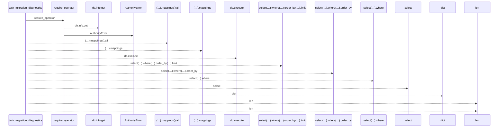
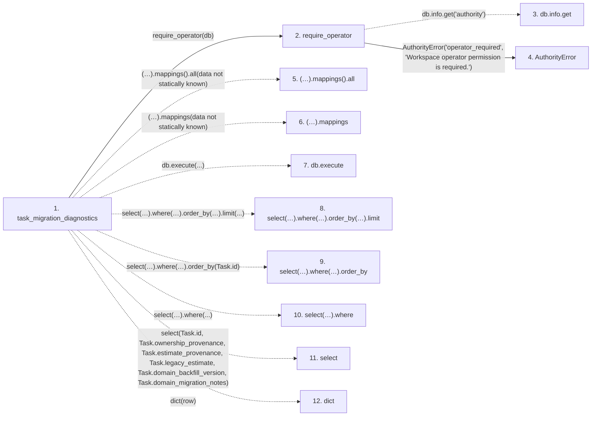

# task_migration_diagnostics

**Entry point:** `task_migration_diagnostics` (`http`)
**Source:** [routers_task_domain](../modules/routers_task_domain.md)
**Modules touched:** [authority](../modules/authority.md), [routers_task_domain](../modules/routers_task_domain.md)

## Call sequence

<!-- Auto-generated from static call edges. Dashed arrows are external or unresolved calls. Reviewed runtime conditions and side effects belong in Behavior. -->

## Data flow

<!-- Auto-generated static analysis. Treat values and boundaries as best-effort hints, not runtime proof. -->

### Step data

| Step | Inputs | Reads | Writes | Returns |
|---|---|---|---|---|
| `task_migration_diagnostics` | `db: DB`, `after_id: int`, `limit: int` | - | - | `{...}` |
| `require_operator` | `db` | - | - | - |
| `db.info.get` | - | - | - | - |
| `AuthorityError` | - | - | - | - |
| `(…).mappings().all` | - | - | - | - |
| `(…).mappings` | - | - | - | - |
| `db.execute` | - | - | - | - |
| `select(…).where(…).order_by(…).limit` | - | - | - | - |
| `select(…).where(…).order_by` | - | - | - | - |
| `select(…).where` | - | - | - | - |
| `select` | - | - | - | - |
| `dict` | - | - | - | - |

### Call data

| From | To | Line | Call |
|---|---|---:|---|
| task_migration_diagnostics | require_operator | 91 | `require_operator(db)` |
| require_operator | db.info.get | 79 | `db.info.get('authority')` |
| require_operator | AuthorityError | 81 | `AuthorityError('operator_required', 'Workspace operator permission is required.')` |
| task_migration_diagnostics | (…).mappings().all | 92 | `(await db.execute(select(Task.id, Task.ownership_provenance, Task.estimate_provenance, Task.legacy_estimate, Task.domain_backfill_version, Task.domain_migration_notes).where(Task.id > after_id).order_by(Task.id).limit(limit + 1))).mappings().all(data not statically known)` |
| task_migration_diagnostics | (…).mappings | 92 | `(await db.execute(select(Task.id, Task.ownership_provenance, Task.estimate_provenance, Task.legacy_estimate, Task.domain_backfill_version, Task.domain_migration_notes).where(Task.id > after_id).order_by(Task.id).limit(limit + 1))).mappings(data not statically known)` |
| task_migration_diagnostics | db.execute | 92 | `db.execute(...)` |
| task_migration_diagnostics | select(…).where(…).order_by(…).limit | 92 | `select(Task.id, Task.ownership_provenance, Task.estimate_provenance, Task.legacy_estimate, Task.domain_backfill_version, Task.domain_migration_notes).where(Task.id > after_id).order_by(Task.id).limit(...)` |
| task_migration_diagnostics | select(…).where(…).order_by | 92 | `select(Task.id, Task.ownership_provenance, Task.estimate_provenance, Task.legacy_estimate, Task.domain_backfill_version, Task.domain_migration_notes).where(Task.id > after_id).order_by(Task.id)` |
| task_migration_diagnostics | select(…).where | 92 | `select(Task.id, Task.ownership_provenance, Task.estimate_provenance, Task.legacy_estimate, Task.domain_backfill_version, Task.domain_migration_notes).where(...)` |
| task_migration_diagnostics | select | 92 | `select(Task.id, Task.ownership_provenance, Task.estimate_provenance, Task.legacy_estimate, Task.domain_backfill_version, Task.domain_migration_notes)` |
| task_migration_diagnostics | dict | 94 | `dict(row)` |

### Boundary effects

*No boundary effects detected.*

### Static analysis gaps

| Kind | Step | Target | Line |
|---|---|---|---:|
| unresolved_call | `require_operator` | `db.info.get` | 79 |
| unresolved_call | `task_migration_diagnostics` | `(await db.execute(select(Task.id, Task.ownership_provenance, Task.estimate_provenance, Task.legacy_estimate, Task.domain_backfill_version, Task.domain_migration_notes).where(Task.id > after_id).order_by(Task.id).limit(limit + 1))).mappings().all` | 92 |
| unresolved_call | `task_migration_diagnostics` | `(await db.execute(select(Task.id, Task.ownership_provenance, Task.estimate_provenance, Task.legacy_estimate, Task.domain_backfill_version, Task.domain_migration_notes).where(Task.id > after_id).order_by(Task.id).limit(limit + 1))).mappings` | 92 |
| unresolved_call | `task_migration_diagnostics` | `db.execute` | 92 |
| unresolved_call | `task_migration_diagnostics` | `select(Task.id, Task.ownership_provenance, Task.estimate_provenance, Task.legacy_estimate, Task.domain_backfill_version, Task.domain_migration_notes).where(Task.id > after_id).order_by(Task.id).limit` | 92 |
| unresolved_call | `task_migration_diagnostics` | `select(Task.id, Task.ownership_provenance, Task.estimate_provenance, Task.legacy_estimate, Task.domain_backfill_version, Task.domain_migration_notes).where(Task.id > after_id).order_by` | 92 |
| unresolved_call | `task_migration_diagnostics` | `select(Task.id, Task.ownership_provenance, Task.estimate_provenance, Task.legacy_estimate, Task.domain_backfill_version, Task.domain_migration_notes).where` | 92 |
| external_call | `task_migration_diagnostics` | `select` | 92 |
| step_limit | `task_migration_diagnostics` | `first 12 steps` | 0 |

## Behavior

This flow starts at `task_migration_diagnostics` and is classified as `http`. The generated call and data-flow sections are bounded static projections; runtime conditions and side effects require source-level confirmation.
