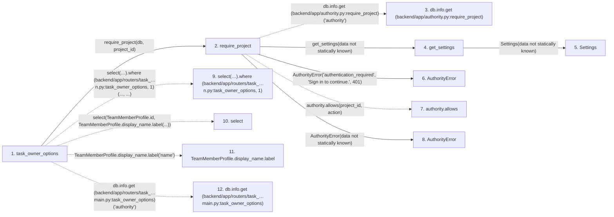

# task_owner_options

**Entry point:** `task_owner_options` (`http`)
**Source:** [routers_task_domain](../modules/routers_task_domain.md)
**Modules touched:** [authority](../modules/authority.md), [config](../modules/config.md), [routers_task_domain](../modules/routers_task_domain.md)

## Call sequence

```mermaid
sequenceDiagram
    participant p0 as task_owner_options
    participant p1 as require_project
    participant p2 as db.info.get (backend/app/authority.py:require_project)
    participant p3 as get_settings
    participant p4 as Settings
    participant p5 as AuthorityError
    participant p6 as authority.allows
    participant p7 as select(…).where (backend/app/routers/task_…n.py:task_owner_options, 1)
    participant p8 as select
    participant p9 as TeamMemberProfile.display_name.label
    participant p10 as db.info.get (backend/app/routers/task_…main.py:task_owner_options)
    participant p11 as select(…).where (backend/app/routers/task_…main.py:task_owner_options)
    participant p12 as ProjectMembership.role.in_
    participant p13 as select(…).where (backend/app/routers/task_…n.py:task_owner_options, 2)
    participant p14 as WorkspaceMembership.role.in_
    participant p15 as query.join(…).join(…).where
    participant p16 as query.join(…).join
    participant p17 as query.join
    participant p18 as Principal.enabled.is_
    participant p19 as or_
    participant p20 as Principal.id.in_
    participant p21 as internal_authority
    participant p22 as db.info.get (backend/app/authority.py:internal_authority)
    participant p23 as (…).mappings().all
    participant p24 as (…).mappings
    participant p25 as db.execute
    participant p26 as query.order_by(…).limit
    p0->>p1: require_project
    p1-->>p2: db.info.get (backend/app/authority.py:require_project)
    p1->>p3: get_settings
    p3->>p4: Settings
    p1->>p5: AuthorityError
    p1-->>p6: authority.allows
    p1->>p5: AuthorityError
    p0-->>p7: select(…).where (backend/app/routers/task_…n.py:task_owner_options, 1)
    p0-->>p8: select
    p0-->>p9: TeamMemberProfile.display_name.label
    p0-->>p10: db.info.get (backend/app/routers/task_…main.py:task_owner_options)
    p0-->>p11: select(…).where (backend/app/routers/task_…main.py:task_owner_options)
    p0-->>p8: select
    p0-->>p12: ProjectMembership.role.in_
    p0-->>p13: select(…).where (backend/app/routers/task_…n.py:task_owner_options, 2)
    p0-->>p8: select
    p0-->>p14: WorkspaceMembership.role.in_
    p0-->>p15: query.join(…).join(…).where
    p0-->>p16: query.join(…).join
    p0-->>p17: query.join
    p0-->>p18: Principal.enabled.is_
    p0-->>p19: or_
    p0-->>p20: Principal.id.in_
    p0-->>p20: Principal.id.in_
    p0->>p21: internal_authority
    p21-->>p22: db.info.get (backend/app/authority.py:internal_authority)
    p0-->>p23: (…).mappings().all
    p0-->>p24: (…).mappings
    p0-->>p25: db.execute
    p0-->>p26: query.order_by(…).limit
```

<!-- Auto-generated from static call edges. Dashed arrows are external or unresolved calls. Reviewed runtime conditions and side effects belong in Behavior. -->

> Call sequence diagram shows 30 of 34 interactions; 4 omitted to keep the visualization within the 30-interaction and generated-diagram limits.

## Data flow

<!-- Auto-generated static analysis. Treat values and boundaries as best-effort hints, not runtime proof. -->

### Step data

| Step | Inputs | Reads | Writes | Returns |
|---|---|---|---|---|
| `task_owner_options` | `db: DB`, `project_id: int \| None`, `after_id: int`, `limit: int` | - | - | `{...}` |
| `require_project` | `db`, `project_id`, `action` | - | - | `none` |
| `db.info.get (backend/app/authority.py:require_project)` | - | - | - | - |
| `get_settings` | - | - | - | `Settings(...)` |
| `Settings` | - | - | - | - |
| `AuthorityError` | - | - | - | - |
| `authority.allows` | - | - | - | - |
| `AuthorityError` | - | - | - | - |
| `select(…).where (backend/app/routers/task_…n.py:task_owner_options, 1)` | - | - | - | - |
| `select` | - | - | - | - |
| `TeamMemberProfile.display_name.label` | - | - | - | - |
| `db.info.get (backend/app/routers/task_…main.py:task_owner_options)` | - | - | - | - |

### Call data

| From | To | Line | Call |
|---|---|---:|---|
| task_owner_options | require_project | 89 | `require_project(db, project_id)` |
| require_project | db.info.get (backend/app/authority.py:require_project) | 69 | `db.info.get('authority')` |
| require_project | get_settings | 71 | `get_settings(data not statically known)` |
| get_settings | Settings | 480 | `Settings(data not statically known)` |
| require_project | AuthorityError | 73 | `AuthorityError('authentication_required', 'Sign in to continue.', 401)` |
| require_project | authority.allows | 74 | `authority.allows(project_id, action)` |
| require_project | AuthorityError | 75 | `AuthorityError(data not statically known)` |
| task_owner_options | select(…).where (backend/app/routers/task_…n.py:task_owner_options, 1) | 90 | `select(TeamMemberProfile.id, TeamMemberProfile.display_name.label('name')).where(..., ...)` |
| task_owner_options | select | 90 | `select(TeamMemberProfile.id, TeamMemberProfile.display_name.label(...))` |
| task_owner_options | TeamMemberProfile.display_name.label | 90 | `TeamMemberProfile.display_name.label('name')` |
| task_owner_options | db.info.get (backend/app/routers/task_…main.py:task_owner_options) | 91 | `db.info.get('authority')` |

### Boundary effects

*No boundary effects detected.*

### Static analysis gaps

| Kind | Step | Target | Line |
|---|---|---|---:|
| unresolved_call | `require_project` | `db.info.get` | 69 |
| unresolved_call | `require_project` | `authority.allows` | 74 |
| unresolved_call | `task_owner_options` | `select(TeamMemberProfile.id, TeamMemberProfile.display_name.label('name')).where` | 90 |
| external_call | `task_owner_options` | `select` | 90 |
| unresolved_call | `task_owner_options` | `TeamMemberProfile.display_name.label` | 90 |
| unresolved_call | `task_owner_options` | `db.info.get` | 91 |
| step_limit | `task_owner_options` | `first 12 steps` | 0 |

## Behavior

This flow starts at `task_owner_options` and is classified as `http`. The generated call and data-flow sections are bounded static projections; runtime conditions and side effects require source-level confirmation.
