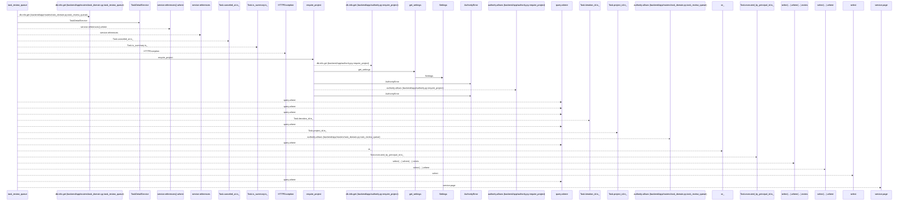
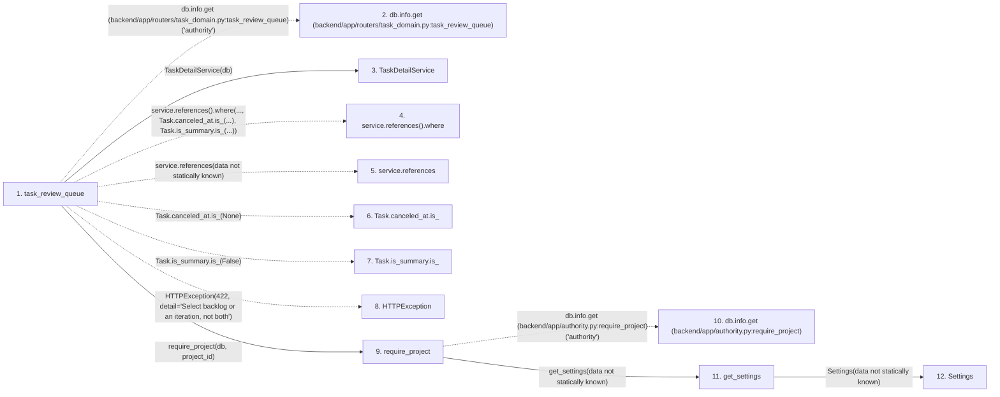

# task_review_queue

**Entry point:** `task_review_queue` (`http`)
**Source:** [routers_task_domain](../modules/routers_task_domain.md)
**Modules touched:** [authority](../modules/authority.md), [config](../modules/config.md), [routers_task_domain](../modules/routers_task_domain.md), [task_detail_service](../modules/task_detail_service.md)

## Call sequence

<!-- Auto-generated from static call edges. Dashed arrows are external or unresolved calls. Reviewed runtime conditions and side effects belong in Behavior. -->

## Data flow

<!-- Auto-generated static analysis. Treat values and boundaries as best-effort hints, not runtime proof. -->

### Step data

| Step | Inputs | Reads | Writes | Returns |
|---|---|---|---|---|
| `task_review_queue` | `db: DB`, `limit: int`, `after_id: int`, `project_id: int \| None`, `iteration_id: int \| None`, `backlog_only: bool` | `Task`, `Task`, `Task`, `Task` | - | `...` |
| `db.info.get (backend/app/routers/task_domain.py:task_review_queue)` | - | - | - | - |
| `TaskDetailService` | - | - | - | - |
| `service.references().where` | - | - | - | - |
| `service.references` | - | - | - | - |
| `Task.canceled_at.is_` | - | - | - | - |
| `Task.is_summary.is_` | - | - | - | - |
| `HTTPException` | - | - | - | - |
| `require_project` | `db`, `project_id`, `action` | - | - | `none` |
| `db.info.get (backend/app/authority.py:require_project)` | - | - | - | - |
| `get_settings` | - | - | - | `Settings(...)` |
| `Settings` | - | - | - | - |

### Call data

| From | To | Line | Call |
|---|---|---:|---|
| task_review_queue | db.info.get (backend/app/routers/task_domain.py:task_review_queue) | 140 | `db.info.get('authority')` |
| task_review_queue | TaskDetailService | 141 | `TaskDetailService(db)` |
| task_review_queue | service.references().where | 142 | `service.references().where(..., Task.canceled_at.is_(...), Task.is_summary.is_(...))` |
| task_review_queue | service.references | 142 | `service.references(data not statically known)` |
| task_review_queue | Task.canceled_at.is_ | 142 | `Task.canceled_at.is_(None)` |
| task_review_queue | Task.is_summary.is_ | 142 | `Task.is_summary.is_(False)` |
| task_review_queue | HTTPException | 144 | `HTTPException(422, detail='Select backlog or an iteration, not both')` |
| task_review_queue | require_project | 147 | `require_project(db, project_id)` |
| require_project | db.info.get (backend/app/authority.py:require_project) | 69 | `db.info.get('authority')` |
| require_project | get_settings | 71 | `get_settings(data not statically known)` |
| get_settings | Settings | 481 | `Settings(data not statically known)` |

### Boundary effects

*No boundary effects detected.*

### Static analysis gaps

| Kind | Step | Target | Line |
|---|---|---|---:|
| unresolved_call | `task_review_queue` | `db.info.get` | 140 |
| unresolved_call | `task_review_queue` | `service.references().where` | 142 |
| unresolved_call | `task_review_queue` | `service.references` | 142 |
| unresolved_call | `task_review_queue` | `Task.canceled_at.is_` | 142 |
| unresolved_call | `task_review_queue` | `Task.is_summary.is_` | 142 |
| external_call | `task_review_queue` | `HTTPException` | 144 |
| unresolved_call | `require_project` | `db.info.get` | 69 |
| step_limit | `task_review_queue` | `first 12 steps` | 0 |

## Behavior

Returns a bounded independent-review queue under current project review permissions. Scope filters apply before pagination. The executing principal and current progress author are excluded; an unlinked human profile does not substitute for a missing principal or review permission.
