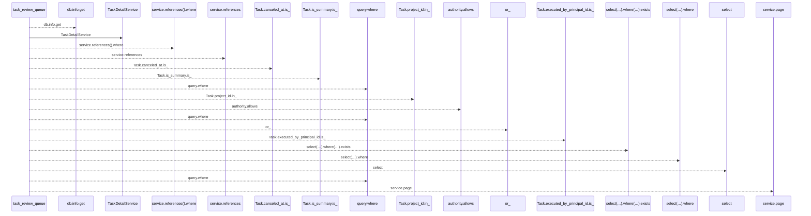
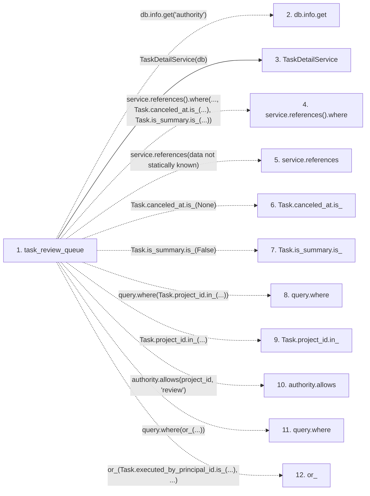

# task_review_queue

**Entry point:** `task_review_queue` (`http`)
**Source:** [routers_task_domain](../modules/routers_task_domain.md)
**Modules touched:** [routers_task_domain](../modules/routers_task_domain.md), [task_detail_service](../modules/task_detail_service.md)

## Call sequence

<!-- Auto-generated from static call edges. Dashed arrows are external or unresolved calls. Reviewed runtime conditions and side effects belong in Behavior. -->

## Data flow

<!-- Auto-generated static analysis. Treat values and boundaries as best-effort hints, not runtime proof. -->

### Step data

| Step | Inputs | Reads | Writes | Returns |
|---|---|---|---|---|
| `task_review_queue` | `db: DB`, `limit: int`, `after_id: int` | `Task`, `Task` | - | `...` |
| `db.info.get` | - | - | - | - |
| `TaskDetailService` | - | - | - | - |
| `service.references().where` | - | - | - | - |
| `service.references` | - | - | - | - |
| `Task.canceled_at.is_` | - | - | - | - |
| `Task.is_summary.is_` | - | - | - | - |
| `query.where` | - | - | - | - |
| `Task.project_id.in_` | - | - | - | - |
| `authority.allows` | - | - | - | - |
| `query.where` | - | - | - | - |
| `or_` | - | - | - | - |

### Call data

| From | To | Line | Call |
|---|---|---:|---|
| task_review_queue | db.info.get | 86 | `db.info.get('authority')` |
| task_review_queue | TaskDetailService | 87 | `TaskDetailService(db)` |
| task_review_queue | service.references().where | 88 | `service.references().where(..., Task.canceled_at.is_(...), Task.is_summary.is_(...))` |
| task_review_queue | service.references | 88 | `service.references(data not statically known)` |
| task_review_queue | Task.canceled_at.is_ | 88 | `Task.canceled_at.is_(None)` |
| task_review_queue | Task.is_summary.is_ | 88 | `Task.is_summary.is_(False)` |
| task_review_queue | query.where | 91 | `query.where(Task.project_id.in_(...))` |
| task_review_queue | Task.project_id.in_ | 91 | `Task.project_id.in_(...)` |
| task_review_queue | authority.allows | 91 | `authority.allows(project_id, 'review')` |
| task_review_queue | query.where | 93 | `query.where(or_(...))` |
| task_review_queue | or_ | 93 | `or_(Task.executed_by_principal_id.is_(...), ...)` |

### Boundary effects

*No boundary effects detected.*

### Static analysis gaps

| Kind | Step | Target | Line |
|---|---|---|---:|
| unresolved_call | `task_review_queue` | `db.info.get` | 86 |
| unresolved_call | `task_review_queue` | `service.references().where` | 88 |
| unresolved_call | `task_review_queue` | `service.references` | 88 |
| unresolved_call | `task_review_queue` | `Task.canceled_at.is_` | 88 |
| unresolved_call | `task_review_queue` | `Task.is_summary.is_` | 88 |
| unresolved_call | `task_review_queue` | `query.where` | 91 |
| unresolved_call | `task_review_queue` | `Task.project_id.in_` | 91 |
| unresolved_call | `task_review_queue` | `authority.allows` | 91 |
| unresolved_call | `task_review_queue` | `query.where` | 93 |
| external_call | `task_review_queue` | `or_` | 93 |
| step_limit | `task_review_queue` | `first 12 steps` | 0 |

## Behavior

This flow starts at `task_review_queue` and is classified as `http`. The generated call and data-flow sections are bounded static projections; runtime conditions and side effects require source-level confirmation.
