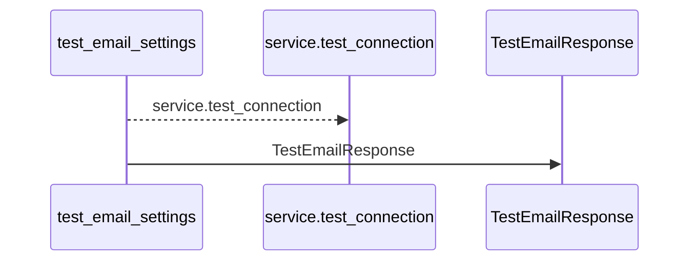
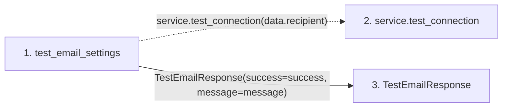

# test_email_settings

**Entry point:** `test_email_settings` (`http`)
**Source:** [routers_email_settings](../modules/routers_email_settings.md)
**Modules touched:** [routers_email_settings](../modules/routers_email_settings.md), [schemas_email_settings](../modules/schemas_email_settings.md)

## Call sequence

<!-- Auto-generated from static call edges. Dashed arrows are external or unresolved calls. Reviewed runtime conditions and side effects belong in Behavior. -->

## Data flow

<!-- Auto-generated static analysis. Treat values and boundaries as best-effort hints, not runtime proof. -->

### Step data

| Step | Inputs | Reads | Writes | Returns |
|---|---|---|---|---|
| `test_email_settings` | `data: TestEmailRequest`, `service: Annotated[EmailSettingsService, Depends(get_settings_service)]` | - | - | `TestEmailResponse(...)` |
| `service.test_connection` | - | - | - | - |
| `TestEmailResponse` | - | - | - | - |

### Call data

| From | To | Line | Call |
|---|---|---:|---|
| test_email_settings | service.test_connection | 99 | `service.test_connection(data.recipient)` |
| test_email_settings | TestEmailResponse | 101 | `TestEmailResponse(success=success, message=message)` |

### Boundary effects

*No boundary effects detected.*

### Static analysis gaps

| Kind | Step | Target | Line |
|---|---|---|---:|
| unresolved_call | `test_email_settings` | `service.test_connection` | 99 |

## Behavior

This flow starts at `test_email_settings` and is classified as `http`. The generated call and data-flow sections are bounded static projections; runtime conditions and side effects require source-level confirmation.
