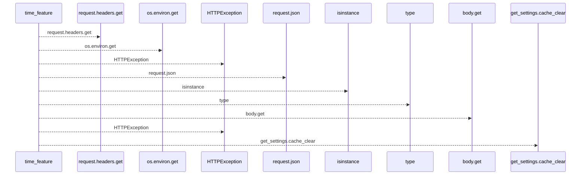
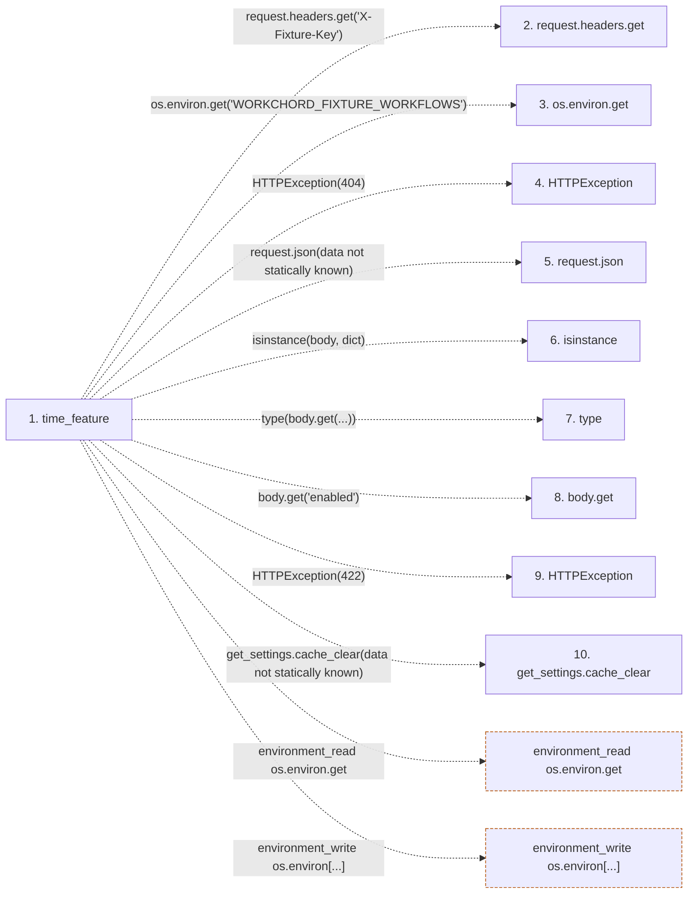

# time_feature

**Entry point:** `time_feature` (`http`)
**Source:** [serve_disposable_api](../modules/serve_disposable_api.md)
**Modules touched:** [serve_disposable_api](../modules/serve_disposable_api.md)

## Call sequence

<!-- Auto-generated from static call edges. Dashed arrows are external or unresolved calls. Reviewed runtime conditions and side effects belong in Behavior. -->

## Data flow

<!-- Auto-generated static analysis. Treat values and boundaries as best-effort hints, not runtime proof. -->

### Step data

| Step | Inputs | Reads | Writes | Returns |
|---|---|---|---|---|
| `time_feature` | `request: Request`, `task_id: int` | - | `os.environ[...]` | `{...}` |
| `request.headers.get` | - | - | - | - |
| `os.environ.get` | - | - | - | - |
| `HTTPException` | - | - | - | - |
| `request.json` | - | - | - | - |
| `isinstance` | - | - | - | - |
| `type` | - | - | - | - |
| `body.get` | - | - | - | - |
| `HTTPException` | - | - | - | - |
| `get_settings.cache_clear` | - | - | - | - |

### Call data

| From | To | Line | Call |
|---|---|---:|---|
| time_feature | request.headers.get | 78 | `request.headers.get('X-Fixture-Key')` |
| time_feature | os.environ.get | 78 | `os.environ.get('WORKCHORD_FIXTURE_WORKFLOWS')` |
| time_feature | HTTPException | 79 | `HTTPException(404)` |
| time_feature | request.json | 80 | `request.json(data not statically known)` |
| time_feature | isinstance | 81 | `isinstance(body, dict)` |
| time_feature | type | 81 | `type(body.get(...))` |
| time_feature | body.get | 81 | `body.get('enabled')` |
| time_feature | HTTPException | 82 | `HTTPException(422)` |
| time_feature | get_settings.cache_clear | 85 | `get_settings.cache_clear(data not statically known)` |

### Boundary effects

| Kind | Target | Step | Line |
|---|---|---|---:|
| environment_read | `os.environ.get` | `time_feature` | 78 |
| environment_write | `os.environ[...]` | `time_feature` | 84 |

### Static analysis gaps

| Kind | Step | Target | Line |
|---|---|---|---:|
| unresolved_call | `time_feature` | `HTTPException` | 79 |
| unresolved_call | `time_feature` | `request.json` | 80 |
| external_call | `time_feature` | `isinstance` | 81 |
| external_call | `time_feature` | `type` | 81 |
| unresolved_call | `time_feature` | `body.get` | 81 |
| unresolved_call | `time_feature` | `HTTPException` | 82 |
| unresolved_call | `time_feature` | `get_settings.cache_clear` | 85 |

## Behavior

This flow starts at `time_feature` and is classified as `http`. The generated call and data-flow sections are bounded static projections; runtime conditions and side effects require source-level confirmation.
