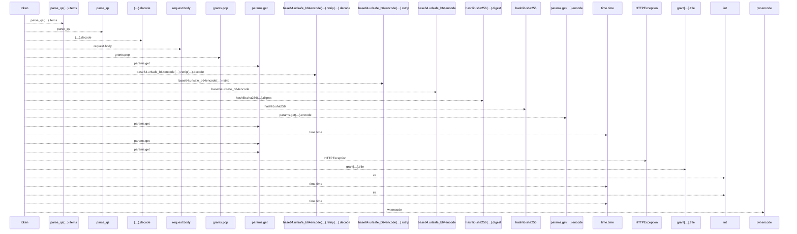
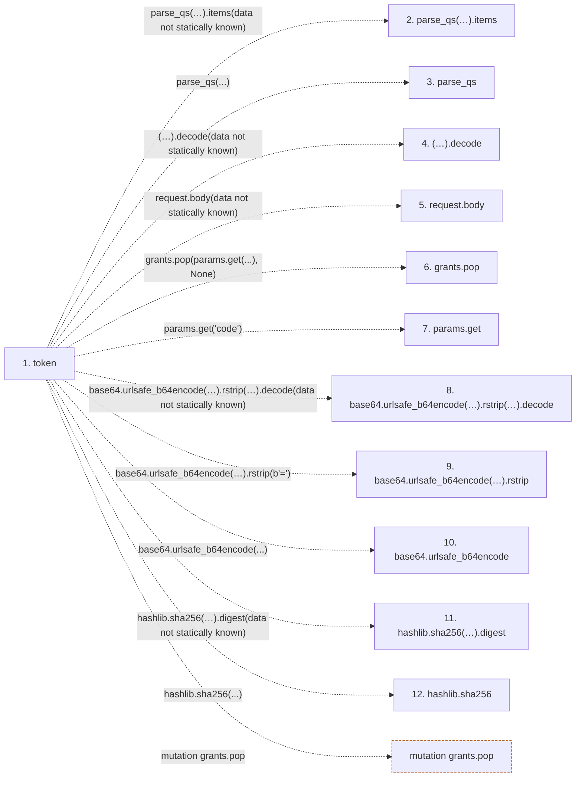

# token

**Entry point:** `token` (`http`)
**Source:** [serve_disposable_oidc](../modules/serve_disposable_oidc.md)
**Modules touched:** [serve_disposable_oidc](../modules/serve_disposable_oidc.md)

## Call sequence

<!-- Auto-generated from static call edges. Dashed arrows are external or unresolved calls. Reviewed runtime conditions and side effects belong in Behavior. -->

## Data flow

<!-- Auto-generated static analysis. Treat values and boundaries as best-effort hints, not runtime proof. -->

### Step data

| Step | Inputs | Reads | Writes | Returns |
|---|---|---|---|---|
| `token` | `request: Request` | `redirect_uri`, `issuer`, `key`, `jwk` | - | `{...}` |
| `parse_qs(…).items` | - | - | - | - |
| `parse_qs` | - | - | - | - |
| `(…).decode` | - | - | - | - |
| `request.body` | - | - | - | - |
| `grants.pop` | - | - | - | - |
| `params.get` | - | - | - | - |
| `base64.urlsafe_b64encode(…).rstrip(…).decode` | - | - | - | - |
| `base64.urlsafe_b64encode(…).rstrip` | - | - | - | - |
| `base64.urlsafe_b64encode` | - | - | - | - |
| `hashlib.sha256(…).digest` | - | - | - | - |
| `hashlib.sha256` | - | - | - | - |

### Call data

| From | To | Line | Call |
|---|---|---:|---|
| token | parse_qs(…).items | 62 | `parse_qs((await request.body()).decode()).items(data not statically known)` |
| token | parse_qs | 62 | `parse_qs(...)` |
| token | (…).decode | 62 | `(await request.body()).decode(data not statically known)` |
| token | request.body | 62 | `request.body(data not statically known)` |
| token | grants.pop | 63 | `grants.pop(params.get(...), None)` |
| token | params.get | 63 | `params.get('code')` |
| token | base64.urlsafe_b64encode(…).rstrip(…).decode | 64 | `base64.urlsafe_b64encode(hashlib.sha256(params.get('code_verifier', '').encode()).digest()).rstrip(b'=').decode(data not statically known)` |
| token | base64.urlsafe_b64encode(…).rstrip | 64 | `base64.urlsafe_b64encode(hashlib.sha256(params.get('code_verifier', '').encode()).digest()).rstrip(b'=')` |
| token | base64.urlsafe_b64encode | 64 | `base64.urlsafe_b64encode(...)` |
| token | hashlib.sha256(…).digest | 64 | `hashlib.sha256(params.get('code_verifier', '').encode()).digest(data not statically known)` |
| token | hashlib.sha256 | 64 | `hashlib.sha256(...)` |

### Boundary effects

| Kind | Target | Step | Line |
|---|---|---|---:|
| mutation | `grants.pop` | `token` | 63 |

### Static analysis gaps

| Kind | Step | Target | Line |
|---|---|---|---:|
| unresolved_call | `token` | `parse_qs((await request.body()).decode()).items` | 62 |
| external_call | `token` | `parse_qs` | 62 |
| unresolved_call | `token` | `(await request.body()).decode` | 62 |
| unresolved_call | `token` | `request.body` | 62 |
| unresolved_call | `token` | `base64.urlsafe_b64encode(hashlib.sha256(params.get('code_verifier', '').encode()).digest()).rstrip(b'=').decode` | 64 |
| unresolved_call | `token` | `base64.urlsafe_b64encode(hashlib.sha256(params.get('code_verifier', '').encode()).digest()).rstrip` | 64 |
| external_call | `token` | `base64.urlsafe_b64encode` | 64 |
| unresolved_call | `token` | `hashlib.sha256(params.get('code_verifier', '').encode()).digest` | 64 |
| external_call | `token` | `hashlib.sha256` | 64 |
| step_limit | `token` | `first 12 steps` | 0 |

## Behavior

This flow starts at `token` and is classified as `http`. The generated call and data-flow sections are bounded static projections; runtime conditions and side effects require source-level confirmation.
