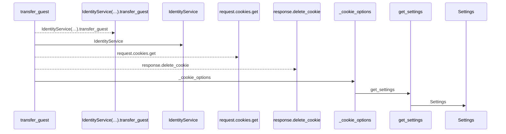
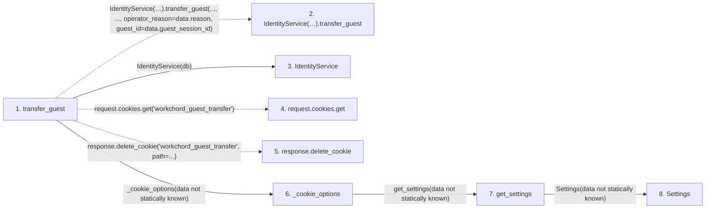

# transfer_guest

**Entry point:** `transfer_guest` (`http`)
**Source:** [routers_identity](../modules/routers_identity.md)
**Modules touched:** [config](../modules/config.md), [identity_service](../modules/identity_service.md), [routers_identity](../modules/routers_identity.md), [session_service](../modules/session_service.md)

## Call sequence

<!-- Auto-generated from static call edges. Dashed arrows are external or unresolved calls. Reviewed runtime conditions and side effects belong in Behavior. -->

## Data flow

<!-- Auto-generated static analysis. Treat values and boundaries as best-effort hints, not runtime proof. -->

### Step data

| Step | Inputs | Reads | Writes | Returns |
|---|---|---|---|---|
| `transfer_guest` | `data: GuestTransferRequest`, `request: Request`, `response: Response`, `db: Database` | - | - | `result` |
| `IdentityService(…).transfer_guest` | - | - | - | - |
| `IdentityService` | - | - | - | - |
| `request.cookies.get` | - | - | - | - |
| `response.delete_cookie` | - | - | - | - |
| `_cookie_options` | - | - | - | `{...}` |
| `get_settings` | - | - | - | `Settings(...)` |
| `Settings` | - | - | - | - |

### Call data

| From | To | Line | Call |
|---|---|---:|---|
| transfer_guest | IdentityService(…).transfer_guest | 286 | `IdentityService(db).transfer_guest(..., ..., operator_reason=data.reason, guest_id=data.guest_session_id)` |
| transfer_guest | IdentityService | 286 | `IdentityService(db)` |
| transfer_guest | request.cookies.get | 286 | `request.cookies.get('workchord_guest_transfer')` |
| transfer_guest | response.delete_cookie | 288 | `response.delete_cookie('workchord_guest_transfer', path=...)` |
| transfer_guest | _cookie_options | 288 | `_cookie_options(data not statically known)` |
| _cookie_options | get_settings | 37 | `get_settings(data not statically known)` |
| get_settings | Settings | 481 | `Settings(data not statically known)` |

### Boundary effects

*No boundary effects detected.*

### Static analysis gaps

| Kind | Step | Target | Line |
|---|---|---|---:|
| unresolved_call | `transfer_guest` | `IdentityService(db).transfer_guest` | 286 |
| unresolved_call | `transfer_guest` | `request.cookies.get` | 286 |
| unresolved_call | `transfer_guest` | `response.delete_cookie` | 288 |

## Behavior

This flow starts at `transfer_guest` and is classified as `http`. The generated call and data-flow sections are bounded static projections; runtime conditions and side effects require source-level confirmation.

Transfers supported guest-owned personal data only with current guest-token proof or reasoned operator recovery. Attribution stays on its original anonymous session; public links rotate and the guest token is revoked.
