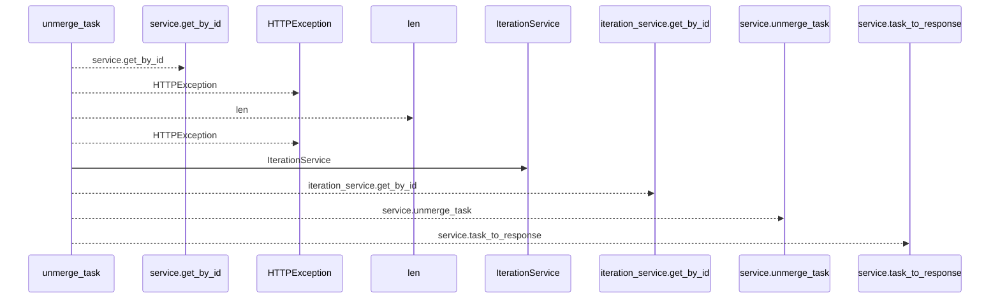
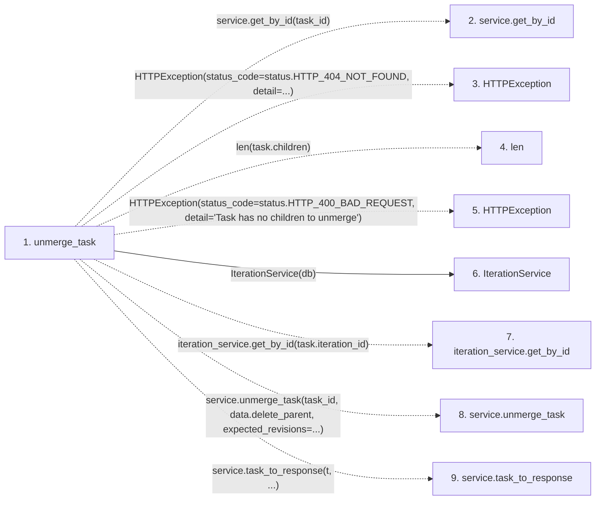

# unmerge_task

**Entry point:** `unmerge_task` (`http`)
**Source:** [tasks](../modules/tasks.md)
**Modules touched:** [iteration_service](../modules/iteration_service.md), [tasks](../modules/tasks.md)

## Call sequence

<!-- Auto-generated from static call edges. Dashed arrows are external or unresolved calls. Reviewed runtime conditions and side effects belong in Behavior. -->

## Data flow

<!-- Auto-generated static analysis. Treat values and boundaries as best-effort hints, not runtime proof. -->

### Step data

| Step | Inputs | Reads | Writes | Returns |
|---|---|---|---|---|
| `unmerge_task` | `task_id: int`, `data: TaskUnmerge`, `service: Annotated[TaskService, Depends(get_task_service)]`, `db: Annotated[AsyncSession, Depends(get_db, scope='function')]` | `status`, `status` | - | `...` |
| `service.get_by_id` | - | - | - | - |
| `HTTPException` | - | - | - | - |
| `len` | - | - | - | - |
| `HTTPException` | - | - | - | - |
| `IterationService` | - | - | - | - |
| `iteration_service.get_by_id` | - | - | - | - |
| `service.unmerge_task` | - | - | - | - |
| `service.task_to_response` | - | - | - | - |

### Call data

| From | To | Line | Call |
|---|---|---:|---|
| unmerge_task | service.get_by_id | 744 | `service.get_by_id(task_id)` |
| unmerge_task | HTTPException | 746 | `HTTPException(status_code=status.HTTP_404_NOT_FOUND, detail=...)` |
| unmerge_task | len | 751 | `len(task.children)` |
| unmerge_task | HTTPException | 752 | `HTTPException(status_code=status.HTTP_400_BAD_REQUEST, detail='Task has no children to unmerge')` |
| unmerge_task | IterationService | 757 | `IterationService(db)` |
| unmerge_task | iteration_service.get_by_id | 758 | `iteration_service.get_by_id(task.iteration_id)` |
| unmerge_task | service.unmerge_task | 760 | `service.unmerge_task(task_id, data.delete_parent, expected_revisions=...)` |
| unmerge_task | service.task_to_response | 762 | `service.task_to_response(t, ...)` |

### Boundary effects

*No boundary effects detected.*

### Static analysis gaps

| Kind | Step | Target | Line |
|---|---|---|---:|
| unresolved_call | `unmerge_task` | `service.get_by_id` | 744 |
| external_call | `unmerge_task` | `HTTPException` | 746 |
| external_call | `unmerge_task` | `HTTPException` | 752 |
| unresolved_call | `unmerge_task` | `iteration_service.get_by_id` | 758 |
| unresolved_call | `unmerge_task` | `service.unmerge_task` | 760 |
| unresolved_call | `unmerge_task` | `service.task_to_response` | 762 |

## Behavior

This flow starts at `unmerge_task` and is classified as `http`. The generated call and data-flow sections are bounded static projections; runtime conditions and side effects require source-level confirmation.
