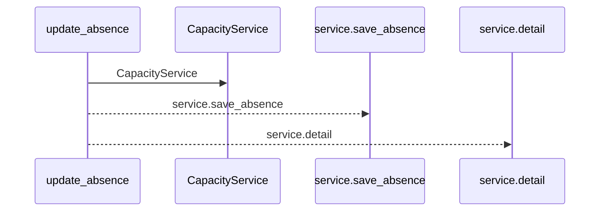
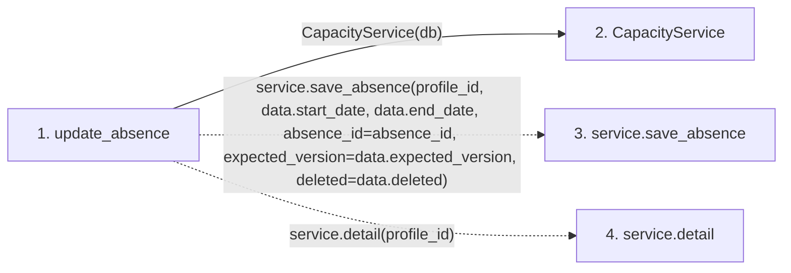

# update_absence

**Entry point:** `update_absence` (`http`)
**Source:** [routers_capacity](../modules/routers_capacity.md)
**Modules touched:** [capacity_service](../modules/capacity_service.md), [routers_capacity](../modules/routers_capacity.md)

## Call sequence

<!-- Auto-generated from static call edges. Dashed arrows are external or unresolved calls. Reviewed runtime conditions and side effects belong in Behavior. -->

## Data flow

<!-- Auto-generated static analysis. Treat values and boundaries as best-effort hints, not runtime proof. -->

### Step data

| Step | Inputs | Reads | Writes | Returns |
|---|---|---|---|---|
| `update_absence` | `profile_id: int`, `absence_id: int`, `data: AbsenceUpdate`, `db: Database` | - | - | `...` |
| `CapacityService` | - | - | - | - |
| `service.save_absence` | - | - | - | - |
| `service.detail` | - | - | - | - |

### Call data

| From | To | Line | Call |
|---|---|---:|---|
| update_absence | CapacityService | 51 | `CapacityService(db)` |
| update_absence | service.save_absence | 52 | `service.save_absence(profile_id, data.start_date, data.end_date, absence_id=absence_id, expected_version=data.expected_version, deleted=data.deleted)` |
| update_absence | service.detail | 54 | `service.detail(profile_id)` |

### Boundary effects

*No boundary effects detected.*

### Static analysis gaps

| Kind | Step | Target | Line |
|---|---|---|---:|
| unresolved_call | `update_absence` | `service.save_absence` | 52 |
| unresolved_call | `update_absence` | `service.detail` | 54 |

## Behavior

Requires the current absence version and owner authority. Updates retain provenance; removal leaves a canonical tombstone and removes active legacy adapters. Stale writes produce a structured availability conflict.
