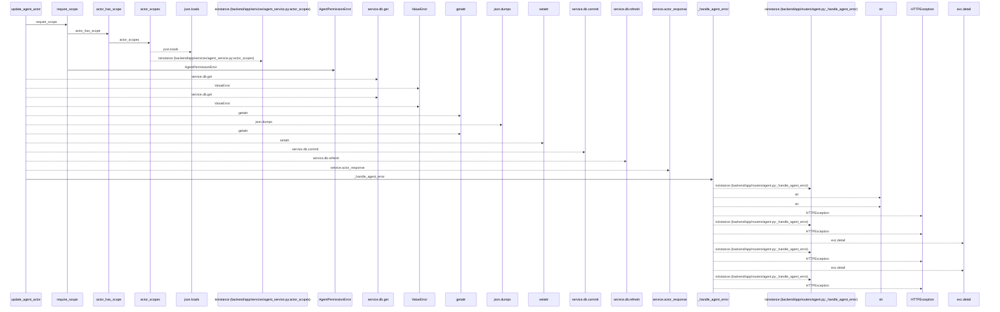
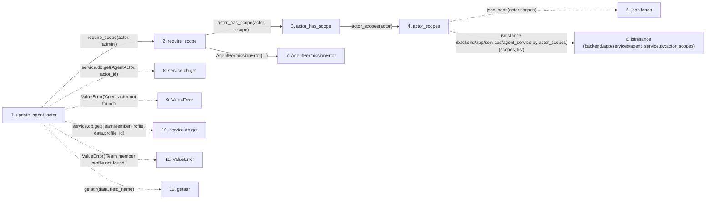

# update_agent_actor

**Entry point:** `update_agent_actor` (`http`)
**Source:** [routers_agent](../modules/routers_agent.md)
**Modules touched:** [agent_service](../modules/agent_service.md), [routers_agent](../modules/routers_agent.md)

## Call sequence

<!-- Auto-generated from static call edges. Dashed arrows are external or unresolved calls. Reviewed runtime conditions and side effects belong in Behavior. -->

> Call sequence diagram shows 30 of 43 interactions; 13 omitted to keep the visualization within the 30-interaction and generated-diagram limits.

## Data flow

<!-- Auto-generated static analysis. Treat values and boundaries as best-effort hints, not runtime proof. -->

### Step data

| Step | Inputs | Reads | Writes | Returns |
|---|---|---|---|---|
| `update_agent_actor` | `actor_id: int`, `data: AgentActorUpdate`, `actor: Annotated[AgentActor, Depends(get_agent_admin_actor)]`, `service: Annotated[AgentWorkService, Depends(get_agent_work_service)]` | `AgentActor`, `TeamMemberProfile` | `target.lifecycle_state`, `target.queue_revision` | `service.actor_response(...)` |
| `require_scope` | `actor: AgentActor`, `scope: str` | - | - | - |
| `actor_has_scope` | `actor: AgentActor`, `scope: str` | - | - | `...` |
| `actor_scopes` | `actor: AgentActor` | `json` | - | `...` |
| `json.loads` | - | - | - | - |
| `isinstance (backend/app/services/agent_service.py:actor_scopes)` | - | - | - | - |
| `AgentPermissionError` | - | - | - | - |
| `service.db.get` | - | - | - | - |
| `ValueError` | - | - | - | - |
| `service.db.get` | - | - | - | - |
| `ValueError` | - | - | - | - |
| `getattr` | - | - | - | - |

### Call data

| From | To | Line | Call |
|---|---|---:|---|
| update_agent_actor | require_scope | 607 | `require_scope(actor, 'admin')` |
| require_scope | actor_has_scope | 86 | `actor_has_scope(actor, scope)` |
| actor_has_scope | actor_scopes | 80 | `actor_scopes(actor)` |
| actor_scopes | json.loads | 72 | `json.loads(actor.scopes)` |
| actor_scopes | isinstance (backend/app/services/agent_service.py:actor_scopes) | 75 | `isinstance(scopes, list)` |
| require_scope | AgentPermissionError | 87 | `AgentPermissionError(...)` |
| update_agent_actor | service.db.get | 608 | `service.db.get(AgentActor, actor_id)` |
| update_agent_actor | ValueError | 610 | `ValueError('Agent actor not found')` |
| update_agent_actor | service.db.get | 612 | `service.db.get(TeamMemberProfile, data.profile_id)` |
| update_agent_actor | ValueError | 614 | `ValueError('Team member profile not found')` |
| update_agent_actor | getattr | 626 | `getattr(data, field_name)` |

### Boundary effects

*No boundary effects detected.*

### Static analysis gaps

| Kind | Step | Target | Line |
|---|---|---|---:|
| external_call | `actor_scopes` | `json.loads` | 72 |
| external_call | `actor_scopes` | `isinstance` | 75 |
| unresolved_call | `update_agent_actor` | `service.db.get` | 608 |
| external_call | `update_agent_actor` | `ValueError` | 610 |
| unresolved_call | `update_agent_actor` | `service.db.get` | 612 |
| external_call | `update_agent_actor` | `ValueError` | 614 |
| external_call | `update_agent_actor` | `getattr` | 626 |
| step_limit | `update_agent_actor` | `first 12 steps` | 0 |

## Behavior

This flow starts at `update_agent_actor` and is classified as `http`. The generated call and data-flow sections are bounded static projections; runtime conditions and side effects require source-level confirmation.
