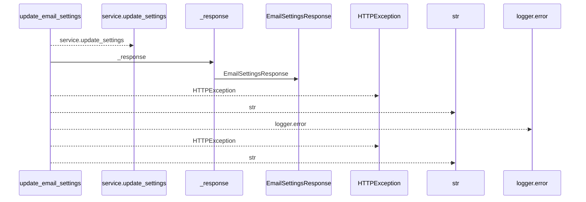
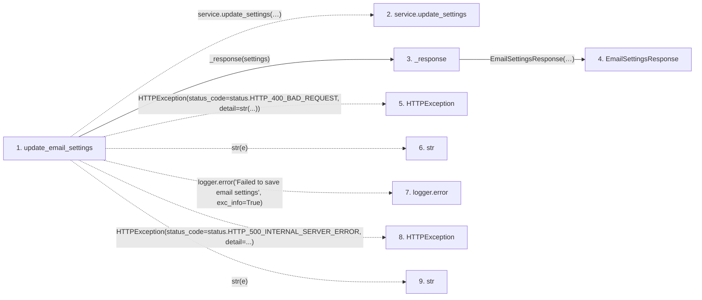

# update_email_settings

**Entry point:** `update_email_settings` (`http`)
**Source:** [routers_email_settings](../modules/routers_email_settings.md)
**Modules touched:** [routers_email_settings](../modules/routers_email_settings.md), [schemas_email_settings](../modules/schemas_email_settings.md)

## Call sequence

<!-- Auto-generated from static call edges. Dashed arrows are external or unresolved calls. Reviewed runtime conditions and side effects belong in Behavior. -->

## Data flow

<!-- Auto-generated static analysis. Treat values and boundaries as best-effort hints, not runtime proof. -->

### Step data

| Step | Inputs | Reads | Writes | Returns |
|---|---|---|---|---|
| `update_email_settings` | `data: EmailSettingsUpdate`, `service: Annotated[EmailSettingsService, Depends(get_settings_service)]` | `status`, `status` | - | `_response(...)` |
| `service.update_settings` | - | - | - | - |
| `_response` | `settings` | - | - | `EmailSettingsResponse(...)` |
| `EmailSettingsResponse` | - | - | - | - |
| `HTTPException` | - | - | - | - |
| `str` | - | - | - | - |
| `logger.error` | - | - | - | - |
| `HTTPException` | - | - | - | - |
| `str` | - | - | - | - |

### Call data

| From | To | Line | Call |
|---|---|---:|---|
| update_email_settings | service.update_settings | 66 | `service.update_settings(enabled=data.enabled, smtp_host=data.smtp_host, smtp_port=data.smtp_port, smtp_user=data.smtp_user, smtp_password=data.smtp_password, smtp_from_email=data.smtp_from_email, smtp_use_tls=data.smtp_use_tls, clear_smtp_password=data.clear_smtp_password)` |
| update_email_settings | _response | 77 | `_response(settings)` |
| _response | EmailSettingsResponse | 24 | `EmailSettingsResponse(enabled=settings.enabled, smtp_host=settings.smtp_host, smtp_port=settings.smtp_port, smtp_user=settings.smtp_user, smtp_from_email=settings.smtp_from_email, smtp_use_tls=settings.smtp_use_tls, has_password=settings.has_password, field_sources=settings.field_sources)` |
| update_email_settings | HTTPException | 79 | `HTTPException(status_code=status.HTTP_400_BAD_REQUEST, detail=str(...))` |
| update_email_settings | str | 81 | `str(e)` |
| update_email_settings | logger.error | 86 | `logger.error('Failed to save email settings', exc_info=True)` |
| update_email_settings | HTTPException | 87 | `HTTPException(status_code=status.HTTP_500_INTERNAL_SERVER_ERROR, detail=...)` |
| update_email_settings | str | 89 | `str(e)` |

### Boundary effects

*No boundary effects detected.*

### Static analysis gaps

| Kind | Step | Target | Line |
|---|---|---|---:|
| unresolved_call | `update_email_settings` | `service.update_settings` | 66 |
| external_call | `update_email_settings` | `HTTPException` | 79 |
| unresolved_call | `update_email_settings` | `logger.error` | 86 |
| external_call | `update_email_settings` | `HTTPException` | 87 |

## Behavior

This flow starts at `update_email_settings` and is classified as `http`. The generated call and data-flow sections are bounded static projections; runtime conditions and side effects require source-level confirmation.
