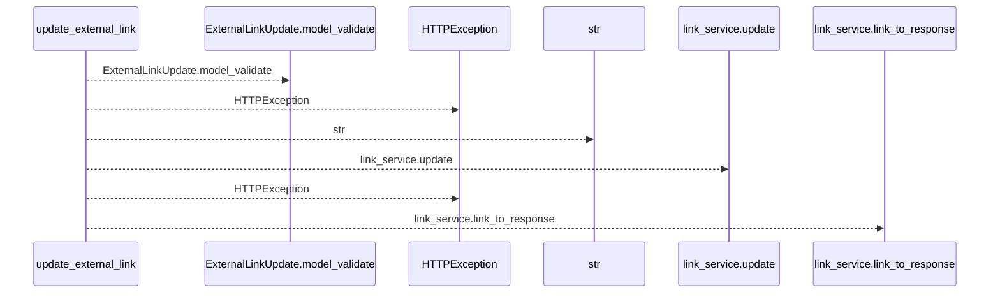
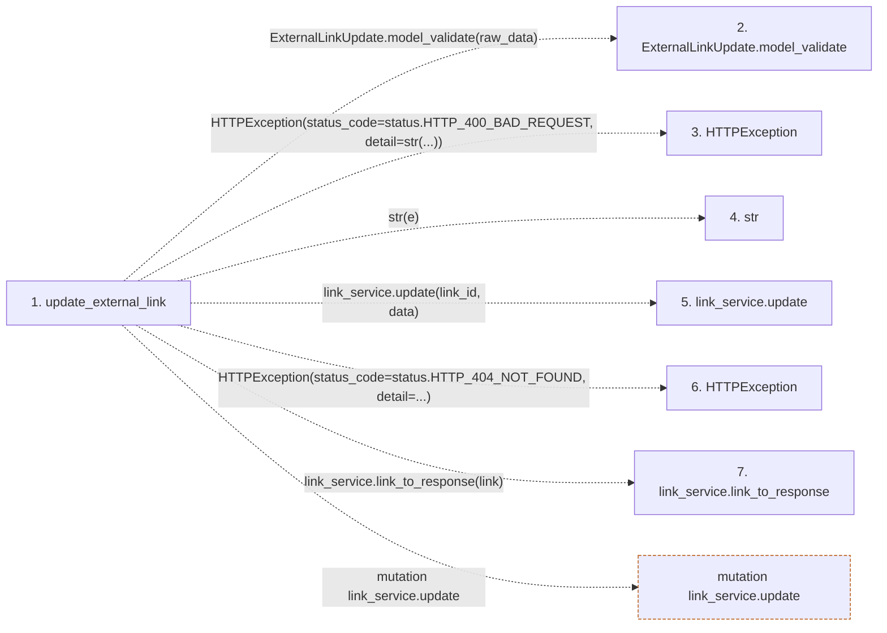

# update_external_link

**Entry point:** `update_external_link` (`http`)
**Source:** [tasks](../modules/tasks.md)
**Modules touched:** [tasks](../modules/tasks.md)

## Call sequence

<!-- Auto-generated from static call edges. Dashed arrows are external or unresolved calls. Reviewed runtime conditions and side effects belong in Behavior. -->

## Data flow

<!-- Auto-generated static analysis. Treat values and boundaries as best-effort hints, not runtime proof. -->

### Step data

| Step | Inputs | Reads | Writes | Returns |
|---|---|---|---|---|
| `update_external_link` | `link_id: int`, `raw_data: Annotated[dict, Body(...)]`, `link_service: Annotated[ExternalLinkService, Depends(get_external_link_service)]` | `ValidationError`, `status`, `status` | - | `link_service.link_to_response(...)` |
| `ExternalLinkUpdate.model_validate` | - | - | - | - |
| `HTTPException` | - | - | - | - |
| `str` | - | - | - | - |
| `link_service.update` | - | - | - | - |
| `HTTPException` | - | - | - | - |
| `link_service.link_to_response` | - | - | - | - |

### Call data

| From | To | Line | Call |
|---|---|---:|---|
| update_external_link | ExternalLinkUpdate.model_validate | 526 | `ExternalLinkUpdate.model_validate(raw_data)` |
| update_external_link | HTTPException | 528 | `HTTPException(status_code=status.HTTP_400_BAD_REQUEST, detail=str(...))` |
| update_external_link | str | 530 | `str(e)` |
| update_external_link | link_service.update | 533 | `link_service.update(link_id, data)` |
| update_external_link | HTTPException | 535 | `HTTPException(status_code=status.HTTP_404_NOT_FOUND, detail=...)` |
| update_external_link | link_service.link_to_response | 539 | `link_service.link_to_response(link)` |

### Boundary effects

| Kind | Target | Step | Line |
|---|---|---|---:|
| mutation | `link_service.update` | `update_external_link` | 533 |

### Static analysis gaps

| Kind | Step | Target | Line |
|---|---|---|---:|
| unresolved_call | `update_external_link` | `ExternalLinkUpdate.model_validate` | 526 |
| external_call | `update_external_link` | `HTTPException` | 528 |
| external_call | `update_external_link` | `HTTPException` | 535 |
| unresolved_call | `update_external_link` | `link_service.link_to_response` | 539 |

## Behavior

This flow starts at `update_external_link` and is classified as `http`. The generated call and data-flow sections are bounded static projections; runtime conditions and side effects require source-level confirmation.
