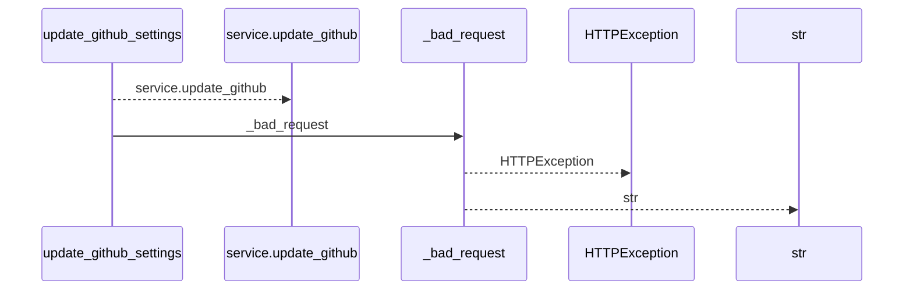
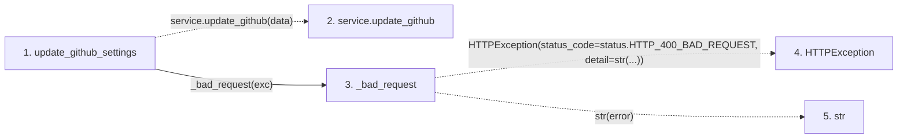

# update_github_settings

**Entry point:** `update_github_settings` (`http`)
**Source:** [routers_system_settings](../modules/routers_system_settings.md)
**Modules touched:** [routers_system_settings](../modules/routers_system_settings.md)

## Call sequence

<!-- Auto-generated from static call edges. Dashed arrows are external or unresolved calls. Reviewed runtime conditions and side effects belong in Behavior. -->

## Data flow

<!-- Auto-generated static analysis. Treat values and boundaries as best-effort hints, not runtime proof. -->

### Step data

| Step | Inputs | Reads | Writes | Returns |
|---|---|---|---|---|
| `update_github_settings` | `data: GitHubRuntimeSettingsUpdate`, `service: Annotated[RuntimeSettingsService, Depends(get_runtime_settings_service)]` | `RuntimeSettingsError` | - | `...` |
| `service.update_github` | - | - | - | - |
| `_bad_request` | `error: ValueError` | `status` | - | `HTTPException(...)` |
| `HTTPException` | - | - | - | - |
| `str` | - | - | - | - |

### Call data

| From | To | Line | Call |
|---|---|---:|---|
| update_github_settings | service.update_github | 75 | `service.update_github(data)` |
| update_github_settings | _bad_request | 77 | `_bad_request(exc)` |
| _bad_request | HTTPException | 33 | `HTTPException(status_code=status.HTTP_400_BAD_REQUEST, detail=str(...))` |
| _bad_request | str | 33 | `str(error)` |

### Boundary effects

*No boundary effects detected.*

### Static analysis gaps

| Kind | Step | Target | Line |
|---|---|---|---:|
| unresolved_call | `update_github_settings` | `service.update_github` | 75 |
| external_call | `_bad_request` | `HTTPException` | 33 |

## Behavior

This flow starts at `update_github_settings` and is classified as `http`. The generated call and data-flow sections are bounded static projections; runtime conditions and side effects require source-level confirmation.
