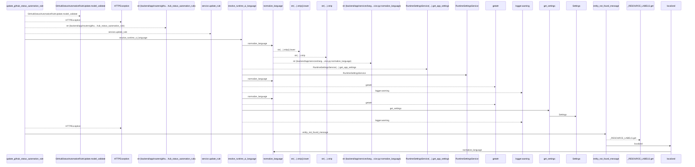
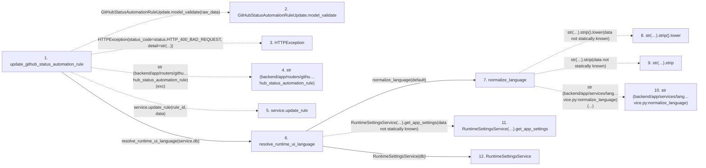

# update_github_status_automation_rule

**Entry point:** `update_github_status_automation_rule` (`http`)
**Source:** [routers_github](../modules/routers_github.md)
**Modules touched:** [config](../modules/config.md), [language_service](../modules/language_service.md), [routers_github](../modules/routers_github.md), [system_settings_service](../modules/system_settings_service.md)

## Call sequence

<!-- Auto-generated from static call edges. Dashed arrows are external or unresolved calls. Reviewed runtime conditions and side effects belong in Behavior. -->

## Data flow

<!-- Auto-generated static analysis. Treat values and boundaries as best-effort hints, not runtime proof. -->

### Step data

| Step | Inputs | Reads | Writes | Returns |
|---|---|---|---|---|
| `update_github_status_automation_rule` | `rule_id: int`, `raw_data: Annotated[dict, Body(...)]`, `service: Annotated[GitHubStatusAutomationService, Depends(get_github_status_automation_service)]` | `ValidationError`, `status`, `status` | - | `rule` |
| `GitHubStatusAutomationRuleUpdate.model_validate` | - | - | - | - |
| `HTTPException` | - | - | - | - |
| `str (backend/app/routers/githu…hub_status_automation_rule)` | - | - | - | - |
| `service.update_rule` | - | - | - | - |
| `resolve_runtime_ui_language` | `db: Any`, `default: LanguageCode \| None` | - | - | `normalize_language(...)`, `normalize_language(...)`, `fallback` |
| `normalize_language` | `value: Any`, `default: LanguageCode` | - | - | `normalized`, `default` |
| `str(…).strip().lower` | - | - | - | - |
| `str(…).strip` | - | - | - | - |
| `str (backend/app/services/lang…vice.py:normalize_language)` | - | - | - | - |
| `RuntimeSettingsService(…).get_app_settings` | - | - | - | - |
| `RuntimeSettingsService` | - | - | - | - |

### Call data

| From | To | Line | Call |
|---|---|---:|---|
| update_github_status_automation_rule | GitHubStatusAutomationRuleUpdate.model_validate | 98 | `GitHubStatusAutomationRuleUpdate.model_validate(raw_data)` |
| update_github_status_automation_rule | HTTPException | 100 | `HTTPException(status_code=status.HTTP_400_BAD_REQUEST, detail=str(...))` |
| update_github_status_automation_rule | str (backend/app/routers/githu…hub_status_automation_rule) | 102 | `str(exc)` |
| update_github_status_automation_rule | service.update_rule | 105 | `service.update_rule(rule_id, data)` |
| update_github_status_automation_rule | resolve_runtime_ui_language | 107 | `resolve_runtime_ui_language(service.db)` |
| resolve_runtime_ui_language | normalize_language | 406 | `normalize_language(default)` |
| normalize_language | str(…).strip().lower | 35 | `str(value or '').strip().lower(data not statically known)` |
| normalize_language | str(…).strip | 35 | `str(value or '').strip(data not statically known)` |
| normalize_language | str (backend/app/services/lang…vice.py:normalize_language) | 35 | `str(...)` |
| resolve_runtime_ui_language | RuntimeSettingsService(…).get_app_settings | 411 | `RuntimeSettingsService(db).get_app_settings(data not statically known)` |
| resolve_runtime_ui_language | RuntimeSettingsService | 411 | `RuntimeSettingsService(db)` |

### Boundary effects

*No boundary effects detected.*

### Static analysis gaps

| Kind | Step | Target | Line |
|---|---|---|---:|
| unresolved_call | `update_github_status_automation_rule` | `GitHubStatusAutomationRuleUpdate.model_validate` | 98 |
| external_call | `update_github_status_automation_rule` | `HTTPException` | 100 |
| unresolved_call | `update_github_status_automation_rule` | `service.update_rule` | 105 |
| unresolved_call | `normalize_language` | `str(value or '').strip().lower` | 35 |
| unresolved_call | `normalize_language` | `str(value or '').strip` | 35 |
| unresolved_call | `resolve_runtime_ui_language` | `RuntimeSettingsService(db).get_app_settings` | 411 |
| step_limit | `update_github_status_automation_rule` | `first 12 steps` | 0 |

## Behavior

This flow starts at `update_github_status_automation_rule` and is classified as `http`. The generated call and data-flow sections are bounded static projections; runtime conditions and side effects require source-level confirmation.
