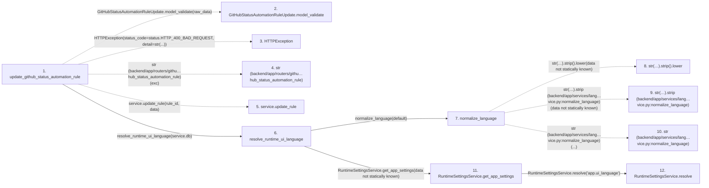

# update_github_status_automation_rule

**Entry point:** `update_github_status_automation_rule` (`http`)
**Source:** [routers_github](../modules/routers_github.md)
**Modules touched:** [config](../modules/config.md), [language_service](../modules/language_service.md), [routers_github](../modules/routers_github.md), [system_settings_service](../modules/system_settings_service.md), and 1 more

**Complete modules touched:**

- [config](../modules/config.md)
- [language_service](../modules/language_service.md)
- [routers_github](../modules/routers_github.md)
- [system_settings_service](../modules/system_settings_service.md)
- [url_policy](../modules/url_policy.md)

## Call sequence

> Static overview in presentation order, not runtime execution order. Arrows retain captured callers; representative internal continuations and boundary examples precede repeated helper detail.

<!-- Auto-generated from static call edges. Dashed arrows are external or unresolved calls. Reviewed runtime conditions and side effects belong in Behavior. -->

```mermaid
sequenceDiagram
    participant p0 as update_github_status_automation_rule
    participant p1 as resolve_runtime_ui_language
    participant p2 as entity_not_found_message
    participant p3 as RuntimeSettingsService.get_app_settings
    participant p4 as localized
    participant p5 as RuntimeSettingsService.resolve
    participant p6 as RuntimeSettingsService._definition
    participant p7 as RuntimeSettingsService._decrypt_secret
    participant p8 as RuntimeSettingsService._coerce
    participant p9 as RuntimeSettingsService._fernet
    participant p10 as normalize_provider_api_url
    participant p11 as normalize_language
    participant p12 as RuntimeSettingsService
    participant p13 as get_settings
    participant p14 as RuntimeSettingsService._row
    participant p15 as RuntimeSettingsService._env_value
    participant p16 as RuntimeSettingsError
    participant p17 as RuntimeSettingsEncryptionError
    participant p18 as normalize_external_http_url
    participant p19 as HTTPException
    participant p20 as GitHubStatusAutomationRuleUpdate.model_validate
    participant p21 as str (backend/app/routers/githu…hub_status_automation_rule)
    participant p22 as service.update_rule
    participant p23 as _RESOURCE_LABELS.get
    participant p24 as getattr (backend/app/services/lang…esolve_runtime_ui_language)
    participant p25 as logger.warning
    participant p26 as str(…).strip().lower
    participant p27 as str(…).strip (backend/app/services/lang…vice.py:normalize_language)
    p0->>p1: resolve_runtime_ui_language
    p0->>p2: entity_not_found_message
    p1->>p3: RuntimeSettingsService.get_app_settings
    p2->>p4: localized
    p3->>p5: RuntimeSettingsService.resolve
    p5->>p6: RuntimeSettingsService._definition
    p5->>p7: RuntimeSettingsService._decrypt_secret
    p5->>p8: RuntimeSettingsService._coerce
    p7->>p9: RuntimeSettingsService._fernet
    p8->>p10: normalize_provider_api_url
    p1->>p11: normalize_language
    p1->>p12: RuntimeSettingsService
    p1->>p13: get_settings
    p5->>p14: RuntimeSettingsService._row
    p5->>p15: RuntimeSettingsService._env_value
    p6->>p16: RuntimeSettingsError
    p7->>p17: RuntimeSettingsEncryptionError
    p10->>p18: normalize_external_http_url
    p0-->>p19: HTTPException(status_code=status.HTTP_400_BAD_REQUEST, detail=str(...))
    p0-->>p20: GitHubStatusAutomationRuleUpdate.model_validate(raw_data)
    p0-->>p21: str (backend/app/routers/githu…hub_status_automation_rule)(exc)
    p0-->>p22: service.update_rule(rule_id, data)
    p0-->>p19: HTTPException(status_code=status.HTTP_404_NOT_FOUND, detail=entity_not_found_message(...))
    p2-->>p23: _RESOURCE_LABELS.get(entity, (...))
    p1-->>p24: getattr (backend/app/services/lang…esolve_runtime_ui_language)(settings, 'app_ui_language', None)
    p1-->>p25: logger.warning('Unable to resolve DB-backed runtime UI language using fallback', exc_info=True)
    p1-->>p24: getattr (backend/app/services/lang…esolve_runtime_ui_language)(get_settings(...), 'app_ui_language', None)
    p1-->>p25: logger.warning('Unable to resolve environment-backed UI language using fallback', exc_info=True)
    p11-->>p26: str(…).strip().lower
    p11-->>p27: str(…).strip (backend/app/services/lang…vice.py:normalize_language)
```

> Call sequence diagram shows 30 of 75 interactions; 45 omitted to keep the visualization within the 30-interaction and generated-diagram limits, with uncertain identities omitted rather than inferred.

> Captured boundary calls: external 5 of 19 (14 omitted); unresolved 7 of 15 (8 omitted). These counts cover the captured static trace.

Omitted captured detail, grouped by actual caller occurrence and target module:

| Caller | Parent step | Target module | Kind | Omitted interactions |
| --- | --- | --- | --- | --- |
| `backend/app/services/language_service.py:normalize_language` | 7 | - | external | 1 |
| `backend/app/services/system_settings_service.py:RuntimeSettingsService._definition` | 13 | - | unresolved | 1 |
| `backend/app/services/system_settings_service.py:RuntimeSettingsService._row` | 16 | - | unresolved | 3 |
| `backend/app/services/system_settings_service.py:RuntimeSettingsService._row` | 16 | - | external | 1 |
| `backend/app/services/system_settings_service.py:RuntimeSettingsService._decrypt_secret` | 21 | - | unresolved | 3 |
| `backend/app/services/system_settings_service.py:RuntimeSettingsService._fernet` | 24 | - | external | 2 |
| `backend/app/services/system_settings_service.py:RuntimeSettingsService._fernet` | 24 | [backend/app/services/system_settings_service.py](../modules/system_settings_service.md) | internal | 2 |
| `backend/app/services/system_settings_service.py:RuntimeSettingsService._coerce` | 31 | - | external | 8 |
> Omission summary shows 8 of 18 groups; 10 further groups are not expanded here. Counts above include all omitted interactions.
> Detailed flow queries retain their own coverage and limits; omitted paths may execute at runtime.

> Trace truncated at the depth limit; deeper calls are omitted.

## Data flow

<!-- Auto-generated static analysis. Treat values and boundaries as best-effort hints, not runtime proof. -->

### Analysis coverage

**Effect analysis partially available.** Flow assembly and source effect analysis are separate; empty observations do not prove an empty handler body.

Source steps: 42; effect analysis evaluated: 23, partial: 0, unavailable: 19. Counts include steps omitted from the displayed trace.

Collector observations for 23 source steps with known totals: observed: 90, emitted: 90, omitted: 0. Unavailable totals are excluded.

- Callable record unavailable for one or more source steps; those steps have no represented callable body.
- Effect collector totals unavailable; observed counts cover captured records only.

| Step | Callable record | Effect analysis | Collector totals | Observed | Emitted | Omitted |
|---|---|---|---|---:|---:|---:|
| `update_github_status_automation_rule` | `available` | `evaluated` | `available` | `7` | `7` | `0` |
| `GitHubStatusAutomationRuleUpdate.model_validate` | `not_applicable` | `not_applicable` | `not_applicable` | — | — | — |
| `HTTPException` | `not_applicable` | `not_applicable` | `not_applicable` | — | — | — |
| `str (backend/app/routers/githu…hub_status_automation_rule)` | `not_applicable` | `not_applicable` | `not_applicable` | — | — | — |
| `service.update_rule` | `not_applicable` | `not_applicable` | `not_applicable` | — | — | — |
| `resolve_runtime_ui_language` | `available` | `evaluated` | `available` | `5` | `5` | `0` |
| `normalize_language` | `available` | `evaluated` | `available` | `4` | `4` | `0` |
| `str(…).strip().lower` | `not_applicable` | `not_applicable` | `not_applicable` | — | — | — |
| `str(…).strip (backend/app/services/lang…vice.py:normalize_language)` | `not_applicable` | `not_applicable` | `not_applicable` | — | — | — |
| `str (backend/app/services/lang…vice.py:normalize_language)` | `not_applicable` | `not_applicable` | `not_applicable` | — | — | — |
| `RuntimeSettingsService.get_app_settings` | `available` | `evaluated` | `available` | `1` | `1` | `0` |
| `RuntimeSettingsService.resolve` | `available` | `evaluated` | `available` | `4` | `4` | `0` |

```mermaid
flowchart LR
    s1["1. update_github_status_automation_rule"]
    s2["2. GitHubStatusAutomationRuleUpdate.model_validate"]
    s3["3. HTTPException"]
    s4["4. str (backend/app/routers/githu…hub_status_automation_rule)"]
    s5["5. service.update_rule"]
    s6["6. resolve_runtime_ui_language"]
    s7["7. normalize_language"]
    s8["8. str(…).strip().lower"]
    s9["9. str(…).strip (backend/app/services/lang…vice.py:normalize_language)"]
    s10["10. str (backend/app/services/lang…vice.py:normalize_language)"]
    s11["11. RuntimeSettingsService.get_app_settings"]
    s12["12. RuntimeSettingsService.resolve"]
    s1 -. "GitHubStatusAutomationRuleUpdate.model_validate(raw_data)" .-> s2
    s1 -. "HTTPException(status_code=status.HTTP_400_BAD_REQUEST, detail=str(...))" .-> s3
    s1 -. "str (backend/app/routers/githu…hub_status_automation_rule)(exc)" .-> s4
    s1 -. "service.update_rule(rule_id, data)" .-> s5
    s1 -->|"resolve_runtime_ui_language(service.db)"| s6
    s6 -->|"normalize_language(default)"| s7
    s7 -. "str(…).strip().lower(data not statically known)" .-> s8
    s7 -. "str(…).strip (backend/app/services/lang…vice.py:normalize_language)(data not statically known)" .-> s9
    s7 -. "str (backend/app/services/lang…vice.py:normalize_language)(...)" .-> s10
    s6 -->|"RuntimeSettingsService.get_app_settings(data not statically known)"| s11
    s11 -->|"RuntimeSettingsService.resolve('app.ui_language')"| s12
    click s1 "../modules/routers_github.md"
    click s6 "../modules/language_service.md"
    click s7 "../modules/language_service.md"
    click s11 "../modules/system_settings_service.md"
    click s12 "../modules/system_settings_service.md"
```

### Step data

| Step | Inputs | Reads | Writes | Returns |
|---|---|---|---|---|
| `update_github_status_automation_rule` | `rule_id: int`, `raw_data: Annotated[dict, Body(...)]`, `service: Annotated[GitHubStatusAutomationService, Depends(get_github_status_automation_service)]` | `ValidationError`, `status`, `status` | - | `rule` |
| `GitHubStatusAutomationRuleUpdate.model_validate` | - | - | - | - |
| `HTTPException` | - | - | - | - |
| `str (backend/app/routers/githu…hub_status_automation_rule)` | - | - | - | - |
| `service.update_rule` | - | - | - | - |
| `resolve_runtime_ui_language` | `db: Any`, `default: LanguageCode \| None` | - | - | `normalize_language(...)`, `normalize_language(...)`, `fallback` |
| `normalize_language` | `value: Any`, `default: LanguageCode` | - | - | `normalized`, `default` |
| `str(…).strip().lower` | - | - | - | - |
| `str(…).strip (backend/app/services/lang…vice.py:normalize_language)` | - | - | - | - |
| `str (backend/app/services/lang…vice.py:normalize_language)` | - | - | - | - |
| `RuntimeSettingsService.get_app_settings` | - | - | - | `SimpleNamespace(...)` |
| `RuntimeSettingsService.resolve` | `key: str` | - | - | `(...)`, `(...)`, `(...)` |

### Call data

| From | To | Line | Call |
|---|---|---:|---|
| update_github_status_automation_rule | GitHubStatusAutomationRuleUpdate.model_validate | 98 | `GitHubStatusAutomationRuleUpdate.model_validate(raw_data)` |
| update_github_status_automation_rule | HTTPException | 100 | `HTTPException(status_code=status.HTTP_400_BAD_REQUEST, detail=str(...))` |
| update_github_status_automation_rule | str (backend/app/routers/githu…hub_status_automation_rule) | 102 | `str(exc)` |
| update_github_status_automation_rule | service.update_rule | 105 | `service.update_rule(rule_id, data)` |
| update_github_status_automation_rule | resolve_runtime_ui_language | 107 | `resolve_runtime_ui_language(service.db)` |
| resolve_runtime_ui_language | normalize_language | 406 | `normalize_language(default)` |
| normalize_language | str(…).strip().lower | 35 | `str(value or '').strip().lower(data not statically known)` |
| normalize_language | str(…).strip (backend/app/services/lang…vice.py:normalize_language) | 35 | `str(value or '').strip(data not statically known)` |
| normalize_language | str (backend/app/services/lang…vice.py:normalize_language) | 35 | `str(...)` |
| resolve_runtime_ui_language | RuntimeSettingsService.get_app_settings | 411 | `RuntimeSettingsService(db).get_app_settings(data not statically known)` |
| RuntimeSettingsService.get_app_settings | RuntimeSettingsService.resolve | 337 | `self.resolve('app.ui_language')` |

### Boundary effects

*No boundary-effect observations were captured in this static trace.*

### Static analysis gaps

| Kind | Step | Target | Line |
|---|---|---|---:|
| unresolved_call | `update_github_status_automation_rule` | `GitHubStatusAutomationRuleUpdate.model_validate` | 98 |
| external_call | `update_github_status_automation_rule` | `HTTPException` | 100 |
| unresolved_call | `update_github_status_automation_rule` | `service.update_rule` | 105 |
| unresolved_call | `normalize_language` | `str(value or '').strip().lower` | 35 |
| unresolved_call | `normalize_language` | `str(value or '').strip` | 35 |
| step_limit | `update_github_status_automation_rule` | `first 12 steps` | 0 |
| truncated_flow | `update_github_status_automation_rule` | `depth limit` | 0 |

## Behavior

This flow starts at `update_github_status_automation_rule` and is classified as `http`. The generated call and data-flow sections are bounded static projections; runtime conditions and side effects require source-level confirmation.
