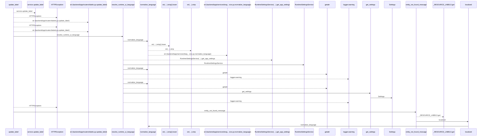
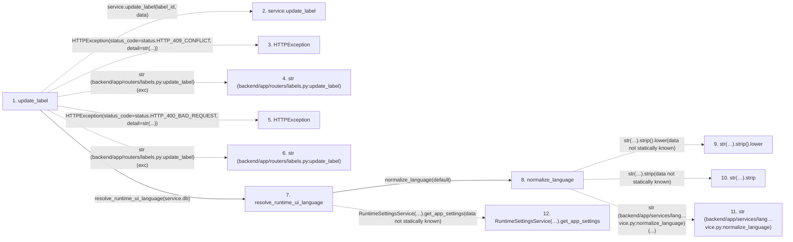

# update_label

**Entry point:** `update_label` (`http`)
**Source:** [labels](../modules/labels.md)
**Modules touched:** [config](../modules/config.md), [labels](../modules/labels.md), [language_service](../modules/language_service.md), [system_settings_service](../modules/system_settings_service.md)

## Call sequence

<!-- Auto-generated from static call edges. Dashed arrows are external or unresolved calls. Reviewed runtime conditions and side effects belong in Behavior. -->

## Data flow

<!-- Auto-generated static analysis. Treat values and boundaries as best-effort hints, not runtime proof. -->

### Step data

| Step | Inputs | Reads | Writes | Returns |
|---|---|---|---|---|
| `update_label` | `label_id: int`, `data: LabelUpdate`, `service: Annotated[LabelService, Depends(get_label_service)]` | `LabelConflictError`, `status`, `status`, `status` | - | `label` |
| `service.update_label` | - | - | - | - |
| `HTTPException` | - | - | - | - |
| `str (backend/app/routers/labels.py:update_label)` | - | - | - | - |
| `HTTPException` | - | - | - | - |
| `str (backend/app/routers/labels.py:update_label)` | - | - | - | - |
| `resolve_runtime_ui_language` | `db: Any`, `default: LanguageCode \| None` | - | - | `normalize_language(...)`, `normalize_language(...)`, `fallback` |
| `normalize_language` | `value: Any`, `default: LanguageCode` | - | - | `normalized`, `default` |
| `str(…).strip().lower` | - | - | - | - |
| `str(…).strip` | - | - | - | - |
| `str (backend/app/services/lang…vice.py:normalize_language)` | - | - | - | - |
| `RuntimeSettingsService(…).get_app_settings` | - | - | - | - |

### Call data

| From | To | Line | Call |
|---|---|---:|---|
| update_label | service.update_label | 116 | `service.update_label(label_id, data)` |
| update_label | HTTPException | 118 | `HTTPException(status_code=status.HTTP_409_CONFLICT, detail=str(...))` |
| update_label | str (backend/app/routers/labels.py:update_label) | 118 | `str(exc)` |
| update_label | HTTPException | 120 | `HTTPException(status_code=status.HTTP_400_BAD_REQUEST, detail=str(...))` |
| update_label | str (backend/app/routers/labels.py:update_label) | 120 | `str(exc)` |
| update_label | resolve_runtime_ui_language | 123 | `resolve_runtime_ui_language(service.db)` |
| resolve_runtime_ui_language | normalize_language | 406 | `normalize_language(default)` |
| normalize_language | str(…).strip().lower | 35 | `str(value or '').strip().lower(data not statically known)` |
| normalize_language | str(…).strip | 35 | `str(value or '').strip(data not statically known)` |
| normalize_language | str (backend/app/services/lang…vice.py:normalize_language) | 35 | `str(...)` |
| resolve_runtime_ui_language | RuntimeSettingsService(…).get_app_settings | 411 | `RuntimeSettingsService(db).get_app_settings(data not statically known)` |

### Boundary effects

*No boundary effects detected.*

### Static analysis gaps

| Kind | Step | Target | Line |
|---|---|---|---:|
| unresolved_call | `update_label` | `service.update_label` | 116 |
| external_call | `update_label` | `HTTPException` | 118 |
| external_call | `update_label` | `HTTPException` | 120 |
| unresolved_call | `normalize_language` | `str(value or '').strip().lower` | 35 |
| unresolved_call | `normalize_language` | `str(value or '').strip` | 35 |
| unresolved_call | `resolve_runtime_ui_language` | `RuntimeSettingsService(db).get_app_settings` | 411 |
| step_limit | `update_label` | `first 12 steps` | 0 |

## Behavior

This flow starts at `update_label` and is classified as `http`. The generated call and data-flow sections are bounded static projections; runtime conditions and side effects require source-level confirmation.
