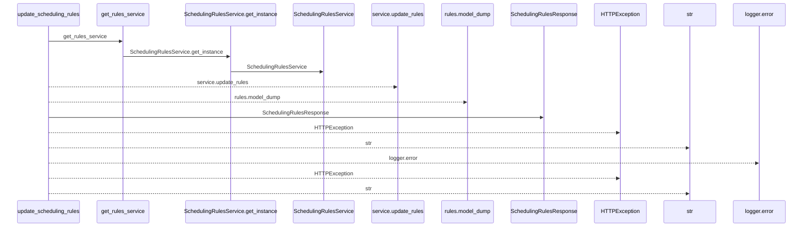
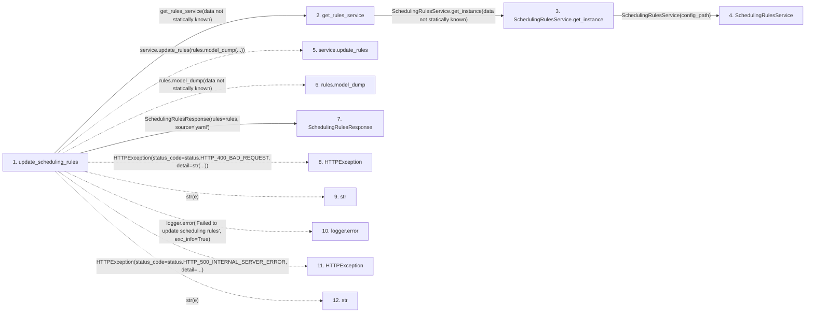

# update_scheduling_rules

**Entry point:** `update_scheduling_rules` (`http`)
**Source:** [routers_scheduling_rules](../modules/routers_scheduling_rules.md)
**Modules touched:** [routers_scheduling_rules](../modules/routers_scheduling_rules.md), [scheduling_rules_service](../modules/scheduling_rules_service.md), [schemas_scheduling_rules](../modules/schemas_scheduling_rules.md)

## Call sequence

<!-- Auto-generated from static call edges. Dashed arrows are external or unresolved calls. Reviewed runtime conditions and side effects belong in Behavior. -->

## Data flow

<!-- Auto-generated static analysis. Treat values and boundaries as best-effort hints, not runtime proof. -->

### Step data

| Step | Inputs | Reads | Writes | Returns |
|---|---|---|---|---|
| `update_scheduling_rules` | `rules: SchedulingRulesSchema` | `status`, `status` | - | `SchedulingRulesResponse(...)` |
| `get_rules_service` | - | - | - | `SchedulingRulesService.get_instance(...)` |
| `SchedulingRulesService.get_instance` | `config_path: Optional[Path]` | `cls._instance`, `cls._instance` | `cls._instance` | `cls._instance` |
| `SchedulingRulesService` | - | - | - | - |
| `service.update_rules` | - | - | - | - |
| `rules.model_dump` | - | - | - | - |
| `SchedulingRulesResponse` | - | - | - | - |
| `HTTPException` | - | - | - | - |
| `str` | - | - | - | - |
| `logger.error` | - | - | - | - |
| `HTTPException` | - | - | - | - |
| `str` | - | - | - | - |

### Call data

| From | To | Line | Call |
|---|---|---:|---|
| update_scheduling_rules | get_rules_service | 47 | `get_rules_service(data not statically known)` |
| get_rules_service | SchedulingRulesService.get_instance | 20 | `SchedulingRulesService.get_instance(data not statically known)` |
| SchedulingRulesService.get_instance | SchedulingRulesService | 105 | `cls(config_path)` |
| update_scheduling_rules | service.update_rules | 50 | `service.update_rules(rules.model_dump(...))` |
| update_scheduling_rules | rules.model_dump | 50 | `rules.model_dump(data not statically known)` |
| update_scheduling_rules | SchedulingRulesResponse | 51 | `SchedulingRulesResponse(rules=rules, source='yaml')` |
| update_scheduling_rules | HTTPException | 56 | `HTTPException(status_code=status.HTTP_400_BAD_REQUEST, detail=str(...))` |
| update_scheduling_rules | str | 58 | `str(e)` |
| update_scheduling_rules | logger.error | 61 | `logger.error('Failed to update scheduling rules', exc_info=True)` |
| update_scheduling_rules | HTTPException | 62 | `HTTPException(status_code=status.HTTP_500_INTERNAL_SERVER_ERROR, detail=...)` |
| update_scheduling_rules | str | 64 | `str(e)` |

### Boundary effects

*No boundary effects detected.*

### Static analysis gaps

| Kind | Step | Target | Line |
|---|---|---|---:|
| unresolved_call | `update_scheduling_rules` | `service.update_rules` | 50 |
| unresolved_call | `update_scheduling_rules` | `rules.model_dump` | 50 |
| external_call | `update_scheduling_rules` | `HTTPException` | 56 |
| unresolved_call | `update_scheduling_rules` | `logger.error` | 61 |
| external_call | `update_scheduling_rules` | `HTTPException` | 62 |

## Behavior

This flow starts at `update_scheduling_rules` and is classified as `http`. The generated call and data-flow sections are bounded static projections; runtime conditions and side effects require source-level confirmation.
