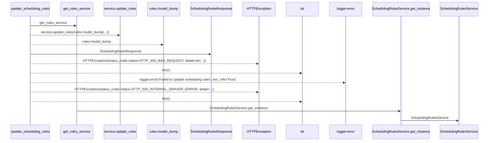
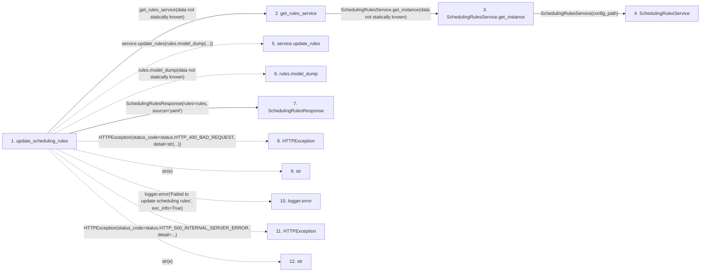

# update_scheduling_rules

**Entry point:** `update_scheduling_rules` (`http`)
**Source:** [routers_scheduling_rules](../modules/routers_scheduling_rules.md)
**Modules touched:** [routers_scheduling_rules](../modules/routers_scheduling_rules.md), [scheduling_rules_service](../modules/scheduling_rules_service.md), [schemas_scheduling_rules](../modules/schemas_scheduling_rules.md)

## Call sequence

> Static overview in presentation order, not runtime execution order. Arrows retain captured callers; representative internal continuations and boundary examples precede repeated helper detail.

<!-- Auto-generated from static call edges. Dashed arrows are external or unresolved calls. Reviewed runtime conditions and side effects belong in Behavior. -->

```mermaid
sequenceDiagram
    participant p0 as update_scheduling_rules
    participant p1 as get_rules_service
    participant p2 as service.update_rules
    participant p3 as rules.model_dump
    participant p4 as SchedulingRulesResponse
    participant p5 as HTTPException
    participant p6 as str
    participant p7 as logger.error
    participant p8 as SchedulingRulesService.get_instance
    participant p9 as SchedulingRulesService
    p0->>p1: get_rules_service
    p0-->>p2: service.update_rules(rules.model_dump(...))
    p0-->>p3: rules.model_dump
    p0->>p4: SchedulingRulesResponse
    p0-->>p5: HTTPException(status_code=status.HTTP_400_BAD_REQUEST, detail=str(...))
    p0-->>p6: str(e)
    p0-->>p7: logger.error('Failed to update scheduling rules', exc_info=True)
    p0-->>p5: HTTPException(status_code=status.HTTP_500_INTERNAL_SERVER_ERROR, detail=...)
    p0-->>p6: str(e)
    p1->>p8: SchedulingRulesService.get_instance
    p8->>p9: SchedulingRulesService
```

> Call sequence diagram shows 11 of 11 interactions; 0 omitted to keep the visualization within the 30-interaction and generated-diagram limits, with uncertain identities omitted rather than inferred.

> Captured boundary calls: external 4 of 4 (0 omitted); unresolved 3 of 3 (0 omitted). These counts cover the captured static trace.
> Detailed flow queries retain their own coverage and limits; omitted paths may execute at runtime.

## Data flow

<!-- Auto-generated static analysis. Treat values and boundaries as best-effort hints, not runtime proof. -->

### Analysis coverage

**Effect analysis partially available.** Flow assembly and source effect analysis are separate; empty observations do not prove an empty handler body.

Source steps: 5; effect analysis evaluated: 3, partial: 0, unavailable: 2. Counts include steps omitted from the displayed trace.

Collector observations for 3 source steps with known totals: observed: 10, emitted: 10, omitted: 0. Unavailable totals are excluded.

- Callable record unavailable for one or more source steps; those steps have no represented callable body.
- Effect collector totals unavailable; observed counts cover captured records only.

| Step | Callable record | Effect analysis | Collector totals | Observed | Emitted | Omitted |
|---|---|---|---|---:|---:|---:|
| `update_scheduling_rules` | `available` | `evaluated` | `available` | `4` | `4` | `0` |
| `get_rules_service` | `available` | `evaluated` | `available` | `1` | `1` | `0` |
| `SchedulingRulesService.get_instance` | `available` | `evaluated` | `available` | `5` | `5` | `0` |
| `SchedulingRulesService` | `unavailable` | `unavailable` | `unavailable` | — | — | — |
| `service.update_rules` | `not_applicable` | `not_applicable` | `not_applicable` | — | — | — |
| `rules.model_dump` | `not_applicable` | `not_applicable` | `not_applicable` | — | — | — |
| `SchedulingRulesResponse` | `unavailable` | `unavailable` | `unavailable` | — | — | — |
| `HTTPException` | `not_applicable` | `not_applicable` | `not_applicable` | — | — | — |
| `str` | `not_applicable` | `not_applicable` | `not_applicable` | — | — | — |
| `logger.error` | `not_applicable` | `not_applicable` | `not_applicable` | — | — | — |
| `HTTPException` | `not_applicable` | `not_applicable` | `not_applicable` | — | — | — |
| `str` | `not_applicable` | `not_applicable` | `not_applicable` | — | — | — |

```mermaid
flowchart LR
    s1["1. update_scheduling_rules"]
    s2["2. get_rules_service"]
    s3["3. SchedulingRulesService.get_instance"]
    s4["4. SchedulingRulesService"]
    s5["5. service.update_rules"]
    s6["6. rules.model_dump"]
    s7["7. SchedulingRulesResponse"]
    s8["8. HTTPException"]
    s9["9. str"]
    s10["10. logger.error"]
    s11["11. HTTPException"]
    s12["12. str"]
    s1 -->|"get_rules_service(data not statically known)"| s2
    s2 -->|"SchedulingRulesService.get_instance(data not statically known)"| s3
    s3 -->|"SchedulingRulesService(config_path)"| s4
    s1 -. "service.update_rules(rules.model_dump(...))" .-> s5
    s1 -. "rules.model_dump(data not statically known)" .-> s6
    s1 -->|"SchedulingRulesResponse(rules=rules, source='yaml')"| s7
    s1 -. "HTTPException(status_code=status.HTTP_400_BAD_REQUEST, detail=str(...))" .-> s8
    s1 -. "str(e)" .-> s9
    s1 -. "logger.error('Failed to update scheduling rules', exc_info=True)" .-> s10
    s1 -. "HTTPException(status_code=status.HTTP_500_INTERNAL_SERVER_ERROR, detail=...)" .-> s11
    s1 -. "str(e)" .-> s12
    click s1 "../modules/routers_scheduling_rules.md"
    click s2 "../modules/routers_scheduling_rules.md"
    click s3 "../modules/scheduling_rules_service.md"
    click s4 "../modules/scheduling_rules_service.md"
    click s7 "../modules/schemas_scheduling_rules.md"
```

### Step data

| Step | Inputs | Reads | Writes | Returns |
|---|---|---|---|---|
| `update_scheduling_rules` | `rules: SchedulingRulesSchema` | `status`, `status` | - | `SchedulingRulesResponse(...)` |
| `get_rules_service` | - | - | - | `SchedulingRulesService.get_instance(...)` |
| `SchedulingRulesService.get_instance` | `config_path: Optional[Path]` | `cls._instance`, `cls._instance` | `cls._instance` | `cls._instance` |
| `SchedulingRulesService` | - | - | - | - |
| `service.update_rules` | - | - | - | - |
| `rules.model_dump` | - | - | - | - |
| `SchedulingRulesResponse` | - | - | - | - |
| `HTTPException` | - | - | - | - |
| `str` | - | - | - | - |
| `logger.error` | - | - | - | - |
| `HTTPException` | - | - | - | - |
| `str` | - | - | - | - |

### Call data

| From | To | Line | Call |
|---|---|---:|---|
| update_scheduling_rules | get_rules_service | 47 | `get_rules_service(data not statically known)` |
| get_rules_service | SchedulingRulesService.get_instance | 20 | `SchedulingRulesService.get_instance(data not statically known)` |
| SchedulingRulesService.get_instance | SchedulingRulesService | 105 | `cls(config_path)` |
| update_scheduling_rules | service.update_rules | 50 | `service.update_rules(rules.model_dump(...))` |
| update_scheduling_rules | rules.model_dump | 50 | `rules.model_dump(data not statically known)` |
| update_scheduling_rules | SchedulingRulesResponse | 51 | `SchedulingRulesResponse(rules=rules, source='yaml')` |
| update_scheduling_rules | HTTPException | 56 | `HTTPException(status_code=status.HTTP_400_BAD_REQUEST, detail=str(...))` |
| update_scheduling_rules | str | 58 | `str(e)` |
| update_scheduling_rules | logger.error | 61 | `logger.error('Failed to update scheduling rules', exc_info=True)` |
| update_scheduling_rules | HTTPException | 62 | `HTTPException(status_code=status.HTTP_500_INTERNAL_SERVER_ERROR, detail=...)` |
| update_scheduling_rules | str | 64 | `str(e)` |

### Boundary effects

*No boundary-effect observations were captured in this static trace.*

### Static analysis gaps

| Kind | Step | Target | Line |
|---|---|---|---:|
| unresolved_call | `update_scheduling_rules` | `service.update_rules` | 50 |
| unresolved_call | `update_scheduling_rules` | `rules.model_dump` | 50 |
| external_call | `update_scheduling_rules` | `HTTPException` | 56 |
| unresolved_call | `update_scheduling_rules` | `logger.error` | 61 |
| external_call | `update_scheduling_rules` | `HTTPException` | 62 |

## Behavior

This flow starts at `update_scheduling_rules` and is classified as `http`. The generated call and data-flow sections are bounded static projections; runtime conditions and side effects require source-level confirmation.
