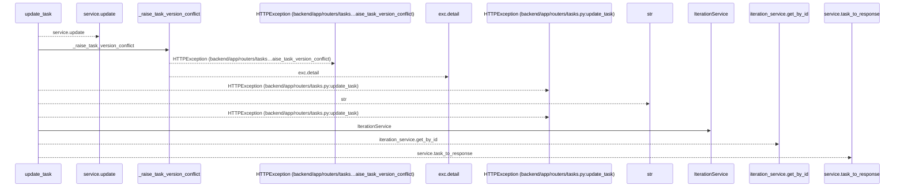
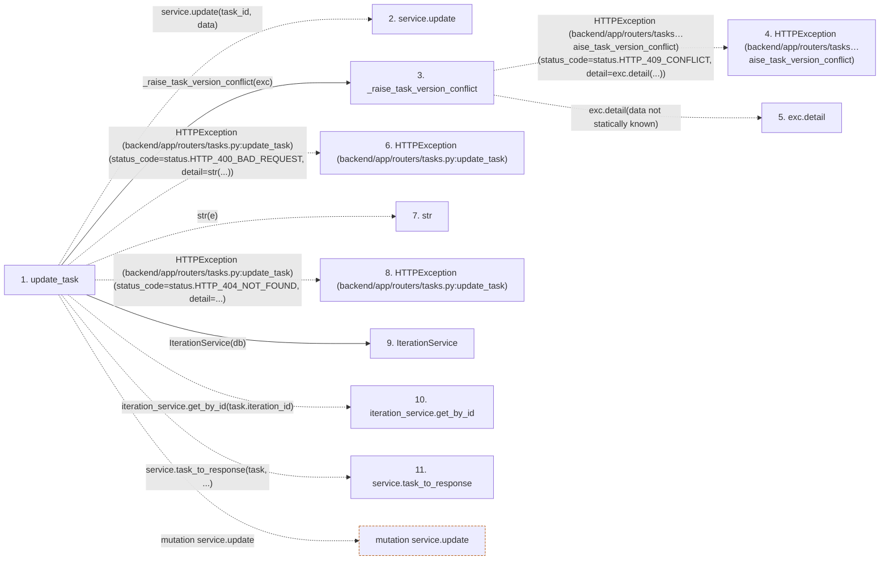

# update_task

**Entry point:** `update_task` (`http`)
**Source:** [tasks](../modules/tasks.md)
**Modules touched:** [iteration_service](../modules/iteration_service.md), [tasks](../modules/tasks.md)

## Call sequence

<!-- Auto-generated from static call edges. Dashed arrows are external or unresolved calls. Reviewed runtime conditions and side effects belong in Behavior. -->

## Data flow

<!-- Auto-generated static analysis. Treat values and boundaries as best-effort hints, not runtime proof. -->

### Step data

| Step | Inputs | Reads | Writes | Returns |
|---|---|---|---|---|
| `update_task` | `task_id: int`, `data: TaskUpdate`, `service: Annotated[TaskService, Depends(get_task_service)]`, `db: Annotated[AsyncSession, Depends(get_db, scope='function')]` | `TaskVersionConflictError`, `status`, `status` | - | `service.task_to_response(...)` |
| `service.update` | - | - | - | - |
| `_raise_task_version_conflict` | `exc: TaskVersionConflictError` | `status` | - | - |
| `HTTPException (backend/app/routers/tasks…aise_task_version_conflict)` | - | - | - | - |
| `exc.detail` | - | - | - | - |
| `HTTPException (backend/app/routers/tasks.py:update_task)` | - | - | - | - |
| `str` | - | - | - | - |
| `HTTPException (backend/app/routers/tasks.py:update_task)` | - | - | - | - |
| `IterationService` | - | - | - | - |
| `iteration_service.get_by_id` | - | - | - | - |
| `service.task_to_response` | - | - | - | - |

### Call data

| From | To | Line | Call |
|---|---|---:|---|
| update_task | service.update | 329 | `service.update(task_id, data)` |
| update_task | _raise_task_version_conflict | 331 | `_raise_task_version_conflict(exc)` |
| _raise_task_version_conflict | HTTPException (backend/app/routers/tasks…aise_task_version_conflict) | 56 | `HTTPException(status_code=status.HTTP_409_CONFLICT, detail=exc.detail(...))` |
| _raise_task_version_conflict | exc.detail | 58 | `exc.detail(data not statically known)` |
| update_task | HTTPException (backend/app/routers/tasks.py:update_task) | 333 | `HTTPException(status_code=status.HTTP_400_BAD_REQUEST, detail=str(...))` |
| update_task | str | 335 | `str(e)` |
| update_task | HTTPException (backend/app/routers/tasks.py:update_task) | 338 | `HTTPException(status_code=status.HTTP_404_NOT_FOUND, detail=...)` |
| update_task | IterationService | 343 | `IterationService(db)` |
| update_task | iteration_service.get_by_id | 344 | `iteration_service.get_by_id(task.iteration_id)` |
| update_task | service.task_to_response | 346 | `service.task_to_response(task, ...)` |

### Boundary effects

| Kind | Target | Step | Line |
|---|---|---|---:|
| mutation | `service.update` | `update_task` | 329 |

### Static analysis gaps

| Kind | Step | Target | Line |
|---|---|---|---:|
| external_call | `_raise_task_version_conflict` | `HTTPException` | 56 |
| unresolved_call | `_raise_task_version_conflict` | `exc.detail` | 58 |
| external_call | `update_task` | `HTTPException` | 333 |
| external_call | `update_task` | `HTTPException` | 338 |
| unresolved_call | `update_task` | `iteration_service.get_by_id` | 344 |
| unresolved_call | `update_task` | `service.task_to_response` | 346 |

## Behavior

This flow starts at `update_task` and is classified as `http`. The generated call and data-flow sections are bounded static projections; runtime conditions and side effects require source-level confirmation.

Backlog project changes require edit permission in both scopes. Project locks are acquired in ascending ID order and the task scope is rechecked before writing. The complete subtree must have no incoming or outgoing dependency across its boundary. Both backlogs receive transactional recovery points, descendants reserve one version per command, and rejected moves roll everything back. Actual dependency changes invalidate current progress and acceptance through general updates and individual add/remove commands. Immutable evidence history remains available, a command reserves one task version, and no-op dependency requests retain their current version. Locked graph relationships are loaded explicitly before applying a dependency update.
