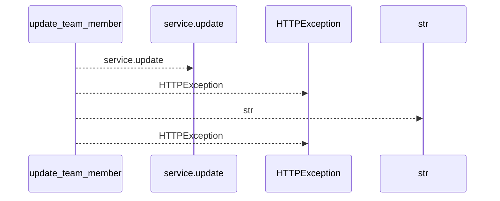
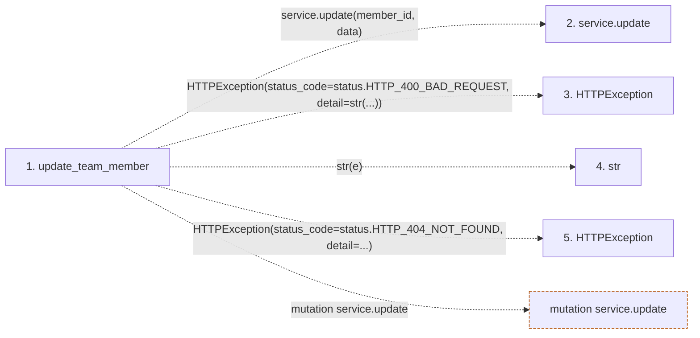

# update_team_member

**Entry point:** `update_team_member` (`http`)
**Source:** [routers_team](../modules/routers_team.md)
**Modules touched:** [routers_team](../modules/routers_team.md)

## Call sequence

<!-- Auto-generated from static call edges. Dashed arrows are external or unresolved calls. Reviewed runtime conditions and side effects belong in Behavior. -->

## Data flow

<!-- Auto-generated static analysis. Treat values and boundaries as best-effort hints, not runtime proof. -->

### Step data

| Step | Inputs | Reads | Writes | Returns |
|---|---|---|---|---|
| `update_team_member` | `member_id: int`, `data: TeamMemberUpdate`, `service: Annotated[TeamService, Depends(get_team_service)]` | `status`, `status` | - | `member` |
| `service.update` | - | - | - | - |
| `HTTPException` | - | - | - | - |
| `str` | - | - | - | - |
| `HTTPException` | - | - | - | - |

### Call data

| From | To | Line | Call |
|---|---|---:|---|
| update_team_member | service.update | 227 | `service.update(member_id, data)` |
| update_team_member | HTTPException | 229 | `HTTPException(status_code=status.HTTP_400_BAD_REQUEST, detail=str(...))` |
| update_team_member | str | 231 | `str(e)` |
| update_team_member | HTTPException | 234 | `HTTPException(status_code=status.HTTP_404_NOT_FOUND, detail=...)` |

### Boundary effects

| Kind | Target | Step | Line |
|---|---|---|---:|
| mutation | `service.update` | `update_team_member` | 227 |

### Static analysis gaps

| Kind | Step | Target | Line |
|---|---|---|---:|
| external_call | `update_team_member` | `HTTPException` | 229 |
| external_call | `update_team_member` | `HTTPException` | 234 |

## Behavior

This flow starts at `update_team_member` and is classified as `http`. The generated call and data-flow sections are bounded static projections; runtime conditions and side effects require source-level confirmation.
