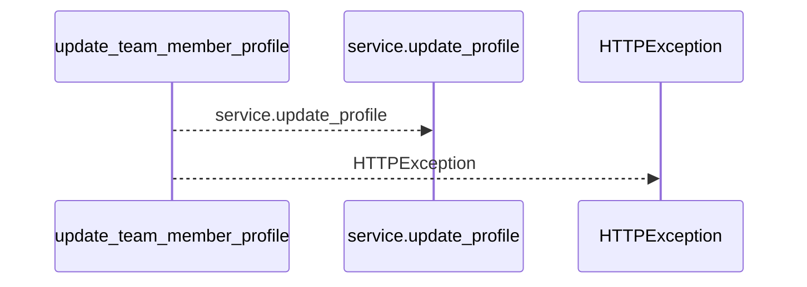
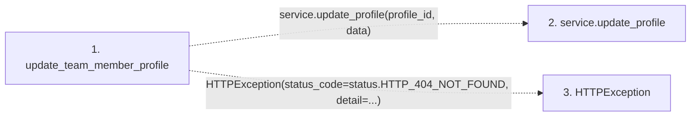

# update_team_member_profile

**Entry point:** `update_team_member_profile` (`http`)
**Source:** [routers_team](../modules/routers_team.md)
**Modules touched:** [routers_team](../modules/routers_team.md)

## Call sequence

<!-- Auto-generated from static call edges. Dashed arrows are external or unresolved calls. Reviewed runtime conditions and side effects belong in Behavior. -->

## Data flow

<!-- Auto-generated static analysis. Treat values and boundaries as best-effort hints, not runtime proof. -->

### Step data

| Step | Inputs | Reads | Writes | Returns |
|---|---|---|---|---|
| `update_team_member_profile` | `profile_id: int`, `data: TeamMemberProfileUpdate`, `service: Annotated[TeamService, Depends(get_team_service)]` | `status` | - | `profile` |
| `service.update_profile` | - | - | - | - |
| `HTTPException` | - | - | - | - |

### Call data

| From | To | Line | Call |
|---|---|---:|---|
| update_team_member_profile | service.update_profile | 100 | `service.update_profile(profile_id, data)` |
| update_team_member_profile | HTTPException | 102 | `HTTPException(status_code=status.HTTP_404_NOT_FOUND, detail=...)` |

### Boundary effects

*No boundary effects detected.*

### Static analysis gaps

| Kind | Step | Target | Line |
|---|---|---|---:|
| unresolved_call | `update_team_member_profile` | `service.update_profile` | 100 |
| external_call | `update_team_member_profile` | `HTTPException` | 102 |

## Behavior

This flow starts at `update_team_member_profile` and is classified as `http`. The generated call and data-flow sections are bounded static projections; runtime conditions and side effects require source-level confirmation.
