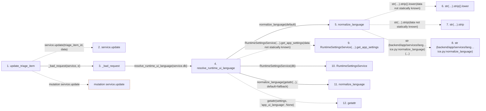

# update_triage_item

**Entry point:** `update_triage_item` (`http`)
**Source:** [routers_triage](../modules/routers_triage.md)
**Modules touched:** [config](../modules/config.md), [language_service](../modules/language_service.md), [routers_triage](../modules/routers_triage.md), [system_settings_service](../modules/system_settings_service.md)

## Call sequence

```mermaid
sequenceDiagram
    participant p0 as update_triage_item
    participant p1 as service.update
    participant p2 as _bad_request
    participant p3 as resolve_runtime_ui_language
    participant p4 as normalize_language
    participant p5 as str(…).strip().lower
    participant p6 as str(…).strip
    participant p7 as str (backend/app/services/lang…ice.py:normalize_language)
    participant p8 as RuntimeSettingsService(…).get_app_settings
    participant p9 as RuntimeSettingsService
    participant p10 as getattr
    participant p11 as logger.warning
    participant p12 as get_settings
    participant p13 as Settings
    participant p14 as HTTPException (backend/app/routers/triage.py:_bad_request)
    participant p15 as backend_error_message
    participant p16 as message.lower
    participant p17 as re.fullmatch
    participant p18 as match.groups
    participant p19 as label.strip().lower().replace
    participant p20 as label.strip().lower
    participant p21 as label.strip
    participant p22 as entity_not_found_message
    participant p23 as _RESOURCE_LABELS.get (backend/app/services/lang…:entity_not_found_message)
    participant p24 as localized
    p0-->>p1: service.update
    p0->>p2: _bad_request
    p2->>p3: resolve_runtime_ui_language
    p3->>p4: normalize_language
    p4-->>p5: str(…).strip().lower
    p4-->>p6: str(…).strip
    p4-->>p7: str (backend/app/services/lang…ice.py:normalize_language)
    p3-->>p8: RuntimeSettingsService(…).get_app_settings
    p3->>p9: RuntimeSettingsService
    p3->>p4: normalize_language
    p3-->>p10: getattr
    p3-->>p11: logger.warning
    p3->>p4: normalize_language
    p3-->>p10: getattr
    p3->>p12: get_settings
    p12->>p13: Settings
    p3-->>p11: logger.warning
    p2-->>p14: HTTPException (backend/app/routers/triage.py:_bad_request)
    p2->>p15: backend_error_message
    p15->>p4: normalize_language
    p15-->>p16: message.lower
    p15-->>p17: re.fullmatch
    p15-->>p18: match.groups
    p15-->>p19: label.strip().lower().replace
    p15-->>p20: label.strip().lower
    p15-->>p21: label.strip
    p15->>p22: entity_not_found_message
    p22-->>p23: _RESOURCE_LABELS.get (backend/app/services/lang…:entity_not_found_message)
    p22->>p24: localized
    p24->>p4: normalize_language
```

<!-- Auto-generated from static call edges. Dashed arrows are external or unresolved calls. Reviewed runtime conditions and side effects belong in Behavior. -->

> Call sequence diagram shows 30 of 119 interactions; 89 omitted to keep the visualization within the 30-interaction and generated-diagram limits.

## Data flow

<!-- Auto-generated static analysis. Treat values and boundaries as best-effort hints, not runtime proof. -->

### Step data

| Step | Inputs | Reads | Writes | Returns |
|---|---|---|---|---|
| `update_triage_item` | `triage_item_id: int`, `data: TriageItemUpdate`, `service: Annotated[TriageService, Depends(get_triage_service)]` | `status` | - | `item` |
| `service.update` | - | - | - | - |
| `_bad_request` | `service`, `error: ValueError` | `status` | - | `HTTPException(...)` |
| `resolve_runtime_ui_language` | `db: Any`, `default: LanguageCode \| None` | - | - | `normalize_language(...)`, `normalize_language(...)`, `fallback` |
| `normalize_language` | `value: Any`, `default: LanguageCode` | - | - | `normalized`, `default` |
| `str(…).strip().lower` | - | - | - | - |
| `str(…).strip` | - | - | - | - |
| `str (backend/app/services/lang…ice.py:normalize_language)` | - | - | - | - |
| `RuntimeSettingsService(…).get_app_settings` | - | - | - | - |
| `RuntimeSettingsService` | - | - | - | - |
| `normalize_language` | `value: Any`, `default: LanguageCode` | - | - | `normalized`, `default` |
| `getattr` | - | - | - | - |

### Call data

| From | To | Line | Call |
|---|---|---:|---|
| update_triage_item | service.update | 261 | `service.update(triage_item_id, data)` |
| update_triage_item | _bad_request | 263 | `_bad_request(service, e)` |
| _bad_request | resolve_runtime_ui_language | 64 | `resolve_runtime_ui_language(service.db)` |
| resolve_runtime_ui_language | normalize_language | 406 | `normalize_language(default)` |
| normalize_language | str(…).strip().lower | 35 | `str(value or '').strip().lower(data not statically known)` |
| normalize_language | str(…).strip | 35 | `str(value or '').strip(data not statically known)` |
| normalize_language | str (backend/app/services/lang…ice.py:normalize_language) | 35 | `str(...)` |
| resolve_runtime_ui_language | RuntimeSettingsService(…).get_app_settings | 411 | `RuntimeSettingsService(db).get_app_settings(data not statically known)` |
| resolve_runtime_ui_language | RuntimeSettingsService | 411 | `RuntimeSettingsService(db)` |
| resolve_runtime_ui_language | normalize_language | 412 | `normalize_language(getattr(...), default=fallback)` |
| resolve_runtime_ui_language | getattr | 412 | `getattr(settings, 'app_ui_language', None)` |

### Boundary effects

| Kind | Target | Step | Line |
|---|---|---|---:|
| mutation | `service.update` | `update_triage_item` | 261 |

### Static analysis gaps

| Kind | Step | Target | Line |
|---|---|---|---:|
| unresolved_call | `normalize_language` | `str(value or '').strip().lower` | 35 |
| unresolved_call | `normalize_language` | `str(value or '').strip` | 35 |
| unresolved_call | `resolve_runtime_ui_language` | `RuntimeSettingsService(db).get_app_settings` | 411 |
| external_call | `resolve_runtime_ui_language` | `getattr` | 412 |
| step_limit | `update_triage_item` | `first 12 steps` | 0 |

## Behavior

This flow starts at `update_triage_item` and is classified as `http`. The generated call and data-flow sections are bounded static projections; runtime conditions and side effects require source-level confirmation.
