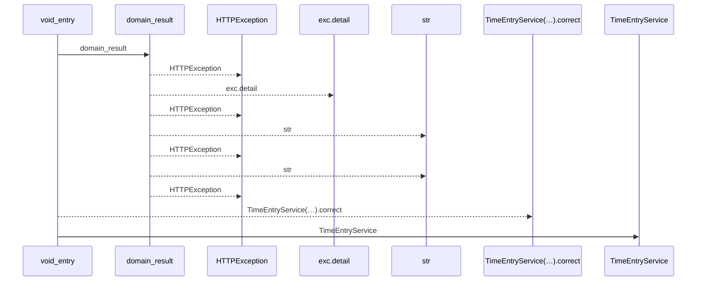
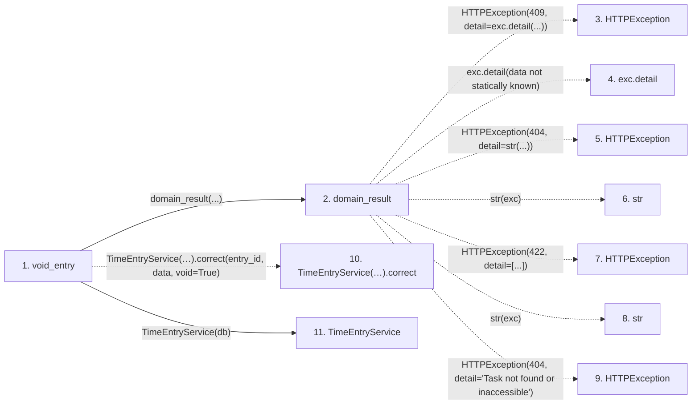

# void_entry

**Entry point:** `void_entry` (`http`)
**Source:** [time_entries](../modules/time_entries.md)
**Modules touched:** [routers_task_domain](../modules/routers_task_domain.md), [time_entries](../modules/time_entries.md), [time_entry_service](../modules/time_entry_service.md)

## Call sequence

<!-- Auto-generated from static call edges. Dashed arrows are external or unresolved calls. Reviewed runtime conditions and side effects belong in Behavior. -->

## Data flow

<!-- Auto-generated static analysis. Treat values and boundaries as best-effort hints, not runtime proof. -->

### Step data

| Step | Inputs | Reads | Writes | Returns |
|---|---|---|---|---|
| `void_entry` | `entry_id: int`, `data: TimeEntryVoid`, `db: DB` | - | - | `...` |
| `domain_result` | `awaitable` | `TaskVersionConflictError` | - | `result` |
| `HTTPException` | - | - | - | - |
| `exc.detail` | - | - | - | - |
| `HTTPException` | - | - | - | - |
| `str` | - | - | - | - |
| `HTTPException` | - | - | - | - |
| `str` | - | - | - | - |
| `HTTPException` | - | - | - | - |
| `TimeEntryService(…).correct` | - | - | - | - |
| `TimeEntryService` | - | - | - | - |

### Call data

| From | To | Line | Call |
|---|---|---:|---|
| void_entry | domain_result | 78 | `domain_result(...)` |
| domain_result | HTTPException | 51 | `HTTPException(409, detail=exc.detail(...))` |
| domain_result | exc.detail | 51 | `exc.detail(data not statically known)` |
| domain_result | HTTPException | 53 | `HTTPException(404, detail=str(...))` |
| domain_result | str | 53 | `str(exc)` |
| domain_result | HTTPException | 55 | `HTTPException(422, detail=[...])` |
| domain_result | str | 55 | `str(exc)` |
| domain_result | HTTPException | 57 | `HTTPException(404, detail='Task not found or inaccessible')` |
| void_entry | TimeEntryService(…).correct | 78 | `TimeEntryService(db).correct(entry_id, data, void=True)` |
| void_entry | TimeEntryService | 78 | `TimeEntryService(db)` |

### Boundary effects

*No boundary effects detected.*

### Static analysis gaps

| Kind | Step | Target | Line |
|---|---|---|---:|
| external_call | `domain_result` | `HTTPException` | 51 |
| unresolved_call | `domain_result` | `exc.detail` | 51 |
| external_call | `domain_result` | `HTTPException` | 53 |
| external_call | `domain_result` | `HTTPException` | 55 |
| external_call | `domain_result` | `HTTPException` | 57 |
| unresolved_call | `void_entry` | `TimeEntryService(db).correct` | 78 |

## Behavior

This flow starts at `void_entry` and is classified as `http`. The generated call and data-flow sections are bounded static projections; runtime conditions and side effects require source-level confirmation.
