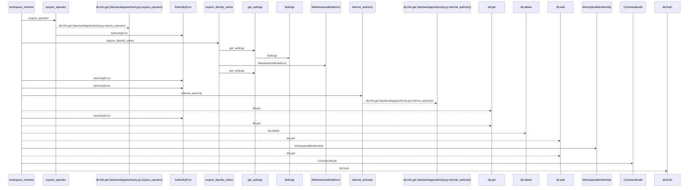
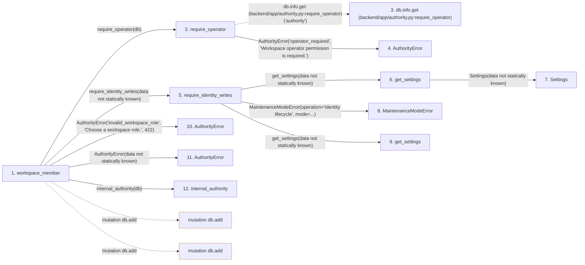

# workspace_member

**Entry point:** `workspace_member` (`http`)
**Source:** [routers_identity](../modules/routers_identity.md)
**Modules touched:** [authority](../modules/authority.md), [config](../modules/config.md), [identity_service](../modules/identity_service.md), [maintenance](../modules/maintenance.md), and 2 more

**Complete modules touched:**

- [authority](../modules/authority.md)
- [config](../modules/config.md)
- [identity_service](../modules/identity_service.md)
- [maintenance](../modules/maintenance.md)
- [models_identity](../modules/models_identity.md)
- [routers_identity](../modules/routers_identity.md)

## Call sequence

<!-- Auto-generated from static call edges. Dashed arrows are external or unresolved calls. Reviewed runtime conditions and side effects belong in Behavior. -->

## Data flow

<!-- Auto-generated static analysis. Treat values and boundaries as best-effort hints, not runtime proof. -->

### Step data

| Step | Inputs | Reads | Writes | Returns |
|---|---|---|---|---|
| `workspace_member` | `principal_id: int`, `data: MembershipChange`, `db: Database` | `Principal`, `WorkspaceMembership` | `existing.role` | `{...}` |
| `require_operator` | `db` | - | - | - |
| `db.info.get (backend/app/authority.py:require_operator)` | - | - | - | - |
| `AuthorityError` | - | - | - | - |
| `require_identity_writes` | - | - | - | - |
| `get_settings` | - | - | - | `Settings(...)` |
| `Settings` | - | - | - | - |
| `MaintenanceModeError` | - | - | - | - |
| `get_settings` | - | - | - | `Settings(...)` |
| `AuthorityError` | - | - | - | - |
| `AuthorityError` | - | - | - | - |
| `internal_authority` | `db` | - | `db.info[...]`, `db.info[...]` | - |

### Call data

| From | To | Line | Call |
|---|---|---:|---|
| workspace_member | require_operator | 208 | `require_operator(db)` |
| require_operator | db.info.get (backend/app/authority.py:require_operator) | 79 | `db.info.get('authority')` |
| require_operator | AuthorityError | 81 | `AuthorityError('operator_required', 'Workspace operator permission is required.')` |
| workspace_member | require_identity_writes | 209 | `require_identity_writes(data not statically known)` |
| require_identity_writes | get_settings | 31 | `get_settings(data not statically known)` |
| get_settings | Settings | 480 | `Settings(data not statically known)` |
| require_identity_writes | MaintenanceModeError | 32 | `MaintenanceModeError(operation='identity lifecycle', mode=...)` |
| require_identity_writes | get_settings | 32 | `get_settings(data not statically known)` |
| workspace_member | AuthorityError | 212 | `AuthorityError('invalid_workspace_role', 'Choose a workspace role.', 422)` |
| workspace_member | AuthorityError | 214 | `AuthorityError(data not statically known)` |
| workspace_member | internal_authority | 215 | `internal_authority(db)` |

### Boundary effects

| Kind | Target | Step | Line |
|---|---|---|---:|
| mutation | `db.add` | `workspace_member` | 225 |
| mutation | `db.add` | `workspace_member` | 226 |

### Static analysis gaps

| Kind | Step | Target | Line |
|---|---|---|---:|
| unresolved_call | `require_operator` | `db.info.get` | 79 |
| step_limit | `workspace_member` | `first 12 steps` | 0 |

## Behavior

This flow starts at `workspace_member` and is classified as `http`. The generated call and data-flow sections are bounded static projections; runtime conditions and side effects require source-level confirmation.
