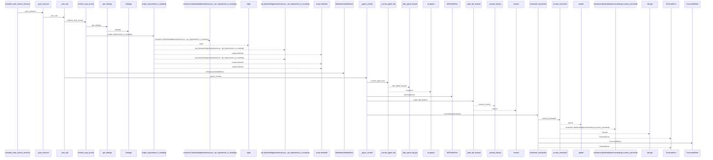
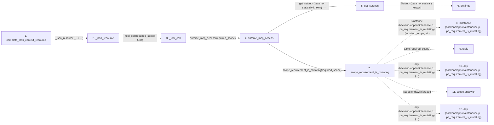

# complete_task_context_resource

**Entry point:** `complete_task_context_resource` (`mcp`)
**Source:** [mcp_server](../modules/mcp_server.md)
**Modules touched:** [agent_service](../modules/agent_service.md), [agent_work_service](../modules/agent_work_service.md), [commands](../modules/commands.md), [config](../modules/config.md), and 4 more

**Complete modules touched:**

- [agent_service](../modules/agent_service.md)
- [agent_work_service](../modules/agent_work_service.md)
- [commands](../modules/commands.md)
- [config](../modules/config.md)
- [identity_service](../modules/identity_service.md)
- [maintenance](../modules/maintenance.md)
- [mcp_agent_tools](../modules/mcp_agent_tools.md)
- [mcp_server](../modules/mcp_server.md)

## Call sequence

<!-- Auto-generated from static call edges. Dashed arrows are external or unresolved calls. Reviewed runtime conditions and side effects belong in Behavior. -->

> Call sequence diagram shows 30 of 94 interactions; 64 omitted to keep the visualization within the 30-interaction and generated-diagram limits.

> Trace truncated at the depth limit; deeper calls are omitted.

## Data flow

<!-- Auto-generated static analysis. Treat values and boundaries as best-effort hints, not runtime proof. -->

### Step data

| Step | Inputs | Reads | Writes | Returns |
|---|---|---|---|---|
| `complete_task_context_resource` | `task_id: str` | - | - | `...` |
| `_json_resource` | `required_scope: ScopeRequirement`, `func: Callable[[Any, AgentActor], Any]` | - | - | `json.dumps(...)` |
| `_tool_call` | `required_scope: ScopeRequirement`, `func: Callable[[Any, AgentActor], Any]`, `preview` | `ToolError`, `AggregateVersionConflict`, `HierarchyScopeError`, `AuthorityError`, `MCPAuthError`, `MaintenanceModeError`, `AgentRoutingConflictError`, `AgentTeamSetupConflictError` | - | `...` |
| `enforce_mcp_access` | `required_scope: Any` | - | - | `none` |
| `get_settings` | - | - | - | `Settings(...)` |
| `Settings` | - | - | - | - |
| `scope_requirement_is_mutating` | `required_scope: Any` | - | - | `False`, `...` |
| `isinstance (backend/app/maintenance.p…pe_requirement_is_mutating)` | - | - | - | - |
| `tuple` | - | - | - | - |
| `any (backend/app/maintenance.p…pe_requirement_is_mutating)` | - | - | - | - |
| `scope.endswith` | - | - | - | - |
| `any (backend/app/maintenance.p…pe_requirement_is_mutating)` | - | - | - | - |

### Call data

| From | To | Line | Call |
|---|---|---:|---|
| complete_task_context_resource | _json_resource | 2203 | `_json_resource((...), ...)` |
| _json_resource | _tool_call | 330 | `_tool_call(required_scope, func)` |
| _tool_call | enforce_mcp_access | 302 | `enforce_mcp_access(required_scope)` |
| enforce_mcp_access | get_settings | 112 | `get_settings(data not statically known)` |
| get_settings | Settings | 479 | `Settings(data not statically known)` |
| enforce_mcp_access | scope_requirement_is_mutating | 113 | `scope_requirement_is_mutating(required_scope)` |
| scope_requirement_is_mutating | isinstance (backend/app/maintenance.p…pe_requirement_is_mutating) | 100 | `isinstance(required_scope, str)` |
| scope_requirement_is_mutating | tuple | 100 | `tuple(required_scope)` |
| scope_requirement_is_mutating | any (backend/app/maintenance.p…pe_requirement_is_mutating) | 101 | `any(...)` |
| scope_requirement_is_mutating | scope.endswith | 101 | `scope.endswith(':read')` |
| scope_requirement_is_mutating | any (backend/app/maintenance.p…pe_requirement_is_mutating) | 102 | `any(...)` |

### Boundary effects

*No boundary effects detected.*

### Static analysis gaps

| Kind | Step | Target | Line |
|---|---|---|---:|
| external_call | `scope_requirement_is_mutating` | `isinstance` | 100 |
| external_call | `scope_requirement_is_mutating` | `any` | 101 |
| unresolved_call | `scope_requirement_is_mutating` | `scope.endswith` | 101 |
| external_call | `scope_requirement_is_mutating` | `any` | 102 |
| step_limit | `complete_task_context_resource` | `first 12 steps` | 0 |
| truncated_flow | `complete_task_context_resource` | `depth limit` | 0 |

## Behavior

This flow starts at `complete_task_context_resource` and is classified as `mcp`. The generated call and data-flow sections are bounded static projections; runtime conditions and side effects require source-level confirmation.
