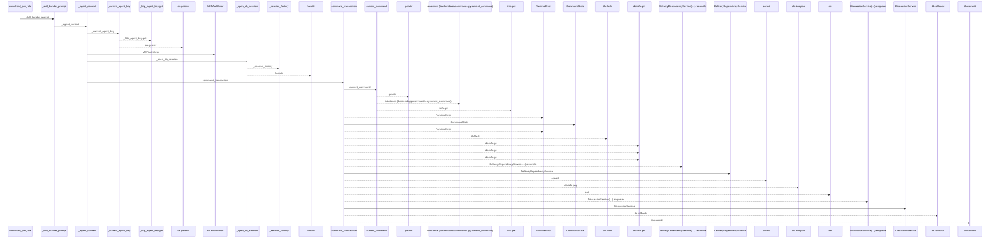
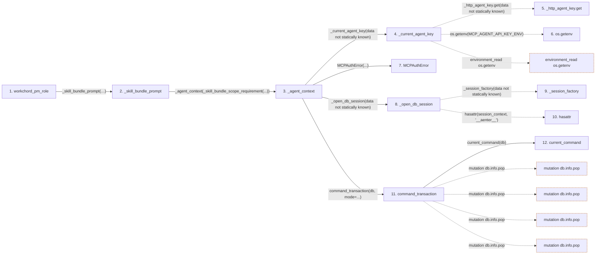

# workchord_pm_role

**Entry point:** `workchord_pm_role` (`mcp`)
**Source:** [mcp_server](../modules/mcp_server.md)
**Modules touched:** [agent_service](../modules/agent_service.md), [commands](../modules/commands.md), [config](../modules/config.md), [delivery_dependency_service](../modules/delivery_dependency_service.md), and 3 more

**Complete modules touched:**

- [agent_service](../modules/agent_service.md)
- [commands](../modules/commands.md)
- [config](../modules/config.md)
- [delivery_dependency_service](../modules/delivery_dependency_service.md)
- [discussion_service](../modules/discussion_service.md)
- [identity_service](../modules/identity_service.md)
- [mcp_server](../modules/mcp_server.md)

## Call sequence

<!-- Auto-generated from static call edges. Dashed arrows are external or unresolved calls. Reviewed runtime conditions and side effects belong in Behavior. -->

> Call sequence diagram shows 30 of 57 interactions; 27 omitted to keep the visualization within the 30-interaction and generated-diagram limits.

> Trace truncated at the depth limit; deeper calls are omitted.

## Data flow

<!-- Auto-generated static analysis. Treat values and boundaries as best-effort hints, not runtime proof. -->

### Step data

| Step | Inputs | Reads | Writes | Returns |
|---|---|---|---|---|
| `workchord_pm_role` | - | - | - | `...` |
| `_skill_bundle_prompt` | `value: str` | - | - | `value` |
| `_agent_context` | `required_scope: ScopeRequirement`, `preview` | `MCP_AGENT_API_KEY_ENV` | `db.info[...]` | - |
| `_current_agent_key` | - | `MCP_AGENT_API_KEY_ENV` | - | `...` |
| `_http_agent_key.get` | - | - | - | - |
| `os.getenv` | - | - | - | - |
| `MCPAuthError` | - | - | - | - |
| `_open_db_session` | - | - | - | `none` |
| `_session_factory` | - | - | - | - |
| `hasattr` | - | - | - | - |
| `command_transaction` | `db: AsyncSession`, `mode`, `commit` | - | `previous.failed`, `db.info[...]` | `none` |
| `current_command` | `db` | - | - | `...` |

### Call data

| From | To | Line | Call |
|---|---|---:|---|
| workchord_pm_role | _skill_bundle_prompt | 2327 | `_skill_bundle_prompt('Read workchord://agent/capabilities, resolve its recommended PM skill version, then read workchord://skill-bundles/workchord-pm/{version}/SKILL.md. Follow that controller skill and its referenced files; do not infer authority from profile capability matches.')` |
| _skill_bundle_prompt | _agent_context | 338 | `_agent_context(_skill_bundle_scope_requirement(...))` |
| _agent_context | _current_agent_key | 247 | `_current_agent_key(data not statically known)` |
| _current_agent_key | _http_agent_key.get | 200 | `_http_agent_key.get(data not statically known)` |
| _current_agent_key | os.getenv | 200 | `os.getenv(MCP_AGENT_API_KEY_ENV)` |
| _agent_context | MCPAuthError | 249 | `MCPAuthError(...)` |
| _agent_context | _open_db_session | 250 | `_open_db_session(data not statically known)` |
| _open_db_session | _session_factory | 181 | `_session_factory(data not statically known)` |
| _open_db_session | hasattr | 182 | `hasattr(session_context, '__aenter__')` |
| _agent_context | command_transaction | 251 | `command_transaction(db, mode=...)` |
| command_transaction | current_command | 87 | `current_command(db)` |

### Boundary effects

| Kind | Target | Step | Line |
|---|---|---|---:|
| environment_read | `os.getenv` | `_current_agent_key` | 200 |
| mutation | `db.info.pop` | `command_transaction` | 107 |
| mutation | `db.info.pop` | `command_transaction` | 120 |
| mutation | `db.info.pop` | `command_transaction` | 121 |
| mutation | `db.info.pop` | `command_transaction` | 123 |

### Static analysis gaps

| Kind | Step | Target | Line |
|---|---|---|---:|
| unresolved_call | `_open_db_session` | `_session_factory` | 181 |
| external_call | `_open_db_session` | `hasattr` | 182 |
| step_limit | `workchord_pm_role` | `first 12 steps` | 0 |
| truncated_flow | `workchord_pm_role` | `depth limit` | 0 |

## Behavior

This flow starts at `workchord_pm_role` and is classified as `mcp`. The generated call and data-flow sections are bounded static projections; runtime conditions and side effects require source-level confirmation.
