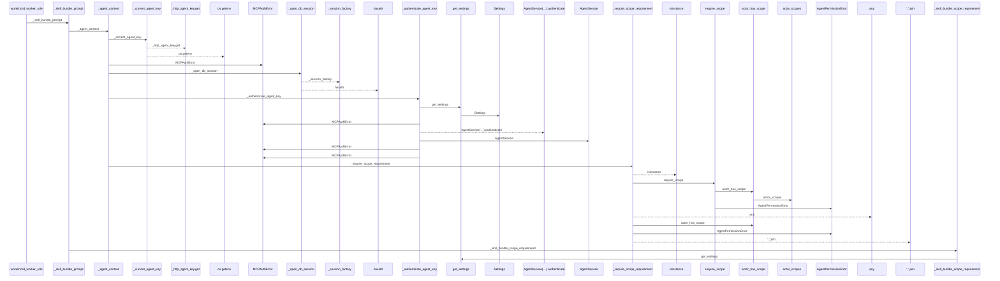
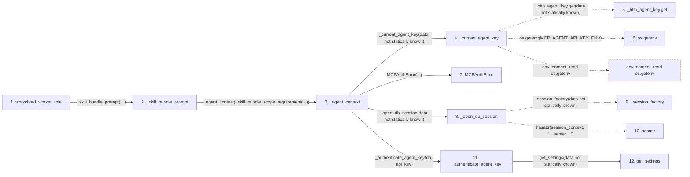

# workchord_worker_role

**Entry point:** `workchord_worker_role` (`mcp`)
**Source:** [mcp_server](../modules/mcp_server.md)
**Modules touched:** [agent_service](../modules/agent_service.md), [config](../modules/config.md), [mcp_server](../modules/mcp_server.md)

## Call sequence

<!-- Auto-generated from static call edges. Dashed arrows are external or unresolved calls. Reviewed runtime conditions and side effects belong in Behavior. -->

> Trace truncated at the depth limit; deeper calls are omitted.

## Data flow

<!-- Auto-generated static analysis. Treat values and boundaries as best-effort hints, not runtime proof. -->

### Step data

| Step | Inputs | Reads | Writes | Returns |
|---|---|---|---|---|
| `workchord_worker_role` | - | - | - | `...` |
| `_skill_bundle_prompt` | `value: str` | - | - | `value` |
| `_agent_context` | `required_scope: ScopeRequirement` | `MCP_AGENT_API_KEY_ENV` | - | - |
| `_current_agent_key` | - | `MCP_AGENT_API_KEY_ENV` | - | `...` |
| `_http_agent_key.get` | - | - | - | - |
| `os.getenv` | - | - | - | - |
| `MCPAuthError` | - | - | - | - |
| `_open_db_session` | - | - | - | `none` |
| `_session_factory` | - | - | - | - |
| `hasattr` | - | - | - | - |
| `_authenticate_agent_key` | `db: Any`, `api_key: str` | - | - | `actor` |
| `get_settings` | - | - | - | `Settings(...)` |

### Call data

| From | To | Line | Call |
|---|---|---:|---|
| workchord_worker_role | _skill_bundle_prompt | 2257 | `_skill_bundle_prompt('Read workchord://agent/capabilities, resolve its recommended worker skill version, then read workchord://skill-bundles/workchord-worker/{version}/SKILL.md. Follow that skill, call workchord://agent/me/work, and execute only the exact server-selected assignment.')` |
| _skill_bundle_prompt | _agent_context | 309 | `_agent_context(_skill_bundle_scope_requirement(...))` |
| _agent_context | _current_agent_key | 227 | `_current_agent_key(data not statically known)` |
| _current_agent_key | _http_agent_key.get | 180 | `_http_agent_key.get(data not statically known)` |
| _current_agent_key | os.getenv | 180 | `os.getenv(MCP_AGENT_API_KEY_ENV)` |
| _agent_context | MCPAuthError | 229 | `MCPAuthError(...)` |
| _agent_context | _open_db_session | 230 | `_open_db_session(data not statically known)` |
| _open_db_session | _session_factory | 161 | `_session_factory(data not statically known)` |
| _open_db_session | hasattr | 162 | `hasattr(session_context, '__aenter__')` |
| _agent_context | _authenticate_agent_key | 231 | `_authenticate_agent_key(db, api_key)` |
| _authenticate_agent_key | get_settings | 185 | `get_settings(data not statically known)` |

### Boundary effects

| Kind | Target | Step | Line |
|---|---|---|---:|
| environment_read | `os.getenv` | `_current_agent_key` | 180 |

### Static analysis gaps

| Kind | Step | Target | Line |
|---|---|---|---:|
| unresolved_call | `_open_db_session` | `_session_factory` | 161 |
| external_call | `_open_db_session` | `hasattr` | 162 |
| step_limit | `workchord_worker_role` | `first 12 steps` | 0 |
| truncated_flow | `workchord_worker_role` | `depth limit` | 0 |

## Behavior

This flow starts at `workchord_worker_role` and is classified as `mcp`. The generated call and data-flow sections are bounded static projections; runtime conditions and side effects require source-level confirmation.
