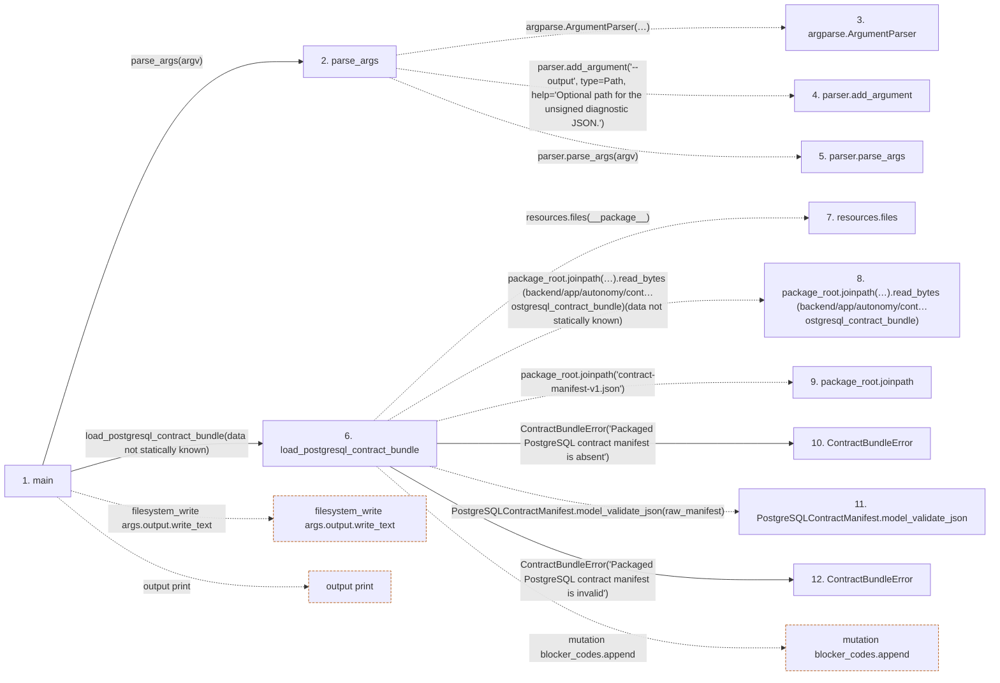

# agent_preflight

**Entry point:** `main` (`process`)
**Source:** [agent_preflight](../modules/agent_preflight.md)
**Modules touched:** [agent_preflight](../modules/agent_preflight.md), [autonomy_canonical](../modules/autonomy_canonical.md), [loader](../modules/loader.md), [preflight](../modules/preflight.md)

**Related modules:** [autonomy_canonical](../modules/autonomy_canonical.md), [postgresql___init__](../modules/postgresql___init__.md), [preflight](../modules/preflight.md)

## Call sequence

```mermaid
sequenceDiagram
    participant p0 as main
    participant p1 as parse_args
    participant p2 as argparse.ArgumentParser
    participant p3 as parser.add_argument
    participant p4 as parser.parse_args
    participant p5 as load_postgresql_contract_bundle
    participant p6 as resources.files
    participant p7 as package_root.joinpath(…).read_bytes (backend/app/autonomy/cont…ostgresql_contract_bundle)
    participant p8 as package_root.joinpath
    participant p9 as ContractBundleError
    participant p10 as PostgreSQLContractManifest.model_validate_json
    participant p11 as canonical_json_bytes
    participant p12 as json.dumps(…).encode
    participant p13 as json.dumps (backend/app/autonomy/cano…l.py:canonical_json_bytes)
    participant p14 as _json_value
    participant p15 as isinstance (backend/app/autonomy/canonical.py:_json_value)
    participant p16 as value.model_dump
    participant p17 as value.isoformat
    participant p18 as str
    participant p19 as value.items
    participant p20 as package_root.joinpath(…).read_bytes (backend/app/autonomy/cont…gresql_contract_bundle, 1)
    p0->>p1: parse_args
    p1-->>p2: argparse.ArgumentParser
    p1-->>p3: parser.add_argument
    p1-->>p4: parser.parse_args
    p0->>p5: load_postgresql_contract_bundle
    p5-->>p6: resources.files
    p5-->>p7: package_root.joinpath(…).read_bytes (backend/app/autonomy/cont…ostgresql_contract_bundle)
    p5-->>p8: package_root.joinpath
    p5->>p9: ContractBundleError
    p5-->>p10: PostgreSQLContractManifest.model_validate_json
    p5->>p9: ContractBundleError
    p5->>p11: canonical_json_bytes
    p11-->>p12: json.dumps(…).encode
    p11-->>p13: json.dumps (backend/app/autonomy/cano…l.py:canonical_json_bytes)
    p11->>p14: _json_value
    p14-->>p15: isinstance (backend/app/autonomy/canonical.py:_json_value)
    p14-->>p16: value.model_dump
    p14-->>p15: isinstance (backend/app/autonomy/canonical.py:_json_value)
    p14-->>p15: isinstance (backend/app/autonomy/canonical.py:_json_value)
    p14-->>p17: value.isoformat
    p14-->>p15: isinstance (backend/app/autonomy/canonical.py:_json_value)
    p14-->>p18: str
    p14->>p14: _json_value
    p14-->>p19: value.items
    p14-->>p15: isinstance (backend/app/autonomy/canonical.py:_json_value)
    p14-->>p15: isinstance (backend/app/autonomy/canonical.py:_json_value)
    p14->>p14: _json_value
    p5-->>p20: package_root.joinpath(…).read_bytes (backend/app/autonomy/cont…gresql_contract_bundle, 1)
    p5-->>p8: package_root.joinpath
    p5->>p9: ContractBundleError
```

<!-- Auto-generated from static call edges. Dashed arrows are external or unresolved calls. Reviewed runtime conditions and side effects belong in Behavior. -->

> Call sequence diagram shows 30 of 153 interactions; 123 omitted to keep the visualization within the 30-interaction and generated-diagram limits.

## Data flow

<!-- Auto-generated static analysis. Treat values and boundaries as best-effort hints, not runtime proof. -->

### Step data

| Step | Inputs | Reads | Writes | Returns |
|---|---|---|---|---|
| `main` | `argv: list[str] \| None` | - | - | `2` |
| `parse_args` | `argv: list[str] \| None` | `Path` | - | `parser.parse_args(...)` |
| `argparse.ArgumentParser` | - | - | - | - |
| `parser.add_argument` | - | - | - | - |
| `parser.parse_args` | - | - | - | - |
| `load_postgresql_contract_bundle` | `archive: ImmutableContractArchive \| None`, `require_archive: bool` | - | `members[...]` | `PostgreSQLContractBundle(...)` |
| `resources.files` | - | - | - | - |
| `package_root.joinpath(…).read_bytes (backend/app/autonomy/cont…ostgresql_contract_bundle)` | - | - | - | - |
| `package_root.joinpath` | - | - | - | - |
| `ContractBundleError` | - | - | - | - |
| `PostgreSQLContractManifest.model_validate_json` | - | - | - | - |
| `ContractBundleError` | - | - | - | - |

### Call data

| From | To | Line | Call |
|---|---|---:|---|
| main | parse_args | 50 | `parse_args(argv)` |
| parse_args | argparse.ArgumentParser | 35 | `argparse.ArgumentParser(description='Evaluate the locally discoverable PostgreSQL autonomous-start inputs. This diagnostic never substitutes for the required remote-signed preflight.')` |
| parse_args | parser.add_argument | 41 | `parser.add_argument('--output', type=Path, help='Optional path for the unsigned diagnostic JSON.')` |
| parse_args | parser.parse_args | 46 | `parser.parse_args(argv)` |
| main | load_postgresql_contract_bundle | 51 | `load_postgresql_contract_bundle(data not statically known)` |
| load_postgresql_contract_bundle | resources.files | 179 | `resources.files(__package__)` |
| load_postgresql_contract_bundle | package_root.joinpath(…).read_bytes (backend/app/autonomy/cont…ostgresql_contract_bundle) | 181 | `package_root.joinpath('contract-manifest-v1.json').read_bytes(data not statically known)` |
| load_postgresql_contract_bundle | package_root.joinpath | 181 | `package_root.joinpath('contract-manifest-v1.json')` |
| load_postgresql_contract_bundle | ContractBundleError | 183 | `ContractBundleError('Packaged PostgreSQL contract manifest is absent')` |
| load_postgresql_contract_bundle | PostgreSQLContractManifest.model_validate_json | 185 | `PostgreSQLContractManifest.model_validate_json(raw_manifest)` |
| load_postgresql_contract_bundle | ContractBundleError | 187 | `ContractBundleError('Packaged PostgreSQL contract manifest is invalid')` |

### Boundary effects

| Kind | Target | Step | Line |
|---|---|---|---:|
| filesystem_write | `args.output.write_text` | `main` | 64 |
| output | `print` | `main` | 66 |
| mutation | `blocker_codes.append` | `load_postgresql_contract_bundle` | 211 |

### Static analysis gaps

| Kind | Step | Target | Line |
|---|---|---|---:|
| external_call | `parse_args` | `argparse.ArgumentParser` | 35 |
| unresolved_call | `parse_args` | `parser.add_argument` | 41 |
| unresolved_call | `parse_args` | `parser.parse_args` | 46 |
| external_call | `load_postgresql_contract_bundle` | `resources.files` | 179 |
| unresolved_call | `load_postgresql_contract_bundle` | `package_root.joinpath('contract-manifest-v1.json').read_bytes` | 181 |
| unresolved_call | `load_postgresql_contract_bundle` | `package_root.joinpath` | 181 |
| unresolved_call | `load_postgresql_contract_bundle` | `PostgreSQLContractManifest.model_validate_json` | 185 |
| step_limit | `main` | `first 12 steps` | 0 |

## Behavior

This flow starts at `main` and is classified as `process`. The generated call and data-flow sections are bounded static projections; runtime conditions and side effects require source-level confirmation.
