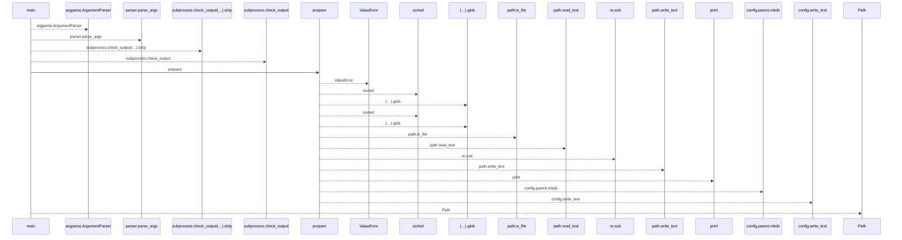
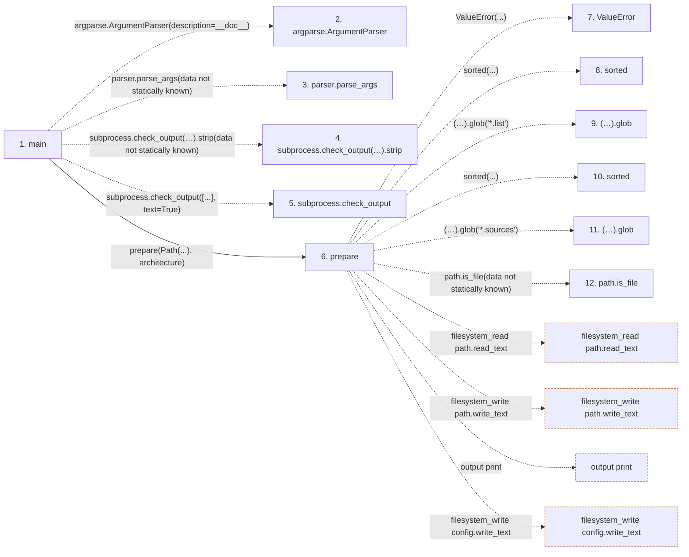

# apt_runtime

**Entry point:** `main` (`process`)
**Source:** [apt_runtime](../modules/apt_runtime.md)
**Modules touched:** [apt_runtime](../modules/apt_runtime.md)

## Call sequence

<!-- Auto-generated from static call edges. Dashed arrows are external or unresolved calls. Reviewed runtime conditions and side effects belong in Behavior. -->

## Data flow

<!-- Auto-generated static analysis. Treat values and boundaries as best-effort hints, not runtime proof. -->

### Step data

| Step | Inputs | Reads | Writes | Returns |
|---|---|---|---|---|
| `main` | - | - | - | - |
| `argparse.ArgumentParser` | - | - | - | - |
| `parser.parse_args` | - | - | - | - |
| `subprocess.check_output(…).strip` | - | - | - | - |
| `subprocess.check_output` | - | - | - | - |
| `prepare` | `root: Path`, `architecture: str` | `APT_CONFIG` | - | - |
| `ValueError` | - | - | - | - |
| `sorted` | - | - | - | - |
| `(…).glob` | - | - | - | - |
| `sorted` | - | - | - | - |
| `(…).glob` | - | - | - | - |
| `path.is_file` | - | - | - | - |

### Call data

| From | To | Line | Call |
|---|---|---:|---|
| main | argparse.ArgumentParser | 39 | `argparse.ArgumentParser(description=__doc__)` |
| main | parser.parse_args | 40 | `parser.parse_args(data not statically known)` |
| main | subprocess.check_output(…).strip | 41 | `subprocess.check_output(['dpkg', '--print-architecture'], text=True).strip(data not statically known)` |
| main | subprocess.check_output | 41 | `subprocess.check_output([...], text=True)` |
| main | prepare | 42 | `prepare(Path(...), architecture)` |
| prepare | ValueError | 19 | `ValueError(...)` |
| prepare | sorted | 23 | `sorted(...)` |
| prepare | (…).glob | 23 | `(root / 'sources.list.d').glob('*.list')` |
| prepare | sorted | 24 | `sorted(...)` |
| prepare | (…).glob | 24 | `(root / 'sources.list.d').glob('*.sources')` |
| prepare | path.is_file | 26 | `path.is_file(data not statically known)` |

### Boundary effects

| Kind | Target | Step | Line |
|---|---|---|---:|
| filesystem_read | `path.read_text` | `prepare` | 28 |
| filesystem_write | `path.write_text` | `prepare` | 31 |
| output | `print` | `prepare` | 32 |
| filesystem_write | `config.write_text` | `prepare` | 35 |

### Static analysis gaps

| Kind | Step | Target | Line |
|---|---|---|---:|
| external_call | `main` | `argparse.ArgumentParser` | 39 |
| unresolved_call | `main` | `parser.parse_args` | 40 |
| unresolved_call | `main` | `subprocess.check_output(['dpkg', '--print-architecture'], text=True).strip` | 41 |
| external_call | `main` | `subprocess.check_output` | 41 |
| external_call | `prepare` | `ValueError` | 19 |
| external_call | `prepare` | `sorted` | 23 |
| unresolved_call | `prepare` | `(root / 'sources.list.d').glob` | 23 |
| external_call | `prepare` | `sorted` | 24 |
| unresolved_call | `prepare` | `(root / 'sources.list.d').glob` | 24 |
| unresolved_call | `prepare` | `path.is_file` | 26 |
| step_limit | `main` | `first 12 steps` | 0 |

## Behavior

This flow starts at `main` and is classified as `process`. The generated call and data-flow sections are bounded static projections; runtime conditions and side effects require source-level confirmation.
