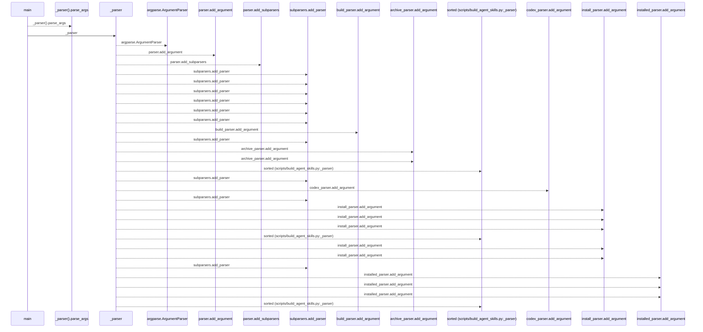
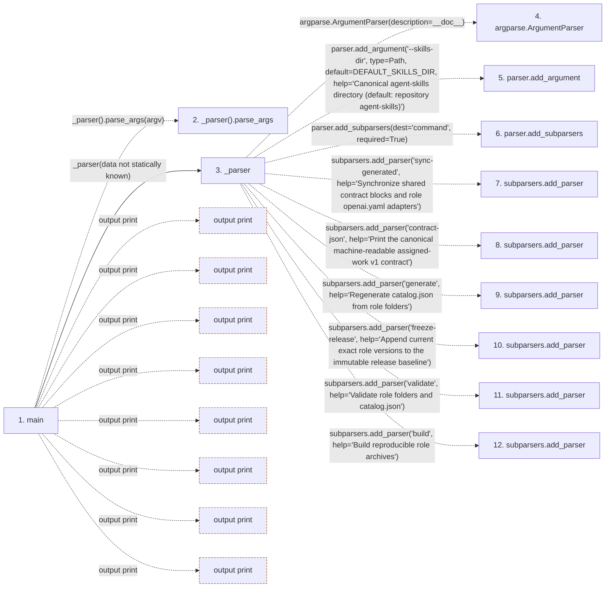

# build_agent_skills

**Entry point:** `main` (`process`)
**Source:** [build_agent_skills](../modules/build_agent_skills.md)
**Modules touched:** [build_agent_skills](../modules/build_agent_skills.md)

## Call sequence

<!-- Auto-generated from static call edges. Dashed arrows are external or unresolved calls. Reviewed runtime conditions and side effects belong in Behavior. -->

> Call sequence diagram shows 30 of 1164 interactions; 1134 omitted to keep the visualization within the 30-interaction and generated-diagram limits.

> Trace truncated at the depth limit; deeper calls are omitted.

## Data flow

<!-- Auto-generated static analysis. Treat values and boundaries as best-effort hints, not runtime proof. -->

### Step data

| Step | Inputs | Reads | Writes | Returns |
|---|---|---|---|---|
| `main` | `argv: list[str] \| None` | `REPOSITORY_ROOT`, `ASSIGNED_WORK_V1_CONTRACT`, `SkillPackError`, `sys` | - | `2`, `0` |
| `_parser().parse_args` | - | - | - | - |
| `_parser` | - | `Path`, `DEFAULT_SKILLS_DIR`, `Path`, `Path`, `ROLE_METADATA`, `Path`, `Path`, `Path` | - | `parser` |
| `argparse.ArgumentParser` | - | - | - | - |
| `parser.add_argument` | - | - | - | - |
| `parser.add_subparsers` | - | - | - | - |
| `subparsers.add_parser` | - | - | - | - |
| `subparsers.add_parser` | - | - | - | - |
| `subparsers.add_parser` | - | - | - | - |
| `subparsers.add_parser` | - | - | - | - |
| `subparsers.add_parser` | - | - | - | - |
| `subparsers.add_parser` | - | - | - | - |

### Call data

| From | To | Line | Call |
|---|---|---:|---|
| main | _parser().parse_args | 3079 | `_parser().parse_args(argv)` |
| main | _parser | 3079 | `_parser(data not statically known)` |
| _parser | argparse.ArgumentParser | 3020 | `argparse.ArgumentParser(description=__doc__)` |
| _parser | parser.add_argument | 3021 | `parser.add_argument('--skills-dir', type=Path, default=DEFAULT_SKILLS_DIR, help='Canonical agent-skills directory (default: repository agent-skills)')` |
| _parser | parser.add_subparsers | 3027 | `parser.add_subparsers(dest='command', required=True)` |
| _parser | subparsers.add_parser | 3028 | `subparsers.add_parser('sync-generated', help='Synchronize shared contract blocks and role openai.yaml adapters')` |
| _parser | subparsers.add_parser | 3032 | `subparsers.add_parser('contract-json', help='Print the canonical machine-readable assigned-work v1 contract')` |
| _parser | subparsers.add_parser | 3036 | `subparsers.add_parser('generate', help='Regenerate catalog.json from role folders')` |
| _parser | subparsers.add_parser | 3037 | `subparsers.add_parser('freeze-release', help='Append current exact role versions to the immutable release baseline')` |
| _parser | subparsers.add_parser | 3041 | `subparsers.add_parser('validate', help='Validate role folders and catalog.json')` |
| _parser | subparsers.add_parser | 3042 | `subparsers.add_parser('build', help='Build reproducible role archives')` |

### Boundary effects

| Kind | Target | Step | Line |
|---|---|---|---:|
| output | `print` | `main` | 3088 |
| output | `print` | `main` | 3093 |
| output | `print` | `main` | 3096 |
| output | `print` | `main` | 3099 |
| output | `print` | `main` | 3102 |
| output | `print` | `main` | 3108 |
| output | `print` | `main` | 3111 |
| output | `print` | `main` | 3120 |

### Static analysis gaps

| Kind | Step | Target | Line |
|---|---|---|---:|
| unresolved_call | `main` | `_parser().parse_args` | 3079 |
| external_call | `_parser` | `argparse.ArgumentParser` | 3020 |
| unresolved_call | `_parser` | `parser.add_argument` | 3021 |
| unresolved_call | `_parser` | `parser.add_subparsers` | 3027 |
| unresolved_call | `_parser` | `subparsers.add_parser` | 3028 |
| unresolved_call | `_parser` | `subparsers.add_parser` | 3032 |
| unresolved_call | `_parser` | `subparsers.add_parser` | 3036 |
| unresolved_call | `_parser` | `subparsers.add_parser` | 3037 |
| unresolved_call | `_parser` | `subparsers.add_parser` | 3041 |
| unresolved_call | `_parser` | `subparsers.add_parser` | 3042 |
| step_limit | `main` | `first 12 steps` | 0 |
| truncated_flow | `main` | `depth limit` | 0 |

## Behavior

This flow starts at `main` and is classified as `process`. The generated call and data-flow sections are bounded static projections; runtime conditions and side effects require source-level confirmation.
