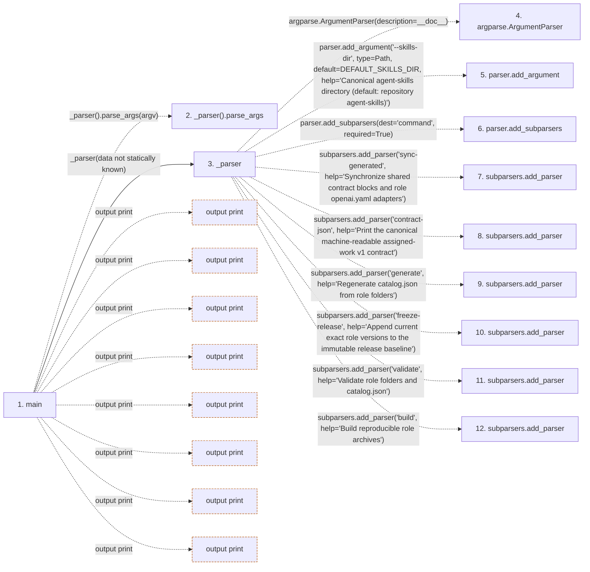

# build_agent_skills

**Entry point:** `main` (`process`)
**Source:** [build_agent_skills](../modules/build_agent_skills.md)
**Modules touched:** [build_agent_skills](../modules/build_agent_skills.md)

## Call sequence

> Static overview in presentation order, not runtime execution order. Arrows retain captured callers; representative internal continuations and boundary examples precede repeated helper detail.

<!-- Auto-generated from static call edges. Dashed arrows are external or unresolved calls. Reviewed runtime conditions and side effects belong in Behavior. -->

```mermaid
sequenceDiagram
    participant p0 as main
    participant p1 as sync_generated_skill_sources
    participant p2 as write_catalog
    participant p3 as freeze_release
    participant p4 as build_release
    participant p5 as validate_archive
    participant p6 as build_codex_plugin
    participant p7 as build_claude_code_plugin
    participant p8 as build_antigravity_skills
    participant p9 as install_skill
    participant p10 as validate_installed_skill
    participant p11 as rollback_skill
    participant p12 as uninstall_skill
    participant p13 as _parser
    participant p14 as SkillPackError
    participant p15 as _canonical_json
    participant p16 as validate_catalog
    participant p17 as build_adapters
    participant p18 as generate_catalog
    participant p19 as _load_release
    participant p20 as _verified_role_files
    participant p21 as _release_skill
    participant p22 as _replace_generated_contract_block
    participant p23 as _validated_archive_members
    participant p24 as render_workflow_vocabulary_markdown
    participant p25 as _destination_mutation_lock
    participant p26 as load_workflow_vocabulary
    participant p27 as _recover_interrupted_transaction
    participant p28 as _replace_built_tree
    participant p29 as print
    participant p30 as _parser().parse_args
    p0->>p1: sync_generated_skill_sources
    p0->>p2: write_catalog
    p0->>p3: freeze_release
    p0->>p4: build_release
    p0->>p5: validate_archive
    p0->>p6: build_codex_plugin
    p0->>p7: build_claude_code_plugin
    p0->>p8: build_antigravity_skills
    p0->>p9: install_skill
    p0->>p10: validate_installed_skill
    p0->>p11: rollback_skill
    p0->>p12: uninstall_skill
    p0->>p13: _parser
    p0->>p14: SkillPackError
    p0->>p15: _canonical_json
    p0->>p16: validate_catalog
    p0->>p17: build_adapters
    p2->>p18: generate_catalog
    p9->>p19: _load_release
    p6->>p20: _verified_role_files
    p9->>p21: _release_skill
    p1->>p22: _replace_generated_contract_block
    p5->>p23: _validated_archive_members
    p1->>p24: render_workflow_vocabulary_markdown
    p9->>p25: _destination_mutation_lock
    p1->>p26: load_workflow_vocabulary
    p9->>p27: _recover_interrupted_transaction
    p4->>p28: _replace_built_tree
    p0-->>p29: print(...)
    p0-->>p30: _parser().parse_args(argv)
```

> Call sequence diagram shows 30 of 1314 interactions; 1284 omitted to keep the visualization within the 30-interaction and generated-diagram limits, with uncertain identities omitted rather than inferred.

> Captured boundary calls: external 1 of 316 (315 omitted); unresolved 1 of 449 (448 omitted). These counts cover the captured static trace.

Omitted captured detail, grouped by actual caller occurrence and target module:

| Caller | Parent step | Target module | Kind | Omitted interactions |
| --- | --- | --- | --- | --- |
| `scripts/build_agent_skills.py:_parser` | 3 | - | external | 6 |
| `scripts/build_agent_skills.py:_parser` | 3 | - | unresolved | 36 |
| `scripts/build_agent_skills.py:main` | 1 | - | unresolved | 17 |
| `scripts/build_agent_skills.py:sync_generated_skill_sources` | 49 | - | unresolved | 14 |
| `scripts/build_agent_skills.py:sync_generated_skill_sources` | 49 | [scripts/build_agent_skills.py](../modules/build_agent_skills.md) | internal | 8 |
| `scripts/build_agent_skills.py:_replace_generated_contract_block` | 52 | [scripts/build_agent_skills.py](../modules/build_agent_skills.md) | internal | 2 |
| `scripts/build_agent_skills.py:_generated_contract_block` | 53 | [scripts/build_agent_skills.py](../modules/build_agent_skills.md) | internal | 1 |
| `scripts/build_agent_skills.py:_generated_block` | 54 | - | unresolved | 4 |
> Omission summary shows 8 of 213 groups; 205 further groups are not expanded here. Counts above include all omitted interactions.
> Detailed flow queries retain their own coverage and limits; omitted paths may execute at runtime.

> Trace truncated at the depth limit; deeper calls are omitted.

## Data flow

<!-- Auto-generated static analysis. Treat values and boundaries as best-effort hints, not runtime proof. -->

### Analysis coverage

**Effect analysis partially available.** Flow assembly and source effect analysis are separate; empty observations do not prove an empty handler body.

Source steps: 550; effect analysis evaluated: 318, partial: 11, unavailable: 221. Counts include steps omitted from the displayed trace.

Collector observations for 329 source steps with known totals: observed: 1510, emitted: 1477, omitted: 33. Unavailable totals are excluded.

- Callable record unavailable for one or more source steps; those steps have no represented callable body.
- Effect collector omitted observations before flow assembly; displayed effects are partial.
- Effect collector totals unavailable; observed counts cover captured records only.

| Step | Callable record | Effect analysis | Collector totals | Observed | Emitted | Omitted |
|---|---|---|---|---:|---:|---:|
| `main` | `available` | `partial` | `available` | `22` | `15` | `7` |
| `_parser().parse_args` | `not_applicable` | `not_applicable` | `not_applicable` | — | — | — |
| `_parser` | `available` | `partial` | `available` | `20` | `9` | `11` |
| `argparse.ArgumentParser` | `not_applicable` | `not_applicable` | `not_applicable` | — | — | — |
| `parser.add_argument` | `not_applicable` | `not_applicable` | `not_applicable` | — | — | — |
| `parser.add_subparsers` | `not_applicable` | `not_applicable` | `not_applicable` | — | — | — |
| `subparsers.add_parser` | `not_applicable` | `not_applicable` | `not_applicable` | — | — | — |
| `subparsers.add_parser` | `not_applicable` | `not_applicable` | `not_applicable` | — | — | — |
| `subparsers.add_parser` | `not_applicable` | `not_applicable` | `not_applicable` | — | — | — |
| `subparsers.add_parser` | `not_applicable` | `not_applicable` | `not_applicable` | — | — | — |
| `subparsers.add_parser` | `not_applicable` | `not_applicable` | `not_applicable` | — | — | — |
| `subparsers.add_parser` | `not_applicable` | `not_applicable` | `not_applicable` | — | — | — |

```mermaid
flowchart LR
    s1["1. main"]
    s2["2. _parser().parse_args"]
    s3["3. _parser"]
    s4["4. argparse.ArgumentParser"]
    s5["5. parser.add_argument"]
    s6["6. parser.add_subparsers"]
    s7["7. subparsers.add_parser"]
    s8["8. subparsers.add_parser"]
    s9["9. subparsers.add_parser"]
    s10["10. subparsers.add_parser"]
    s11["11. subparsers.add_parser"]
    s12["12. subparsers.add_parser"]
    s1 -. "_parser().parse_args(argv)" .-> s2
    s1 -->|"_parser(data not statically known)"| s3
    s3 -. "argparse.ArgumentParser(description=__doc__)" .-> s4
    s3 -. "parser.add_argument('--skills-dir', type=Path, default=DEFAULT_SKILLS_DIR, help='Canonical agent-skills directory (default: repository agent-skills)')" .-> s5
    s3 -. "parser.add_subparsers(dest='command', required=True)" .-> s6
    s3 -. "subparsers.add_parser('sync-generated', help='Synchronize shared contract blocks and role openai.yaml adapters')" .-> s7
    s3 -. "subparsers.add_parser('contract-json', help='Print the canonical machine-readable assigned-work v1 contract')" .-> s8
    s3 -. "subparsers.add_parser('generate', help='Regenerate catalog.json from role folders')" .-> s9
    s3 -. "subparsers.add_parser('freeze-release', help='Append current exact role versions to the immutable release baseline')" .-> s10
    s3 -. "subparsers.add_parser('validate', help='Validate role folders and catalog.json')" .-> s11
    s3 -. "subparsers.add_parser('build', help='Build reproducible role archives')" .-> s12
    b0["output print"]
    s1 -. "output print" .-> b0
    b1["output print"]
    s1 -. "output print" .-> b1
    b2["output print"]
    s1 -. "output print" .-> b2
    b3["output print"]
    s1 -. "output print" .-> b3
    b4["output print"]
    s1 -. "output print" .-> b4
    b5["output print"]
    s1 -. "output print" .-> b5
    b6["output print"]
    s1 -. "output print" .-> b6
    b7["output print"]
    s1 -. "output print" .-> b7
    click s1 "../modules/build_agent_skills.md"
    click s3 "../modules/build_agent_skills.md"
    classDef boundary stroke:#b45309,stroke-dasharray: 4 2
    class b0 boundary
    class b1 boundary
    class b2 boundary
    class b3 boundary
    class b4 boundary
    class b5 boundary
    class b6 boundary
    class b7 boundary
```

### Step data

| Step | Inputs | Reads | Writes | Returns |
|---|---|---|---|---|
| `main` | `argv: list[str] \| None` | `REPOSITORY_ROOT`, `ASSIGNED_WORK_V1_CONTRACT`, `SkillPackError`, `sys` | - | `2`, `0` |
| `_parser().parse_args` | - | - | - | - |
| `_parser` | - | `Path`, `DEFAULT_SKILLS_DIR`, `Path`, `Path`, `ROLE_METADATA`, `Path`, `Path`, `Path` | - | `parser` |
| `argparse.ArgumentParser` | - | - | - | - |
| `parser.add_argument` | - | - | - | - |
| `parser.add_subparsers` | - | - | - | - |
| `subparsers.add_parser` | - | - | - | - |
| `subparsers.add_parser` | - | - | - | - |
| `subparsers.add_parser` | - | - | - | - |
| `subparsers.add_parser` | - | - | - | - |
| `subparsers.add_parser` | - | - | - | - |
| `subparsers.add_parser` | - | - | - | - |

### Call data

| From | To | Line | Call |
|---|---|---:|---|
| main | _parser().parse_args | 3581 | `_parser().parse_args(argv)` |
| main | _parser | 3581 | `_parser(data not statically known)` |
| _parser | argparse.ArgumentParser | 3507 | `argparse.ArgumentParser(description=__doc__)` |
| _parser | parser.add_argument | 3508 | `parser.add_argument('--skills-dir', type=Path, default=DEFAULT_SKILLS_DIR, help='Canonical agent-skills directory (default: repository agent-skills)')` |
| _parser | parser.add_subparsers | 3514 | `parser.add_subparsers(dest='command', required=True)` |
| _parser | subparsers.add_parser | 3515 | `subparsers.add_parser('sync-generated', help='Synchronize shared contract blocks and role openai.yaml adapters')` |
| _parser | subparsers.add_parser | 3519 | `subparsers.add_parser('contract-json', help='Print the canonical machine-readable assigned-work v1 contract')` |
| _parser | subparsers.add_parser | 3523 | `subparsers.add_parser('generate', help='Regenerate catalog.json from role folders')` |
| _parser | subparsers.add_parser | 3524 | `subparsers.add_parser('freeze-release', help='Append current exact role versions to the immutable release baseline')` |
| _parser | subparsers.add_parser | 3528 | `subparsers.add_parser('validate', help='Validate role folders and catalog.json')` |
| _parser | subparsers.add_parser | 3529 | `subparsers.add_parser('build', help='Build reproducible role archives')` |

### Boundary effects

| Kind | Target | Step | Line |
|---|---|---|---:|
| output | `print` | `main` | 3590 |
| output | `print` | `main` | 3595 |
| output | `print` | `main` | 3598 |
| output | `print` | `main` | 3601 |
| output | `print` | `main` | 3604 |
| output | `print` | `main` | 3610 |
| output | `print` | `main` | 3613 |
| output | `print` | `main` | 3616 |

### Static analysis gaps

| Kind | Step | Target | Line |
|---|---|---|---:|
| unresolved_call | `main` | `_parser().parse_args` | 3581 |
| external_call | `_parser` | `argparse.ArgumentParser` | 3507 |
| unresolved_call | `_parser` | `parser.add_argument` | 3508 |
| unresolved_call | `_parser` | `parser.add_subparsers` | 3514 |
| unresolved_call | `_parser` | `subparsers.add_parser` | 3515 |
| unresolved_call | `_parser` | `subparsers.add_parser` | 3519 |
| unresolved_call | `_parser` | `subparsers.add_parser` | 3523 |
| unresolved_call | `_parser` | `subparsers.add_parser` | 3524 |
| unresolved_call | `_parser` | `subparsers.add_parser` | 3528 |
| unresolved_call | `_parser` | `subparsers.add_parser` | 3529 |
| step_limit | `main` | `first 12 steps` | 0 |
| truncated_flow | `main` | `depth limit` | 0 |

## Behavior

This flow starts at `main` and is classified as `process`. The generated call and data-flow sections are bounded static projections; runtime conditions and side effects require source-level confirmation.
