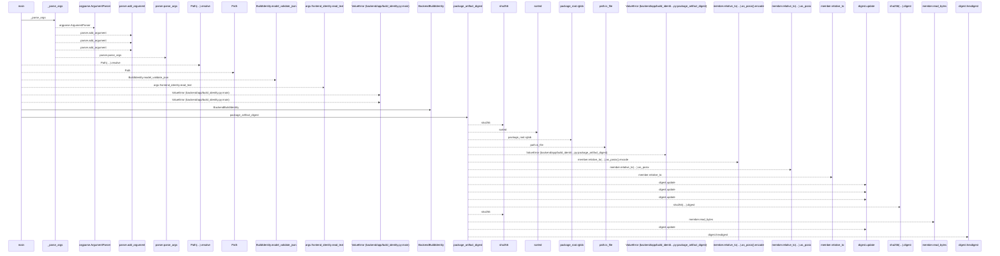
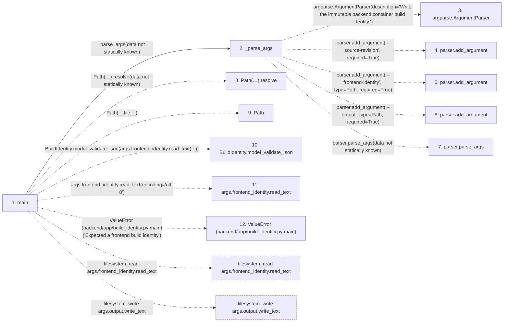

# build_identity

**Entry point:** `main` (`process`)
**Source:** [build_identity](../modules/build_identity.md)
**Modules touched:** [build_identity](../modules/build_identity.md)

**Related modules:** [autonomy_canonical](../modules/autonomy_canonical.md)

## Call sequence

<!-- Auto-generated from static call edges. Dashed arrows are external or unresolved calls. Reviewed runtime conditions and side effects belong in Behavior. -->

> Call sequence diagram shows 30 of 35 interactions; 5 omitted to keep the visualization within the 30-interaction and generated-diagram limits.

## Data flow

<!-- Auto-generated static analysis. Treat values and boundaries as best-effort hints, not runtime proof. -->

### Step data

| Step | Inputs | Reads | Writes | Returns |
|---|---|---|---|---|
| `main` | - | - | - | `0` |
| `_parse_args` | - | `Path`, `Path` | - | `parser.parse_args(...)` |
| `argparse.ArgumentParser` | - | - | - | - |
| `parser.add_argument` | - | - | - | - |
| `parser.add_argument` | - | - | - | - |
| `parser.add_argument` | - | - | - | - |
| `parser.parse_args` | - | - | - | - |
| `Path(…).resolve` | - | - | - | - |
| `Path` | - | - | - | - |
| `BuildIdentity.model_validate_json` | - | - | - | - |
| `args.frontend_identity.read_text` | - | - | - | - |
| `ValueError (backend/app/build_identity.py:main)` | - | - | - | - |

### Call data

| From | To | Line | Call |
|---|---|---:|---|
| main | _parse_args | 80 | `_parse_args(data not statically known)` |
| _parse_args | argparse.ArgumentParser | 70 | `argparse.ArgumentParser(description='Write the immutable backend container build identity.')` |
| _parse_args | parser.add_argument | 73 | `parser.add_argument('--source-revision', required=True)` |
| _parse_args | parser.add_argument | 74 | `parser.add_argument('--frontend-identity', type=Path, required=True)` |
| _parse_args | parser.add_argument | 75 | `parser.add_argument('--output', type=Path, required=True)` |
| _parse_args | parser.parse_args | 76 | `parser.parse_args(data not statically known)` |
| main | Path(…).resolve | 81 | `Path(__file__).resolve(data not statically known)` |
| main | Path | 81 | `Path(__file__)` |
| main | BuildIdentity.model_validate_json | 82 | `BuildIdentity.model_validate_json(args.frontend_identity.read_text(...))` |
| main | args.frontend_identity.read_text | 83 | `args.frontend_identity.read_text(encoding='utf-8')` |
| main | ValueError (backend/app/build_identity.py:main) | 86 | `ValueError('Expected a frontend build identity')` |

### Boundary effects

| Kind | Target | Step | Line |
|---|---|---|---:|
| filesystem_read | `args.frontend_identity.read_text` | `main` | 83 |
| filesystem_write | `args.output.write_text` | `main` | 95 |

### Static analysis gaps

| Kind | Step | Target | Line |
|---|---|---|---:|
| external_call | `_parse_args` | `argparse.ArgumentParser` | 70 |
| unresolved_call | `_parse_args` | `parser.add_argument` | 73 |
| unresolved_call | `_parse_args` | `parser.add_argument` | 74 |
| unresolved_call | `_parse_args` | `parser.add_argument` | 75 |
| unresolved_call | `_parse_args` | `parser.parse_args` | 76 |
| unresolved_call | `main` | `Path(__file__).resolve` | 81 |
| unresolved_call | `main` | `BuildIdentity.model_validate_json` | 82 |
| external_call | `main` | `ValueError` | 86 |
| step_limit | `main` | `first 12 steps` | 0 |

## Behavior

This flow starts at `main` and is classified as `process`. The generated call and data-flow sections are bounded static projections; runtime conditions and side effects require source-level confirmation.
