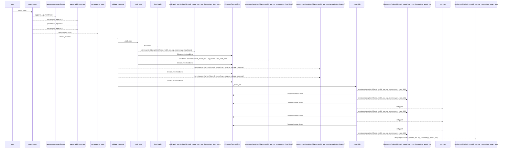
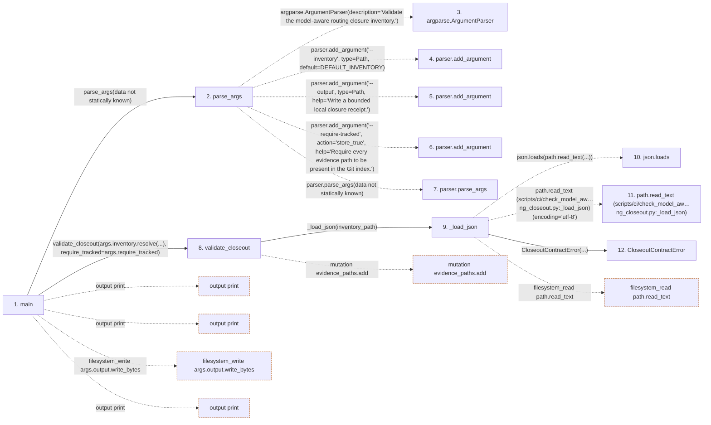

# check_model_aware_routing_closeout

**Entry point:** `main` (`process`)
**Source:** [check_model_aware_routing_closeout](../modules/check_model_aware_routing_closeout.md)
**Modules touched:** [agent_contract](../modules/agent_contract.md), [check_model_aware_routing_closeout](../modules/check_model_aware_routing_closeout.md)

**Related modules:** [agent_contract](../modules/agent_contract.md), [agent_team_setup](../modules/agent_team_setup.md), [app_main](../modules/app_main.md)

## Call sequence

<!-- Auto-generated from static call edges. Dashed arrows are external or unresolved calls. Reviewed runtime conditions and side effects belong in Behavior. -->

> Call sequence diagram shows 30 of 136 interactions; 106 omitted to keep the visualization within the 30-interaction and generated-diagram limits.

## Data flow

<!-- Auto-generated static analysis. Treat values and boundaries as best-effort hints, not runtime proof. -->

### Step data

| Step | Inputs | Reads | Writes | Returns |
|---|---|---|---|---|
| `main` | - | `CloseoutContractError`, `sys`, `MAX_RECEIPT_BYTES`, `sys` | - | `1`, `1`, `0` |
| `parse_args` | - | `Path`, `DEFAULT_INVENTORY`, `Path` | - | `parser.parse_args(...)` |
| `argparse.ArgumentParser` | - | - | - | - |
| `parser.add_argument` | - | - | - | - |
| `parser.add_argument` | - | - | - | - |
| `parser.add_argument` | - | - | - | - |
| `parser.parse_args` | - | - | - | - |
| `validate_closeout` | `inventory_path: Path`, `require_tracked: bool` | `EXPECTED_TASK_IDS`, `EXPECTED_GATE_IDS` | - | `{...}` |
| `_load_json` | `path: Path` | `json` | - | `value` |
| `json.loads` | - | - | - | - |
| `path.read_text (scripts/ci/check_model_aw…ng_closeout.py:_load_json)` | - | - | - | - |
| `CloseoutContractError` | - | - | - | - |

### Call data

| From | To | Line | Call |
|---|---|---:|---|
| main | parse_args | 338 | `parse_args(data not statically known)` |
| parse_args | argparse.ArgumentParser | 56 | `argparse.ArgumentParser(description='Validate the model-aware routing closure inventory.')` |
| parse_args | parser.add_argument | 59 | `parser.add_argument('--inventory', type=Path, default=DEFAULT_INVENTORY)` |
| parse_args | parser.add_argument | 64 | `parser.add_argument('--output', type=Path, help='Write a bounded local closure receipt.')` |
| parse_args | parser.add_argument | 69 | `parser.add_argument('--require-tracked', action='store_true', help='Require every evidence path to be present in the Git index.')` |
| parse_args | parser.parse_args | 74 | `parser.parse_args(data not statically known)` |
| main | validate_closeout | 340 | `validate_closeout(args.inventory.resolve(...), require_tracked=args.require_tracked)` |
| validate_closeout | _load_json | 283 | `_load_json(inventory_path)` |
| _load_json | json.loads | 79 | `json.loads(path.read_text(...))` |
| _load_json | path.read_text (scripts/ci/check_model_aw…ng_closeout.py:_load_json) | 79 | `path.read_text(encoding='utf-8')` |
| _load_json | CloseoutContractError | 81 | `CloseoutContractError(...)` |

### Boundary effects

| Kind | Target | Step | Line |
|---|---|---|---:|
| output | `print` | `main` | 345 |
| output | `print` | `main` | 351 |
| filesystem_write | `args.output.write_bytes` | `main` | 355 |
| output | `print` | `main` | 356 |
| mutation | `evidence_paths.add` | `validate_closeout` | 309 |
| filesystem_read | `path.read_text` | `_load_json` | 79 |

### Static analysis gaps

| Kind | Step | Target | Line |
|---|---|---|---:|
| external_call | `parse_args` | `argparse.ArgumentParser` | 56 |
| unresolved_call | `parse_args` | `parser.add_argument` | 59 |
| unresolved_call | `parse_args` | `parser.add_argument` | 64 |
| unresolved_call | `parse_args` | `parser.add_argument` | 69 |
| unresolved_call | `parse_args` | `parser.parse_args` | 74 |
| step_limit | `main` | `first 12 steps` | 0 |

## Behavior

This flow starts at `main` and is classified as `process`. The generated call and data-flow sections are bounded static projections; runtime conditions and side effects require source-level confirmation.
