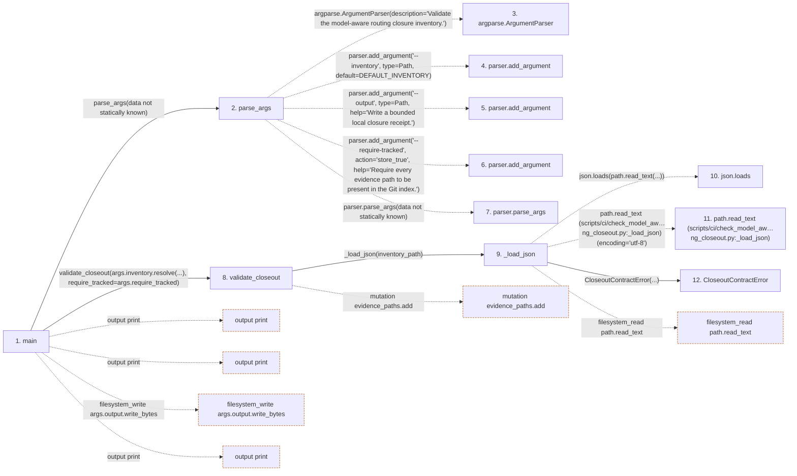

# check_model_aware_routing_closeout

**Entry point:** `main` (`process`)
**Source:** [check_model_aware_routing_closeout](../modules/check_model_aware_routing_closeout.md)
**Modules touched:** [agent_contract](../modules/agent_contract.md), [check_model_aware_routing_closeout](../modules/check_model_aware_routing_closeout.md)

**Related modules:** [agent_contract](../modules/agent_contract.md), [agent_team_setup](../modules/agent_team_setup.md), [app_main](../modules/app_main.md)

## Call sequence

> Static overview in presentation order, not runtime execution order. Arrows retain captured callers; representative internal continuations and boundary examples precede repeated helper detail.

<!-- Auto-generated from static call edges. Dashed arrows are external or unresolved calls. Reviewed runtime conditions and side effects belong in Behavior. -->

```mermaid
sequenceDiagram
    participant p0 as main
    participant p1 as validate_closeout
    participant p2 as parse_args
    participant p3 as _load_json
    participant p4 as _exact_ids
    participant p5 as _evidence_path
    participant p6 as _require_tracked
    participant p7 as _validate_versions
    participant p8 as _validate_master
    participant p9 as _validate_external_truth
    participant p10 as CloseoutContractError
    participant p11 as agent_contract_features
    participant p12 as print
    participant p13 as args.inventory.resolve
    participant p14 as (…).encode
    participant p15 as json.dumps (scripts/ci/check_model_aw…_routing_closeout.py:main)
    participant p16 as len (scripts/ci/check_model_aw…_routing_closeout.py:main)
    participant p17 as args.output.parent.mkdir
    participant p18 as args.output.write_bytes
    participant p19 as argparse.ArgumentParser
    participant p20 as parser.add_argument
    participant p21 as inventory.get (scripts/ci/check_model_aw…eout.py:validate_closeout)
    participant p22 as parser.parse_args
    participant p23 as inventory_path.resolve().relative_to(…).as_posix
    p0->>p1: validate_closeout
    p0->>p2: parse_args
    p1->>p3: _load_json
    p1->>p4: _exact_ids
    p1->>p5: _evidence_path
    p1->>p6: _require_tracked
    p1->>p7: _validate_versions
    p1->>p8: _validate_master
    p1->>p9: _validate_external_truth
    p1->>p10: CloseoutContractError
    p7->>p11: agent_contract_features
    p0-->>p12: print(..., file=sys.stderr)
    p0-->>p13: args.inventory.resolve
    p0-->>p14: (…).encode('utf-8')
    p0-->>p15: json.dumps (scripts/ci/check_model_aw…_routing_closeout.py:main)(receipt, ensure_ascii=False, indent=2, sort_keys=True)
    p0-->>p16: len (scripts/ci/check_model_aw…_routing_closeout.py:main)(encoded)
    p0-->>p12: print('Model-aware routing closeout receipt is oversized', file=sys.stderr)
    p0-->>p17: args.output.parent.mkdir(parents=True, exist_ok=True)
    p0-->>p18: args.output.write_bytes(encoded)
    p0-->>p12: print(...)
    p2-->>p19: argparse.ArgumentParser(description='Validate the model-aware routing closure inventory.')
    p2-->>p20: parser.add_argument('--inventory', type=Path, default=DEFAULT_INVENTORY)
    p1-->>p21: inventory.get (scripts/ci/check_model_aw…eout.py:validate_closeout)('schema_version')
    p2-->>p20: parser.add_argument('--output', type=Path, help='Write a bounded local closure receipt.')
    p2-->>p20: parser.add_argument('--require-tracked', action='store_true', help='Require every evidence path to be present in the Git index.')
    p1-->>p21: inventory.get (scripts/ci/check_model_aw…eout.py:validate_closeout)('decision')
    p2-->>p22: parser.parse_args
    p1-->>p21: inventory.get (scripts/ci/check_model_aw…eout.py:validate_closeout)('tasks')
    p1-->>p21: inventory.get (scripts/ci/check_model_aw…eout.py:validate_closeout)('release_gates')
    p1-->>p23: inventory_path.resolve().relative_to(…).as_posix
```

> Call sequence diagram shows 30 of 136 interactions; 106 omitted to keep the visualization within the 30-interaction and generated-diagram limits, with uncertain identities omitted rather than inferred.

> Captured boundary calls: external 6 of 43 (37 omitted); unresolved 13 of 48 (35 omitted). These counts cover the captured static trace.

Omitted captured detail, grouped by actual caller occurrence and target module:

| Caller | Parent step | Target module | Kind | Omitted interactions |
| --- | --- | --- | --- | --- |
| `scripts/ci/check_model_aware_routing_closeout.py:_load_json` | 9 | - | external | 2 |
| `scripts/ci/check_model_aware_routing_closeout.py:_load_json` | 9 | - | unresolved | 1 |
| `scripts/ci/check_model_aware_routing_closeout.py:_load_json` | 9 | [scripts/ci/check_model_aware_routing_closeout.py](../modules/check_model_aware_routing_closeout.md) | internal | 2 |
| `scripts/ci/check_model_aware_routing_closeout.py:validate_closeout` | 8 | [scripts/ci/check_model_aware_routing_closeout.py](../modules/check_model_aware_routing_closeout.md) | internal | 2 |
| `scripts/ci/check_model_aware_routing_closeout.py:_exact_ids` | 19 | - | external | 14 |
| `scripts/ci/check_model_aware_routing_closeout.py:_exact_ids` | 19 | [scripts/ci/check_model_aware_routing_closeout.py](../modules/check_model_aware_routing_closeout.md) | internal | 7 |
| `scripts/ci/check_model_aware_routing_closeout.py:_exact_ids` | 19 | - | unresolved | 5 |
| `scripts/ci/check_model_aware_routing_closeout.py:validate_closeout` | 8 | - | unresolved | 6 |
> Omission summary shows 8 of 26 groups; 18 further groups are not expanded here. Counts above include all omitted interactions.
> Detailed flow queries retain their own coverage and limits; omitted paths may execute at runtime.

## Data flow

<!-- Auto-generated static analysis. Treat values and boundaries as best-effort hints, not runtime proof. -->

### Analysis coverage

**Effect analysis partially available.** Flow assembly and source effect analysis are separate; empty observations do not prove an empty handler body.

Source steps: 46; effect analysis evaluated: 16, partial: 0, unavailable: 30. Counts include steps omitted from the displayed trace.

Collector observations for 16 source steps with known totals: observed: 86, emitted: 86, omitted: 0. Unavailable totals are excluded.

- Callable record unavailable for one or more source steps; those steps have no represented callable body.
- Effect collector totals unavailable; observed counts cover captured records only.

| Step | Callable record | Effect analysis | Collector totals | Observed | Emitted | Omitted |
|---|---|---|---|---:|---:|---:|
| `main` | `available` | `evaluated` | `available` | `11` | `11` | `0` |
| `parse_args` | `available` | `evaluated` | `available` | `4` | `4` | `0` |
| `argparse.ArgumentParser` | `not_applicable` | `not_applicable` | `not_applicable` | — | — | — |
| `parser.add_argument` | `not_applicable` | `not_applicable` | `not_applicable` | — | — | — |
| `parser.add_argument` | `not_applicable` | `not_applicable` | `not_applicable` | — | — | — |
| `parser.add_argument` | `not_applicable` | `not_applicable` | `not_applicable` | — | — | — |
| `parser.parse_args` | `not_applicable` | `not_applicable` | `not_applicable` | — | — | — |
| `validate_closeout` | `available` | `evaluated` | `available` | `6` | `6` | `0` |
| `_load_json` | `available` | `evaluated` | `available` | `4` | `4` | `0` |
| `json.loads` | `not_applicable` | `not_applicable` | `not_applicable` | — | — | — |
| `path.read_text (scripts/ci/check_model_aw…ng_closeout.py:_load_json)` | `not_applicable` | `not_applicable` | `not_applicable` | — | — | — |
| `CloseoutContractError` | `unavailable` | `unavailable` | `unavailable` | — | — | — |

```mermaid
flowchart LR
    s1["1. main"]
    s2["2. parse_args"]
    s3["3. argparse.ArgumentParser"]
    s4["4. parser.add_argument"]
    s5["5. parser.add_argument"]
    s6["6. parser.add_argument"]
    s7["7. parser.parse_args"]
    s8["8. validate_closeout"]
    s9["9. _load_json"]
    s10["10. json.loads"]
    s11["11. path.read_text (scripts/ci/check_model_aw…ng_closeout.py:_load_json)"]
    s12["12. CloseoutContractError"]
    s1 -->|"parse_args(data not statically known)"| s2
    s2 -. "argparse.ArgumentParser(description='Validate the model-aware routing closure inventory.')" .-> s3
    s2 -. "parser.add_argument('--inventory', type=Path, default=DEFAULT_INVENTORY)" .-> s4
    s2 -. "parser.add_argument('--output', type=Path, help='Write a bounded local closure receipt.')" .-> s5
    s2 -. "parser.add_argument('--require-tracked', action='store_true', help='Require every evidence path to be present in the Git index.')" .-> s6
    s2 -. "parser.parse_args(data not statically known)" .-> s7
    s1 -->|"validate_closeout(args.inventory.resolve(...), require_tracked=args.require_tracked)"| s8
    s8 -->|"_load_json(inventory_path)"| s9
    s9 -. "json.loads(path.read_text(...))" .-> s10
    s9 -. "path.read_text (scripts/ci/check_model_aw…ng_closeout.py:_load_json)(encoding='utf-8')" .-> s11
    s9 -->|"CloseoutContractError(...)"| s12
    b0["output print"]
    s1 -. "output print" .-> b0
    b1["output print"]
    s1 -. "output print" .-> b1
    b2["filesystem_write args.output.write_bytes"]
    s1 -. "filesystem_write args.output.write_bytes" .-> b2
    b3["output print"]
    s1 -. "output print" .-> b3
    b4["mutation evidence_paths.add"]
    s8 -. "mutation evidence_paths.add" .-> b4
    b5["filesystem_read path.read_text"]
    s9 -. "filesystem_read path.read_text" .-> b5
    click s1 "../modules/check_model_aware_routing_closeout.md"
    click s2 "../modules/check_model_aware_routing_closeout.md"
    click s8 "../modules/check_model_aware_routing_closeout.md"
    click s9 "../modules/check_model_aware_routing_closeout.md"
    click s12 "../modules/check_model_aware_routing_closeout.md"
    classDef boundary stroke:#b45309,stroke-dasharray: 4 2
    class b0 boundary
    class b1 boundary
    class b2 boundary
    class b3 boundary
    class b4 boundary
    class b5 boundary
```

### Step data

| Step | Inputs | Reads | Writes | Returns |
|---|---|---|---|---|
| `main` | - | `CloseoutContractError`, `sys`, `MAX_RECEIPT_BYTES`, `sys` | - | `1`, `1`, `0` |
| `parse_args` | - | `Path`, `DEFAULT_INVENTORY`, `Path` | - | `parser.parse_args(...)` |
| `argparse.ArgumentParser` | - | - | - | - |
| `parser.add_argument` | - | - | - | - |
| `parser.add_argument` | - | - | - | - |
| `parser.add_argument` | - | - | - | - |
| `parser.parse_args` | - | - | - | - |
| `validate_closeout` | `inventory_path: Path`, `require_tracked: bool` | `EXPECTED_TASK_IDS`, `EXPECTED_GATE_IDS` | - | `{...}` |
| `_load_json` | `path: Path` | `json` | - | `value` |
| `json.loads` | - | - | - | - |
| `path.read_text (scripts/ci/check_model_aw…ng_closeout.py:_load_json)` | - | - | - | - |
| `CloseoutContractError` | - | - | - | - |

### Call data

| From | To | Line | Call |
|---|---|---:|---|
| main | parse_args | 338 | `parse_args(data not statically known)` |
| parse_args | argparse.ArgumentParser | 56 | `argparse.ArgumentParser(description='Validate the model-aware routing closure inventory.')` |
| parse_args | parser.add_argument | 59 | `parser.add_argument('--inventory', type=Path, default=DEFAULT_INVENTORY)` |
| parse_args | parser.add_argument | 64 | `parser.add_argument('--output', type=Path, help='Write a bounded local closure receipt.')` |
| parse_args | parser.add_argument | 69 | `parser.add_argument('--require-tracked', action='store_true', help='Require every evidence path to be present in the Git index.')` |
| parse_args | parser.parse_args | 74 | `parser.parse_args(data not statically known)` |
| main | validate_closeout | 340 | `validate_closeout(args.inventory.resolve(...), require_tracked=args.require_tracked)` |
| validate_closeout | _load_json | 283 | `_load_json(inventory_path)` |
| _load_json | json.loads | 79 | `json.loads(path.read_text(...))` |
| _load_json | path.read_text (scripts/ci/check_model_aw…ng_closeout.py:_load_json) | 79 | `path.read_text(encoding='utf-8')` |
| _load_json | CloseoutContractError | 81 | `CloseoutContractError(...)` |

### Boundary effects

| Kind | Target | Step | Line |
|---|---|---|---:|
| output | `print` | `main` | 345 |
| output | `print` | `main` | 351 |
| filesystem_write | `args.output.write_bytes` | `main` | 355 |
| output | `print` | `main` | 356 |
| mutation | `evidence_paths.add` | `validate_closeout` | 309 |
| filesystem_read | `path.read_text` | `_load_json` | 79 |

### Static analysis gaps

| Kind | Step | Target | Line |
|---|---|---|---:|
| external_call | `parse_args` | `argparse.ArgumentParser` | 56 |
| unresolved_call | `parse_args` | `parser.add_argument` | 59 |
| unresolved_call | `parse_args` | `parser.add_argument` | 64 |
| unresolved_call | `parse_args` | `parser.add_argument` | 69 |
| unresolved_call | `parse_args` | `parser.parse_args` | 74 |
| step_limit | `main` | `first 12 steps` | 0 |

## Behavior

The command validates the configured inventory, resolves every evidence file within the repository, and optionally requires all evidence paths to be present in the Git index. It then checks package/API versions, advertised capabilities, the representative setup payload and package catalog, and explicit external-validation declarations. Missing files or untracked evidence cause failure before a success receipt is emitted. Schema evidence refers to the consolidated initial migration.
