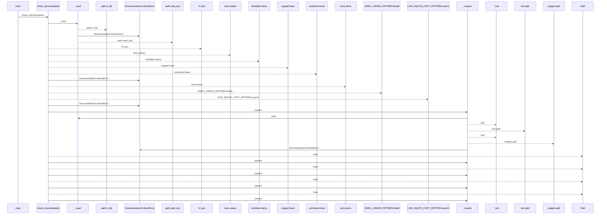
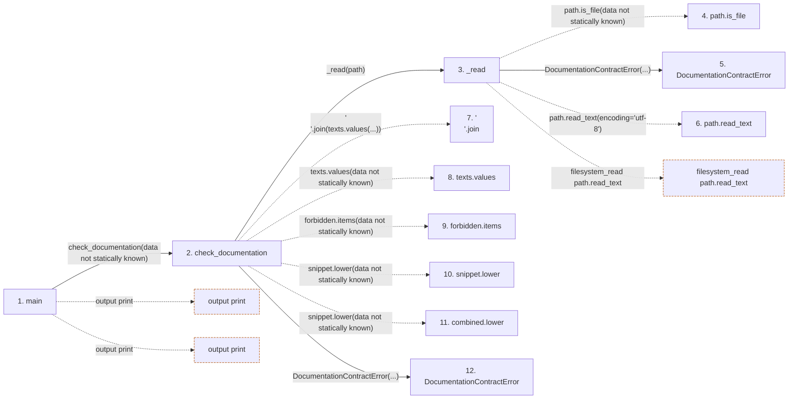

# check_postgresql_documentation

**Entry point:** `main` (`process`)
**Source:** [check_postgresql_documentation](../modules/check_postgresql_documentation.md)
**Modules touched:** [check_postgresql_documentation](../modules/check_postgresql_documentation.md)

## Call sequence

<!-- Auto-generated from static call edges. Dashed arrows are external or unresolved calls. Reviewed runtime conditions and side effects belong in Behavior. -->

> Call sequence diagram shows 30 of 58 interactions; 28 omitted to keep the visualization within the 30-interaction and generated-diagram limits.

## Data flow

<!-- Auto-generated static analysis. Treat values and boundaries as best-effort hints, not runtime proof. -->

### Step data

| Step | Inputs | Reads | Writes | Returns |
|---|---|---|---|---|
| `main` | - | `DocumentationContractError`, `sys` | - | `1`, `0` |
| `check_documentation` | - | `DOCUMENTS`, `DOCUMENTS`, `DOCUMENTS` | - | `(...)` |
| `_read` | `relative_path: Path` | `REPOSITORY_ROOT` | - | `path.read_text(...)` |
| `path.is_file` | - | - | - | - |
| `DocumentationContractError` | - | - | - | - |
| `path.read_text` | - | - | - | - |
| `'\n'.join` | - | - | - | - |
| `texts.values` | - | - | - | - |
| `forbidden.items` | - | - | - | - |
| `snippet.lower` | - | - | - | - |
| `combined.lower` | - | - | - | - |
| `DocumentationContractError` | - | - | - | - |

### Call data

| From | To | Line | Call |
|---|---|---:|---|
| main | check_documentation | 226 | `check_documentation(data not statically known)` |
| check_documentation | _read | 84 | `_read(path)` |
| _read | path.is_file | 45 | `path.is_file(data not statically known)` |
| _read | DocumentationContractError | 46 | `DocumentationContractError(...)` |
| _read | path.read_text | 47 | `path.read_text(encoding='utf-8')` |
| check_documentation | '\n'.join | 85 | `'\n'.join(texts.values(...))` |
| check_documentation | texts.values | 85 | `texts.values(data not statically known)` |
| check_documentation | forbidden.items | 96 | `forbidden.items(data not statically known)` |
| check_documentation | snippet.lower | 97 | `snippet.lower(data not statically known)` |
| check_documentation | combined.lower | 97 | `snippet.lower(data not statically known)` |
| check_documentation | DocumentationContractError | 98 | `DocumentationContractError(...)` |

### Boundary effects

| Kind | Target | Step | Line |
|---|---|---|---:|
| output | `print` | `main` | 228 |
| output | `print` | `main` | 230 |
| filesystem_read | `path.read_text` | `_read` | 47 |

### Static analysis gaps

| Kind | Step | Target | Line |
|---|---|---|---:|
| unresolved_call | `_read` | `path.is_file` | 45 |
| unresolved_call | `check_documentation` | `'\n'.join` | 85 |
| unresolved_call | `check_documentation` | `texts.values` | 85 |
| unresolved_call | `check_documentation` | `forbidden.items` | 96 |
| unresolved_call | `check_documentation` | `snippet.lower` | 97 |
| unresolved_call | `check_documentation` | `combined.lower` | 97 |
| step_limit | `main` | `first 12 steps` | 0 |

## Behavior

This flow starts at `main` and is classified as `process`. The generated call and data-flow sections are bounded static projections; runtime conditions and side effects require source-level confirmation.
