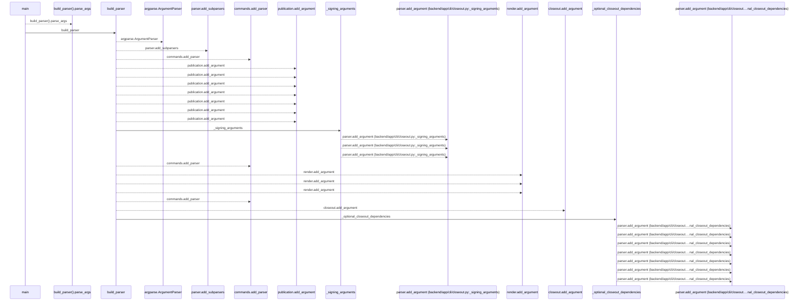
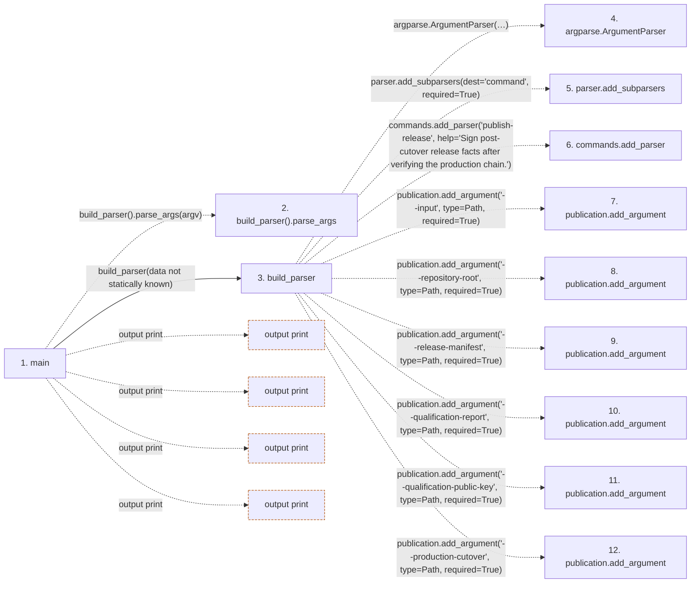

# closeout

**Entry point:** `main` (`process`)
**Source:** [cli_closeout](../modules/cli_closeout.md)
**Modules touched:** [cli_closeout](../modules/cli_closeout.md), [database_migration_closeout](../modules/database_migration_closeout.md), [database_migration_cutover](../modules/database_migration_cutover.md), and 2 more

**Complete modules touched:**

- [cli_closeout](../modules/cli_closeout.md)
- [database_migration_closeout](../modules/database_migration_closeout.md)
- [database_migration_cutover](../modules/database_migration_cutover.md)
- [database_migration_manifest](../modules/database_migration_manifest.md)
- [execution_mode](../modules/execution_mode.md)

**Related modules:** [database_migration_closeout](../modules/database_migration_closeout.md), [database_migration_cutover](../modules/database_migration_cutover.md), [database_migration_manifest](../modules/database_migration_manifest.md)

## Call sequence

<!-- Auto-generated from static call edges. Dashed arrows are external or unresolved calls. Reviewed runtime conditions and side effects belong in Behavior. -->

> Call sequence diagram shows 30 of 1386 interactions; 1356 omitted to keep the visualization within the 30-interaction and generated-diagram limits.

## Data flow

<!-- Auto-generated static analysis. Treat values and boundaries as best-effort hints, not runtime proof. -->

### Step data

| Step | Inputs | Reads | Writes | Returns |
|---|---|---|---|---|
| `main` | `argv: list[str] \| None` | `CutoverEvidenceError`, `ManifestError`, `sys` | - | `0`, `0`, `2`, `0`, `2` |
| `build_parser().parse_args` | - | - | - | - |
| `build_parser` | - | `Path`, `Path`, `Path`, `Path`, `Path`, `Path`, `Path`, `Path` | - | `parser` |
| `argparse.ArgumentParser` | - | - | - | - |
| `parser.add_subparsers` | - | - | - | - |
| `commands.add_parser` | - | - | - | - |
| `publication.add_argument` | - | - | - | - |
| `publication.add_argument` | - | - | - | - |
| `publication.add_argument` | - | - | - | - |
| `publication.add_argument` | - | - | - | - |
| `publication.add_argument` | - | - | - | - |
| `publication.add_argument` | - | - | - | - |

### Call data

| From | To | Line | Call |
|---|---|---:|---|
| main | build_parser().parse_args | 88 | `build_parser().parse_args(argv)` |
| main | build_parser | 88 | `build_parser(data not statically known)` |
| build_parser | argparse.ArgumentParser | 37 | `argparse.ArgumentParser(description='Fail-closed DBM-DOC-002 and DBM-CLOSE-001 evidence. This command does not mutate a database, deployment, or existing release document.')` |
| build_parser | parser.add_subparsers | 43 | `parser.add_subparsers(dest='command', required=True)` |
| build_parser | commands.add_parser | 45 | `commands.add_parser('publish-release', help='Sign post-cutover release facts after verifying the production chain.')` |
| build_parser | publication.add_argument | 49 | `publication.add_argument('--input', type=Path, required=True)` |
| build_parser | publication.add_argument | 50 | `publication.add_argument('--repository-root', type=Path, required=True)` |
| build_parser | publication.add_argument | 51 | `publication.add_argument('--release-manifest', type=Path, required=True)` |
| build_parser | publication.add_argument | 52 | `publication.add_argument('--qualification-report', type=Path, required=True)` |
| build_parser | publication.add_argument | 53 | `publication.add_argument('--qualification-public-key', type=Path, required=True)` |
| build_parser | publication.add_argument | 54 | `publication.add_argument('--production-cutover', type=Path, required=True)` |

### Boundary effects

| Kind | Target | Step | Line |
|---|---|---|---:|
| output | `print` | `main` | 109 |
| output | `print` | `main` | 131 |
| output | `print` | `main` | 135 |
| output | `print` | `main` | 147 |

### Static analysis gaps

| Kind | Step | Target | Line |
|---|---|---|---:|
| unresolved_call | `main` | `build_parser().parse_args` | 88 |
| external_call | `build_parser` | `argparse.ArgumentParser` | 37 |
| unresolved_call | `build_parser` | `parser.add_subparsers` | 43 |
| unresolved_call | `build_parser` | `commands.add_parser` | 45 |
| unresolved_call | `build_parser` | `publication.add_argument` | 49 |
| unresolved_call | `build_parser` | `publication.add_argument` | 50 |
| unresolved_call | `build_parser` | `publication.add_argument` | 51 |
| unresolved_call | `build_parser` | `publication.add_argument` | 52 |
| unresolved_call | `build_parser` | `publication.add_argument` | 53 |
| unresolved_call | `build_parser` | `publication.add_argument` | 54 |
| step_limit | `main` | `first 12 steps` | 0 |

## Behavior

This flow starts at `main` and is classified as `process`. The generated call and data-flow sections are bounded static projections; runtime conditions and side effects require source-level confirmation.
