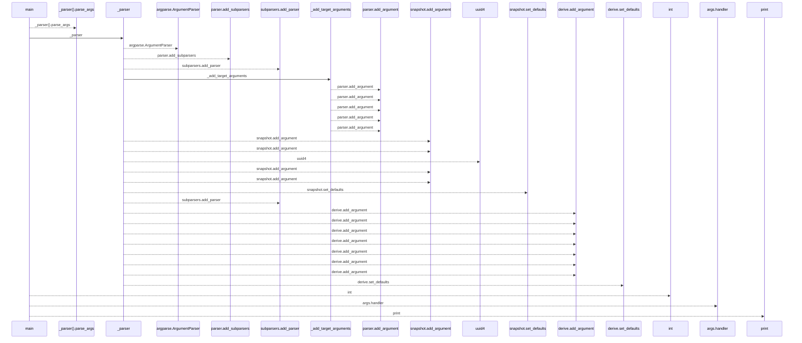
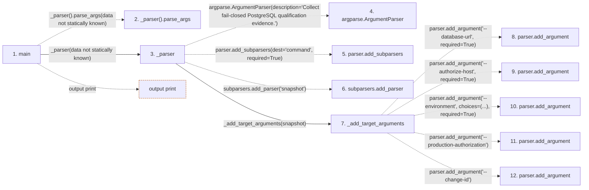

# collect

**Entry point:** `main` (`process`)
**Source:** [collect](../modules/collect.md)
**Modules touched:** [collect](../modules/collect.md)

**Related modules:** [load_common](../modules/load_common.md)

## Call sequence

<!-- Auto-generated from static call edges. Dashed arrows are external or unresolved calls. Reviewed runtime conditions and side effects belong in Behavior. -->

## Data flow

<!-- Auto-generated static analysis. Treat values and boundaries as best-effort hints, not runtime proof. -->

### Step data

| Step | Inputs | Reads | Writes | Returns |
|---|---|---|---|---|
| `main` | - | `QualificationInputError`, `psycopg`, `sys` | - | `int(...)`, `2` |
| `_parser().parse_args` | - | - | - | - |
| `_parser` | - | `Path`, `_snapshot`, `Path`, `Path`, `Path`, `DERIVATION_PHASES`, `Path`, `Path` | - | `parser` |
| `argparse.ArgumentParser` | - | - | - | - |
| `parser.add_subparsers` | - | - | - | - |
| `subparsers.add_parser` | - | - | - | - |
| `_add_target_arguments` | `parser: argparse.ArgumentParser` | - | - | - |
| `parser.add_argument` | - | - | - | - |
| `parser.add_argument` | - | - | - | - |
| `parser.add_argument` | - | - | - | - |
| `parser.add_argument` | - | - | - | - |
| `parser.add_argument` | - | - | - | - |

### Call data

| From | To | Line | Call |
|---|---|---:|---|
| main | _parser().parse_args | 622 | `_parser().parse_args(data not statically known)` |
| main | _parser | 622 | `_parser(data not statically known)` |
| _parser | argparse.ArgumentParser | 596 | `argparse.ArgumentParser(description='Collect fail-closed PostgreSQL qualification evidence.')` |
| _parser | parser.add_subparsers | 599 | `parser.add_subparsers(dest='command', required=True)` |
| _parser | subparsers.add_parser | 601 | `subparsers.add_parser('snapshot')` |
| _parser | _add_target_arguments | 602 | `_add_target_arguments(snapshot)` |
| _add_target_arguments | parser.add_argument | 584 | `parser.add_argument('--database-url', required=True)` |
| _add_target_arguments | parser.add_argument | 585 | `parser.add_argument('--authorize-host', required=True)` |
| _add_target_arguments | parser.add_argument | 586 | `parser.add_argument('--environment', choices=(...), required=True)` |
| _add_target_arguments | parser.add_argument | 591 | `parser.add_argument('--production-authorization')` |
| _add_target_arguments | parser.add_argument | 592 | `parser.add_argument('--change-id')` |

### Boundary effects

| Kind | Target | Step | Line |
|---|---|---|---:|
| output | `print` | `main` | 626 |

### Static analysis gaps

| Kind | Step | Target | Line |
|---|---|---|---:|
| unresolved_call | `main` | `_parser().parse_args` | 622 |
| external_call | `_parser` | `argparse.ArgumentParser` | 596 |
| unresolved_call | `_parser` | `parser.add_subparsers` | 599 |
| unresolved_call | `_parser` | `subparsers.add_parser` | 601 |
| unresolved_call | `_add_target_arguments` | `parser.add_argument` | 584 |
| unresolved_call | `_add_target_arguments` | `parser.add_argument` | 585 |
| unresolved_call | `_add_target_arguments` | `parser.add_argument` | 586 |
| unresolved_call | `_add_target_arguments` | `parser.add_argument` | 591 |
| unresolved_call | `_add_target_arguments` | `parser.add_argument` | 592 |
| step_limit | `main` | `first 12 steps` | 0 |

## Behavior

This flow starts at `main` and is classified as `process`. The generated call and data-flow sections are bounded static projections; runtime conditions and side effects require source-level confirmation.
