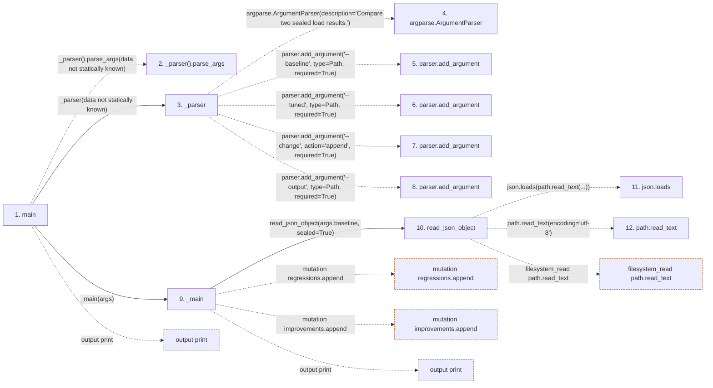

# compare

**Entry point:** `main` (`process`)
**Source:** [compare](../modules/compare.md)
**Modules touched:** [autonomy_canonical](../modules/autonomy_canonical.md), [compare](../modules/compare.md), [load_common](../modules/load_common.md), [loader](../modules/loader.md), [result](../modules/result.md)

**Related modules:** [load_common](../modules/load_common.md), [result](../modules/result.md)

## Call sequence

```mermaid
sequenceDiagram
    participant p0 as main
    participant p1 as _parser().parse_args
    participant p2 as _parser
    participant p3 as argparse.ArgumentParser
    participant p4 as parser.add_argument
    participant p5 as _main
    participant p6 as read_json_object
    participant p7 as json.loads
    participant p8 as path.read_text
    participant p9 as QualificationInputError
    participant p10 as isinstance (scripts/load/common.py:read_json_object)
    participant p11 as verify_document
    participant p12 as document.get
    participant p13 as isinstance (scripts/load/common.py:verify_document)
    participant p14 as len (scripts/load/common.py:verify_document)
    participant p15 as dict (scripts/load/common.py:verify_document)
    participant p16 as payload.pop
    participant p17 as sha256_bytes
    participant p18 as hashlib.sha256(…).hexdigest
    participant p19 as hashlib.sha256
    participant p20 as canonical_json_bytes (scripts/load/common.py)
    participant p21 as json.dumps(…).encode (scripts/load/common.py:canonical_json_bytes)
    participant p22 as json.dumps (scripts/load/common.py:canonical_json_bytes)
    participant p23 as validate_result
    p0-->>p1: _parser().parse_args
    p0->>p2: _parser
    p2-->>p3: argparse.ArgumentParser
    p2-->>p4: parser.add_argument
    p2-->>p4: parser.add_argument
    p2-->>p4: parser.add_argument
    p2-->>p4: parser.add_argument
    p0->>p5: _main
    p5->>p6: read_json_object
    p6-->>p7: json.loads
    p6-->>p8: path.read_text
    p6->>p9: QualificationInputError
    p6-->>p10: isinstance (scripts/load/common.py:read_json_object)
    p6->>p9: QualificationInputError
    p6->>p11: verify_document
    p11-->>p12: document.get
    p11-->>p13: isinstance (scripts/load/common.py:verify_document)
    p11-->>p14: len (scripts/load/common.py:verify_document)
    p11->>p9: QualificationInputError
    p11-->>p15: dict (scripts/load/common.py:verify_document)
    p11-->>p16: payload.pop
    p11->>p17: sha256_bytes
    p17-->>p18: hashlib.sha256(…).hexdigest
    p17-->>p19: hashlib.sha256
    p11->>p20: canonical_json_bytes (scripts/load/common.py)
    p20-->>p21: json.dumps(…).encode (scripts/load/common.py:canonical_json_bytes)
    p20-->>p22: json.dumps (scripts/load/common.py:canonical_json_bytes)
    p11->>p9: QualificationInputError
    p5->>p6: read_json_object
    p5->>p23: validate_result
```

<!-- Auto-generated from static call edges. Dashed arrows are external or unresolved calls. Reviewed runtime conditions and side effects belong in Behavior. -->

> Call sequence diagram shows 30 of 134 interactions; 104 omitted to keep the visualization within the 30-interaction and generated-diagram limits.

> Trace truncated at the depth limit; deeper calls are omitted.

## Data flow

<!-- Auto-generated static analysis. Treat values and boundaries as best-effort hints, not runtime proof. -->

### Step data

| Step | Inputs | Reads | Writes | Returns |
|---|---|---|---|---|
| `main` | - | `QualificationInputError`, `sys` | - | `_main(...)`, `2` |
| `_parser().parse_args` | - | - | - | - |
| `_parser` | - | `Path`, `Path`, `Path` | - | `parser` |
| `argparse.ArgumentParser` | - | - | - | - |
| `parser.add_argument` | - | - | - | - |
| `parser.add_argument` | - | - | - | - |
| `parser.add_argument` | - | - | - | - |
| `parser.add_argument` | - | - | - | - |
| `_main` | `args: argparse.Namespace` | - | `gate_transitions[...]` | `...` |
| `read_json_object` | `path: Path`, `sealed: bool` | `json` | - | `value` |
| `json.loads` | - | - | - | - |
| `path.read_text` | - | - | - | - |

### Call data

| From | To | Line | Call |
|---|---|---:|---|
| main | _parser().parse_args | 148 | `_parser().parse_args(data not statically known)` |
| main | _parser | 148 | `_parser(data not statically known)` |
| _parser | argparse.ArgumentParser | 139 | `argparse.ArgumentParser(description='Compare two sealed load results.')` |
| _parser | parser.add_argument | 140 | `parser.add_argument('--baseline', type=Path, required=True)` |
| _parser | parser.add_argument | 141 | `parser.add_argument('--tuned', type=Path, required=True)` |
| _parser | parser.add_argument | 142 | `parser.add_argument('--change', action='append', required=True)` |
| _parser | parser.add_argument | 143 | `parser.add_argument('--output', type=Path, required=True)` |
| main | _main | 150 | `_main(args)` |
| _main | read_json_object | 50 | `read_json_object(args.baseline, sealed=True)` |
| read_json_object | json.loads | 90 | `json.loads(path.read_text(...))` |
| read_json_object | path.read_text | 90 | `path.read_text(encoding='utf-8')` |

### Boundary effects

| Kind | Target | Step | Line |
|---|---|---|---:|
| output | `print` | `main` | 152 |
| mutation | `regressions.append` | `_main` | 83 |
| mutation | `improvements.append` | `_main` | 85 |
| output | `print` | `_main` | 132 |
| filesystem_read | `path.read_text` | `read_json_object` | 90 |

### Static analysis gaps

| Kind | Step | Target | Line |
|---|---|---|---:|
| unresolved_call | `main` | `_parser().parse_args` | 148 |
| external_call | `_parser` | `argparse.ArgumentParser` | 139 |
| unresolved_call | `_parser` | `parser.add_argument` | 140 |
| unresolved_call | `_parser` | `parser.add_argument` | 141 |
| unresolved_call | `_parser` | `parser.add_argument` | 142 |
| unresolved_call | `_parser` | `parser.add_argument` | 143 |
| step_limit | `main` | `first 12 steps` | 0 |
| truncated_flow | `main` | `depth limit` | 0 |

## Behavior

This flow starts at `main` and is classified as `process`. The generated call and data-flow sections are bounded static projections; runtime conditions and side effects require source-level confirmation.
