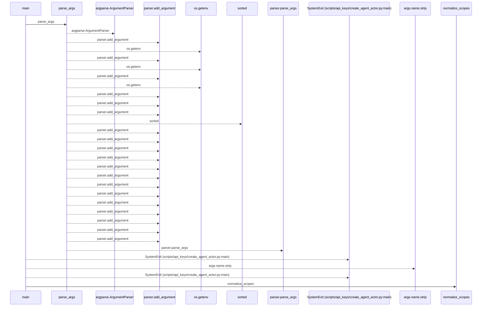
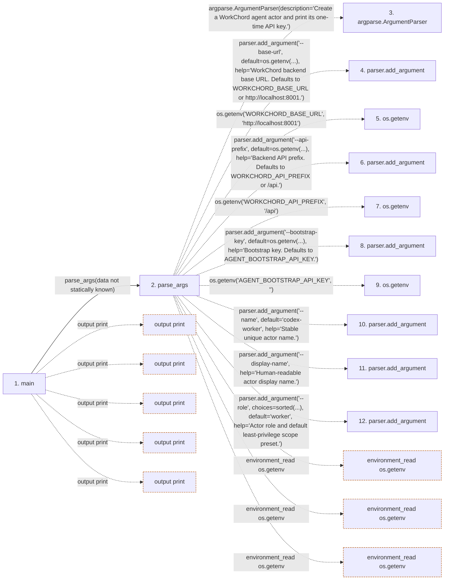

# create_agent_actor

**Entry point:** `main` (`process`)
**Source:** [create_agent_actor](../modules/create_agent_actor.md)
**Modules touched:** [create_agent_actor](../modules/create_agent_actor.md)

## Call sequence

<!-- Auto-generated from static call edges. Dashed arrows are external or unresolved calls. Reviewed runtime conditions and side effects belong in Behavior. -->

> Call sequence diagram shows 30 of 100 interactions; 70 omitted to keep the visualization within the 30-interaction and generated-diagram limits.

## Data flow

<!-- Auto-generated static analysis. Treat values and boundaries as best-effort hints, not runtime proof. -->

### Step data

| Step | Inputs | Reads | Writes | Returns |
|---|---|---|---|---|
| `main` | - | `ROLE_SCOPES`, `sys`, `sys` | - | - |
| `parse_args` | - | `ROLE_SCOPES` | - | `parser.parse_args(...)` |
| `argparse.ArgumentParser` | - | - | - | - |
| `parser.add_argument` | - | - | - | - |
| `os.getenv` | - | - | - | - |
| `parser.add_argument` | - | - | - | - |
| `os.getenv` | - | - | - | - |
| `parser.add_argument` | - | - | - | - |
| `os.getenv` | - | - | - | - |
| `parser.add_argument` | - | - | - | - |
| `parser.add_argument` | - | - | - | - |
| `parser.add_argument` | - | - | - | - |

### Call data

| From | To | Line | Call |
|---|---|---:|---|
| main | parse_args | 309 | `parse_args(data not statically known)` |
| parse_args | argparse.ArgumentParser | 225 | `argparse.ArgumentParser(description='Create a WorkChord agent actor and print its one-time API key.')` |
| parse_args | parser.add_argument | 228 | `parser.add_argument('--base-url', default=os.getenv(...), help='WorkChord backend base URL. Defaults to WORKCHORD_BASE_URL or http://localhost:8001.')` |
| parse_args | os.getenv | 230 | `os.getenv('WORKCHORD_BASE_URL', 'http://localhost:8001')` |
| parse_args | parser.add_argument | 233 | `parser.add_argument('--api-prefix', default=os.getenv(...), help='Backend API prefix. Defaults to WORKCHORD_API_PREFIX or /api.')` |
| parse_args | os.getenv | 235 | `os.getenv('WORKCHORD_API_PREFIX', '/api')` |
| parse_args | parser.add_argument | 238 | `parser.add_argument('--bootstrap-key', default=os.getenv(...), help='Bootstrap key. Defaults to AGENT_BOOTSTRAP_API_KEY.')` |
| parse_args | os.getenv | 240 | `os.getenv('AGENT_BOOTSTRAP_API_KEY', '')` |
| parse_args | parser.add_argument | 243 | `parser.add_argument('--name', default='codex-worker', help='Stable unique actor name.')` |
| parse_args | parser.add_argument | 244 | `parser.add_argument('--display-name', help='Human-readable actor display name.')` |
| parse_args | parser.add_argument | 245 | `parser.add_argument('--role', choices=sorted(...), default='worker', help='Actor role and default least-privilege scope preset.')` |

### Boundary effects

| Kind | Target | Step | Line |
|---|---|---|---:|
| output | `print` | `main` | 351 |
| output | `print` | `main` | 353 |
| output | `print` | `main` | 355 |
| output | `print` | `main` | 357 |
| output | `print` | `main` | 362 |
| environment_read | `os.getenv` | `parse_args` | 230 |
| environment_read | `os.getenv` | `parse_args` | 235 |
| environment_read | `os.getenv` | `parse_args` | 240 |

### Static analysis gaps

| Kind | Step | Target | Line |
|---|---|---|---:|
| external_call | `parse_args` | `argparse.ArgumentParser` | 225 |
| unresolved_call | `parse_args` | `parser.add_argument` | 228 |
| unresolved_call | `parse_args` | `parser.add_argument` | 233 |
| unresolved_call | `parse_args` | `parser.add_argument` | 238 |
| unresolved_call | `parse_args` | `parser.add_argument` | 243 |
| unresolved_call | `parse_args` | `parser.add_argument` | 244 |
| unresolved_call | `parse_args` | `parser.add_argument` | 245 |
| step_limit | `main` | `first 12 steps` | 0 |

## Behavior

This flow starts at `main` and is classified as `process`. The generated call and data-flow sections are bounded static projections; runtime conditions and side effects require source-level confirmation.
