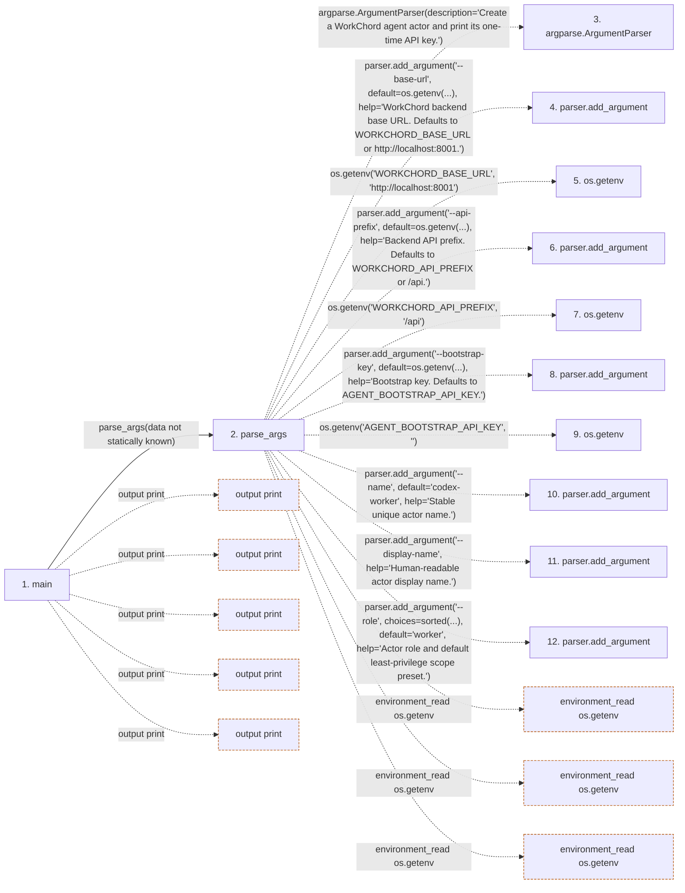

# create_agent_actor

**Entry point:** `main` (`process`)
**Source:** [create_agent_actor](../modules/create_agent_actor.md)
**Modules touched:** [create_agent_actor](../modules/create_agent_actor.md)

## Call sequence

> Static overview in presentation order, not runtime execution order. Arrows retain captured callers; representative internal continuations and boundary examples precede repeated helper detail.

<!-- Auto-generated from static call edges. Dashed arrows are external or unresolved calls. Reviewed runtime conditions and side effects belong in Behavior. -->

```mermaid
sequenceDiagram
    participant p0 as main
    participant p1 as actor_url
    participant p2 as parse_args
    participant p3 as normalize_scopes
    participant p4 as create_actor
    participant p5 as title_from_name
    participant p6 as render_shell
    participant p7 as render_env
    participant p8 as normalize_api_prefix
    participant p9 as normalize_base_url
    participant p10 as SystemExit (scripts/api_keys/create_agent_actor.py:main)
    participant p11 as args.name.strip
    participant p12 as args.model_catalog_key.strip().lower
    participant p13 as args.model_catalog_key.strip
    participant p14 as print
    participant p15 as json.dumps (scripts/api_keys/create_agent_actor.py:main)
    participant p16 as data.get (scripts/api_keys/create_agent_actor.py:main)
    participant p17 as argparse.ArgumentParser
    participant p18 as scope.strip
    participant p19 as json.dumps(…).encode
    participant p20 as ' '.join
    participant p21 as lines.append
    participant p22 as lines.extend (scripts/api_keys/create_agent_actor.py:render_env)
    participant p23 as parser.add_argument
    participant p24 as ', '.join
    p0->>p1: actor_url
    p0->>p2: parse_args
    p0->>p3: normalize_scopes
    p0->>p4: create_actor
    p0->>p5: title_from_name
    p0->>p6: render_shell
    p0->>p7: render_env
    p0->>p8: normalize_api_prefix
    p1->>p9: normalize_base_url
    p0-->>p10: SystemExit (scripts/api_keys/create_agent_actor.py:main)('Missing bootstrap key. Set AGENT_BOOTSTRAP_API_KEY or pass --bootstrap-key.')
    p0-->>p11: args.name.strip
    p0-->>p10: SystemExit (scripts/api_keys/create_agent_actor.py:main)('Actor name cannot be blank')
    p0-->>p12: args.model_catalog_key.strip().lower
    p0-->>p13: args.model_catalog_key.strip
    p0-->>p10: SystemExit (scripts/api_keys/create_agent_actor.py:main)('Model tags require --model-catalog-key provider credentials must not be supplied.')
    p0-->>p14: print(json.dumps(...))
    p0-->>p15: json.dumps (scripts/api_keys/create_agent_actor.py:main)(data, indent=2, sort_keys=True)
    p0-->>p14: print(render_shell(...))
    p0-->>p14: print(render_env(...))
    p0-->>p14: print('The api_key is returned once store it securely before closing this terminal.', file=sys.stderr)
    p0-->>p16: data.get (scripts/api_keys/create_agent_actor.py:main)('model_binding_id')
    p0-->>p14: print(..., file=sys.stderr)
    p2-->>p17: argparse.ArgumentParser(description='Create a WorkChord agent actor and print its one-time API key.')
    p3-->>p18: scope.strip
    p4-->>p19: json.dumps(…).encode('utf-8')
    p5-->>p20: ' '.join(...)
    p6-->>p21: lines.append(' Source this file only in trusted shells.')
    p7-->>p22: lines.extend (scripts/api_keys/create_agent_actor.py:render_env)([...])
    p2-->>p23: parser.add_argument('--base-url', default=os.getenv(...), help='WorkChord backend base URL. Defaults to WORKCHORD_BASE_URL or http://localhost:8001.')
    p3-->>p24: ', '.join(ALLOWED_SCOPES)
```

> Call sequence diagram shows 30 of 100 interactions; 70 omitted to keep the visualization within the 30-interaction and generated-diagram limits, with uncertain identities omitted rather than inferred.

> Captured boundary calls: external 10 of 38 (28 omitted); unresolved 11 of 51 (40 omitted). These counts cover the captured static trace.

Omitted captured detail, grouped by actual caller occurrence and target module:

| Caller | Parent step | Target module | Kind | Omitted interactions |
| --- | --- | --- | --- | --- |
| `scripts/api_keys/create_agent_actor.py:parse_args` | 2 | - | external | 4 |
| `scripts/api_keys/create_agent_actor.py:parse_args` | 2 | - | unresolved | 19 |
| `scripts/api_keys/create_agent_actor.py:normalize_scopes` | 31 | - | external | 1 |
| `scripts/api_keys/create_agent_actor.py:normalize_scopes` | 31 | - | unresolved | 2 |
| `scripts/api_keys/create_agent_actor.py:create_actor` | 40 | - | external | 8 |
| `scripts/api_keys/create_agent_actor.py:create_actor` | 40 | - | unresolved | 4 |
| `scripts/api_keys/create_agent_actor.py:normalize_base_url` | 55 | - | unresolved | 2 |
| `scripts/api_keys/create_agent_actor.py:normalize_base_url` | 55 | - | external | 1 |
> Omission summary shows 8 of 15 groups; 7 further groups are not expanded here. Counts above include all omitted interactions.
> Detailed flow queries retain their own coverage and limits; omitted paths may execute at runtime.

## Data flow

<!-- Auto-generated static analysis. Treat values and boundaries as best-effort hints, not runtime proof. -->

### Analysis coverage

**Effect analysis partially available.** Flow assembly and source effect analysis are separate; empty observations do not prove an empty handler body.

Source steps: 12; effect analysis evaluated: 11, partial: 1, unavailable: 0. Counts include steps omitted from the displayed trace.

Collector observations for 12 source steps with known totals: observed: 67, emitted: 60, omitted: 7. Unavailable totals are excluded.

- Effect collector omitted observations before flow assembly; displayed effects are partial.

| Step | Callable record | Effect analysis | Collector totals | Observed | Emitted | Omitted |
|---|---|---|---|---:|---:|---:|
| `main` | `available` | `evaluated` | `available` | `8` | `8` | `0` |
| `parse_args` | `available` | `evaluated` | `available` | `5` | `5` | `0` |
| `argparse.ArgumentParser` | `not_applicable` | `not_applicable` | `not_applicable` | — | — | — |
| `parser.add_argument` | `not_applicable` | `not_applicable` | `not_applicable` | — | — | — |
| `os.getenv` | `not_applicable` | `not_applicable` | `not_applicable` | — | — | — |
| `parser.add_argument` | `not_applicable` | `not_applicable` | `not_applicable` | — | — | — |
| `os.getenv` | `not_applicable` | `not_applicable` | `not_applicable` | — | — | — |
| `parser.add_argument` | `not_applicable` | `not_applicable` | `not_applicable` | — | — | — |
| `os.getenv` | `not_applicable` | `not_applicable` | `not_applicable` | — | — | — |
| `parser.add_argument` | `not_applicable` | `not_applicable` | `not_applicable` | — | — | — |
| `parser.add_argument` | `not_applicable` | `not_applicable` | `not_applicable` | — | — | — |
| `parser.add_argument` | `not_applicable` | `not_applicable` | `not_applicable` | — | — | — |

```mermaid
flowchart LR
    s1["1. main"]
    s2["2. parse_args"]
    s3["3. argparse.ArgumentParser"]
    s4["4. parser.add_argument"]
    s5["5. os.getenv"]
    s6["6. parser.add_argument"]
    s7["7. os.getenv"]
    s8["8. parser.add_argument"]
    s9["9. os.getenv"]
    s10["10. parser.add_argument"]
    s11["11. parser.add_argument"]
    s12["12. parser.add_argument"]
    s1 -->|"parse_args(data not statically known)"| s2
    s2 -. "argparse.ArgumentParser(description='Create a WorkChord agent actor and print its one-time API key.')" .-> s3
    s2 -. "parser.add_argument('--base-url', default=os.getenv(...), help='WorkChord backend base URL. Defaults to WORKCHORD_BASE_URL or http://localhost:8001.')" .-> s4
    s2 -. "os.getenv('WORKCHORD_BASE_URL', 'http://localhost:8001')" .-> s5
    s2 -. "parser.add_argument('--api-prefix', default=os.getenv(...), help='Backend API prefix. Defaults to WORKCHORD_API_PREFIX or /api.')" .-> s6
    s2 -. "os.getenv('WORKCHORD_API_PREFIX', '/api')" .-> s7
    s2 -. "parser.add_argument('--bootstrap-key', default=os.getenv(...), help='Bootstrap key. Defaults to AGENT_BOOTSTRAP_API_KEY.')" .-> s8
    s2 -. "os.getenv('AGENT_BOOTSTRAP_API_KEY', '')" .-> s9
    s2 -. "parser.add_argument('--name', default='codex-worker', help='Stable unique actor name.')" .-> s10
    s2 -. "parser.add_argument('--display-name', help='Human-readable actor display name.')" .-> s11
    s2 -. "parser.add_argument('--role', choices=sorted(...), default='worker', help='Actor role and default least-privilege scope preset.')" .-> s12
    b0["output print"]
    s1 -. "output print" .-> b0
    b1["output print"]
    s1 -. "output print" .-> b1
    b2["output print"]
    s1 -. "output print" .-> b2
    b3["output print"]
    s1 -. "output print" .-> b3
    b4["output print"]
    s1 -. "output print" .-> b4
    b5["environment_read os.getenv"]
    s2 -. "environment_read os.getenv" .-> b5
    b6["environment_read os.getenv"]
    s2 -. "environment_read os.getenv" .-> b6
    b7["environment_read os.getenv"]
    s2 -. "environment_read os.getenv" .-> b7
    click s1 "../modules/create_agent_actor.md"
    click s2 "../modules/create_agent_actor.md"
    classDef boundary stroke:#b45309,stroke-dasharray: 4 2
    class b0 boundary
    class b1 boundary
    class b2 boundary
    class b3 boundary
    class b4 boundary
    class b5 boundary
    class b6 boundary
    class b7 boundary
```

### Step data

| Step | Inputs | Reads | Writes | Returns |
|---|---|---|---|---|
| `main` | - | `ROLE_SCOPES`, `sys`, `sys` | - | - |
| `parse_args` | - | `ROLE_SCOPES` | - | `parser.parse_args(...)` |
| `argparse.ArgumentParser` | - | - | - | - |
| `parser.add_argument` | - | - | - | - |
| `os.getenv` | - | - | - | - |
| `parser.add_argument` | - | - | - | - |
| `os.getenv` | - | - | - | - |
| `parser.add_argument` | - | - | - | - |
| `os.getenv` | - | - | - | - |
| `parser.add_argument` | - | - | - | - |
| `parser.add_argument` | - | - | - | - |
| `parser.add_argument` | - | - | - | - |

### Call data

| From | To | Line | Call |
|---|---|---:|---|
| main | parse_args | 309 | `parse_args(data not statically known)` |
| parse_args | argparse.ArgumentParser | 225 | `argparse.ArgumentParser(description='Create a WorkChord agent actor and print its one-time API key.')` |
| parse_args | parser.add_argument | 228 | `parser.add_argument('--base-url', default=os.getenv(...), help='WorkChord backend base URL. Defaults to WORKCHORD_BASE_URL or http://localhost:8001.')` |
| parse_args | os.getenv | 230 | `os.getenv('WORKCHORD_BASE_URL', 'http://localhost:8001')` |
| parse_args | parser.add_argument | 233 | `parser.add_argument('--api-prefix', default=os.getenv(...), help='Backend API prefix. Defaults to WORKCHORD_API_PREFIX or /api.')` |
| parse_args | os.getenv | 235 | `os.getenv('WORKCHORD_API_PREFIX', '/api')` |
| parse_args | parser.add_argument | 238 | `parser.add_argument('--bootstrap-key', default=os.getenv(...), help='Bootstrap key. Defaults to AGENT_BOOTSTRAP_API_KEY.')` |
| parse_args | os.getenv | 240 | `os.getenv('AGENT_BOOTSTRAP_API_KEY', '')` |
| parse_args | parser.add_argument | 243 | `parser.add_argument('--name', default='codex-worker', help='Stable unique actor name.')` |
| parse_args | parser.add_argument | 244 | `parser.add_argument('--display-name', help='Human-readable actor display name.')` |
| parse_args | parser.add_argument | 245 | `parser.add_argument('--role', choices=sorted(...), default='worker', help='Actor role and default least-privilege scope preset.')` |

### Boundary effects

| Kind | Target | Step | Line |
|---|---|---|---:|
| output | `print` | `main` | 351 |
| output | `print` | `main` | 353 |
| output | `print` | `main` | 355 |
| output | `print` | `main` | 357 |
| output | `print` | `main` | 362 |
| environment_read | `os.getenv` | `parse_args` | 230 |
| environment_read | `os.getenv` | `parse_args` | 235 |
| environment_read | `os.getenv` | `parse_args` | 240 |

### Static analysis gaps

| Kind | Step | Target | Line |
|---|---|---|---:|
| external_call | `parse_args` | `argparse.ArgumentParser` | 225 |
| unresolved_call | `parse_args` | `parser.add_argument` | 228 |
| unresolved_call | `parse_args` | `parser.add_argument` | 233 |
| unresolved_call | `parse_args` | `parser.add_argument` | 238 |
| unresolved_call | `parse_args` | `parser.add_argument` | 243 |
| unresolved_call | `parse_args` | `parser.add_argument` | 244 |
| unresolved_call | `parse_args` | `parser.add_argument` | 245 |
| step_limit | `main` | `first 12 steps` | 0 |

## Behavior

This flow starts at `main` and is classified as `process`. The generated call and data-flow sections are bounded static projections; runtime conditions and side effects require source-level confirmation.
